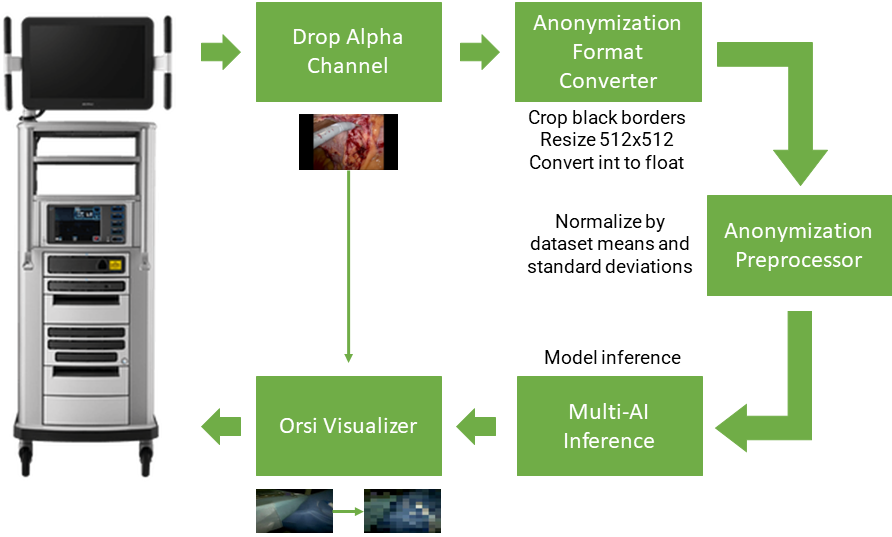

# Orsi In - Out - Body Detection sample app


<center> </center>
<center> Fig. 1: Example of anonymized result after inference </center><br>

## Introduction

In robotic surgery, anonymization of video is necessary to ensure privacy and protect patient data. During e.g. swapping of robotic tools or lens cleaning the endoscope is removed from the body, possibly capturing faces, recognizable tattoos or written patient data. Therefore, going out of body is a suiting definition for an anonymization boundary.

## Pipeline

<center> </center>
<center> Fig. 2: Schematic overview of Holoscan application </center><br>

Towards realtime anonymization, a binary out-of-body classifier was trained and deployed using Holoscan platform. Figure 2 shows a schematic overview of the application. After capturing the frame, the alpha channel is dropped by the [Format Converter](/operators/orsi/orsi_format_converter/format_converter.cpp) operator. Additionally, the black padding borders added by the robotic system are removed, the tensor is resized to 512x512 pixels and the tensor type is converted from int [0, 255] to float [0, 1]. In the [Anonymization Preprocessor](/operators/orsi/orsi_segmentation_preprocessor/segmentation_preprocessor.cpp) operator the tensor pixel values of every collor channel are normalized using the corresponding means and standard deviations of the anonymization dataset. After model inference with the Multi-AI inference operator, the result frame is anonymized in the [Orsi Visualizer](/operators/orsi/orsi_visualizer/orsi_visualizer.cpp) operator according to the model output. The blurring is applied using a glsl program.
## Controls

| Action    | Control |
| -------- | ------- |
| Enable anonymization | B |


## Build app

```bash
./run build orsi_in_out_body
```

## Launch app

**C++** 

```bash
./run launch orsi_in_out_body cpp
```

**Python**

```bash
./run launch orsi_in_out_body python
```

<center> </center>