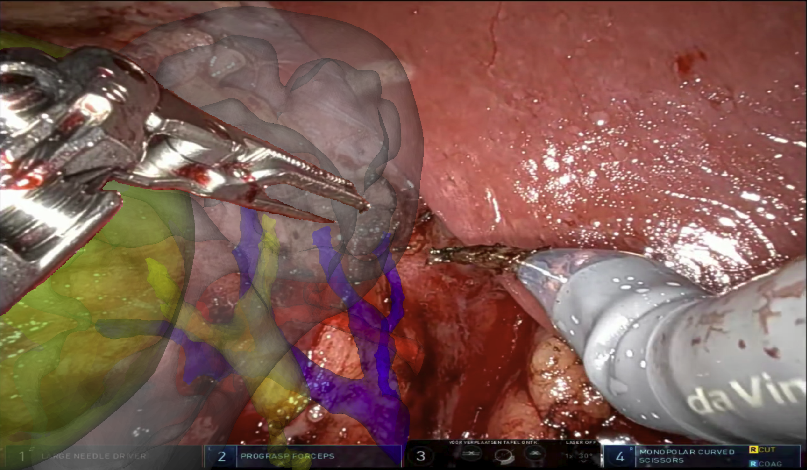
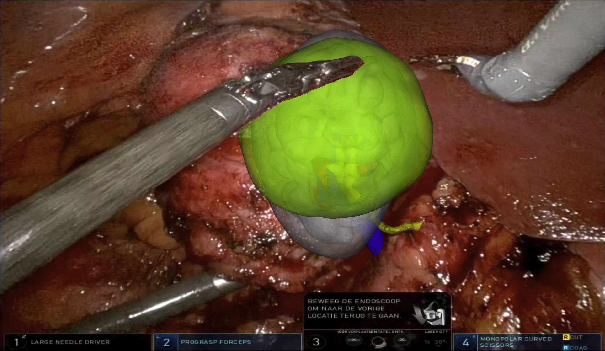
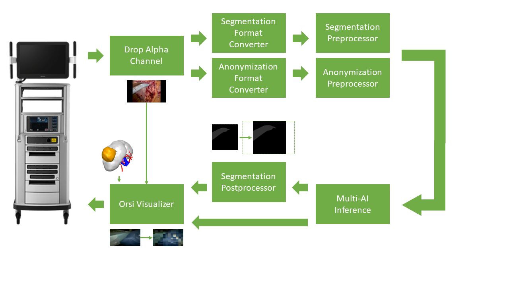

# Orsi Multi AI and AR sample app


<center>  </center>
<center> Fig. 1: Application screenshots  </center><br>

## Introduction

3D models are used in surgery to improve patient outcomes. They provide information on patient specific anatomies that are not visible in the present surgical scene. Especially in robotic surgery these 3D models give great insights because they can be projected and aligned directly onto the endoscopic video. This augmented reality supports navigation for the surgeon in the console. The downside of the 3D model projection is that it occludes the surgical instruments, creating a possible hazardous situation for the patient. This application uses a deep learning segmentation model to identify non-organic items such as tools, clips and wires and projects them on top of the 3D model. This solves the occlusion problem and adds a sense of depth to the AR application. Figure 1 shows in-app screenshots where the 3D model is used to support navigation. The large tumor in green is visible as anatomical landmark.  In addition, the application features an out-of-body detector. Anonymization of video is necessary to ensure privacy and protect patient data. During e.g. swapping of robotic tools or lens cleaning the endoscope is removed from the body, possibly capturing faces, recognizable tattoos or written patient data. Therefore, going out of body is a suiting definition for an anonymization boundary.


<center> </center>
<center> Fig. 2: 3D model of kidney tumor case </center><br>

The application was successfully used to remove a kidney tumor during a partial nephrectomy. Figure 2 shows the kidney 3D model where the tumor is colored in yellow.

## Pipeline

<center> </center>
<center> Fig. 3: Schematic overview of Holoscan application </center><br>

Towards realtime segmentation, AR overlay and anonymization, a binary segmentation model for non-organic items and a binary out-of-body detector was trained and deployed using Holoscan platform. Figure 3 shows a schematic overview of the application. After capturing the frame, the alpha channel is dropped by the [Format Converter](/operators/orsi/orsi_format_converter/format_converter.cpp) operator. Additionally, the black padding borders added by the robotic system are removed, the tensor is resized to 512x512 pixels and the tensor type is converted from int [0, 255] to float [0, 1]. In the [Segmentation Preprocessor](/operators/orsi/orsi_segmentation_preprocessor/segmentation_preprocessor.cpp) and Anonymization Preprocessor operators the tensor pixel values of every color channel are normalized using the corresponding means and standard deviations of the segmentation and anonymization dataset respectively. After model inference with the Multi-AI inference operator, a sigmoid layer is applied to the model predictions by the [Segmentation Postprocessor](/operators/orsi/orsi_segmentation_postprocessor/segmentation_postprocessor.cpp) resulting in a binary segmentation mask. Additionally, the resizing and cropping operations are inverted by first resizing and then adding black padding borders as to not compromise resolution. In the [Orsi Visualizer](/operators/orsi/orsi_visualizer/orsi_visualizer.cpp) operator the 3D model is rendered using the VTK library and composited onto the endoscopic image using OpenGL. The pixels corresponding to non-organic items are passed through the 3D model layer using a glsl shader program. Finally, the frame is anonymized according to the out-of-body detector output.


##  Controls

| Action | Control |
| -------- | ------- |
| Enable/Disable anonymization | B |
| Enable/Disable manipulations | T |
| Load 3D model orientation preset | CTRL + L |
| Save current 3D model orientation as preset **(will overwrite default preset)** | CTRL + S |
| Rotate 3D model (3 degrees of freedom)  | Left Click + Drag |
| Rotate 3D model (1 degree of freedom) | CTRL + Left Click + Drag |
| Zoom 3D model | Right Click + Drag |
| Translate 3D  model | SHIFT + Left Click + Drag |
| Enable/Disable 3D model | E |
| Enable/Disable segmentation overlay | O |
| Increase opacity 3D model | + |
| Decrease opacity 3D model | - |
| Toggle arterial tree | 1 |
| Toggle venous tree | 2 |
| Toggle ureter | 4 |
| Toggle parenchyma | 5 |
| Toggle tumor | 6 |


## Build app

```bash
./run build orsi_multi_ai_ar
```

## Launch app

```bash
./run launch orsi_multi_ai_ar cpp
```

or

```bash
./run launch orsi_multi_ai_ar python
```

<center> </center>