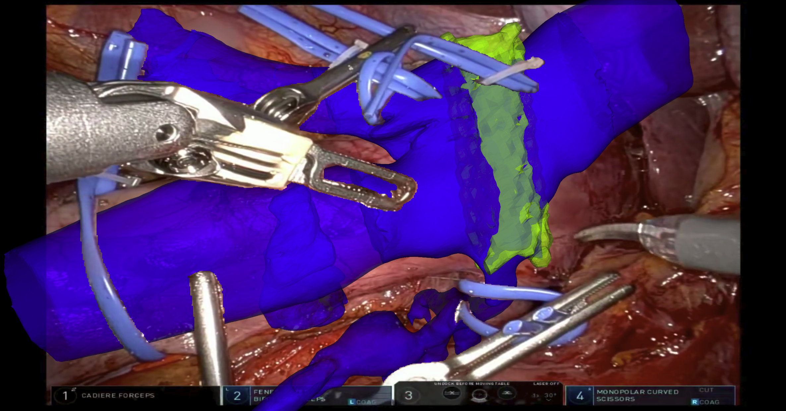
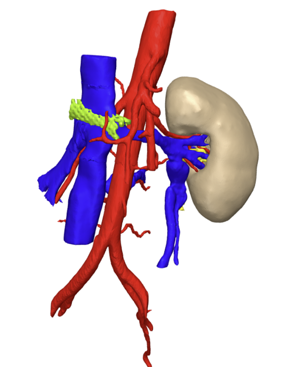
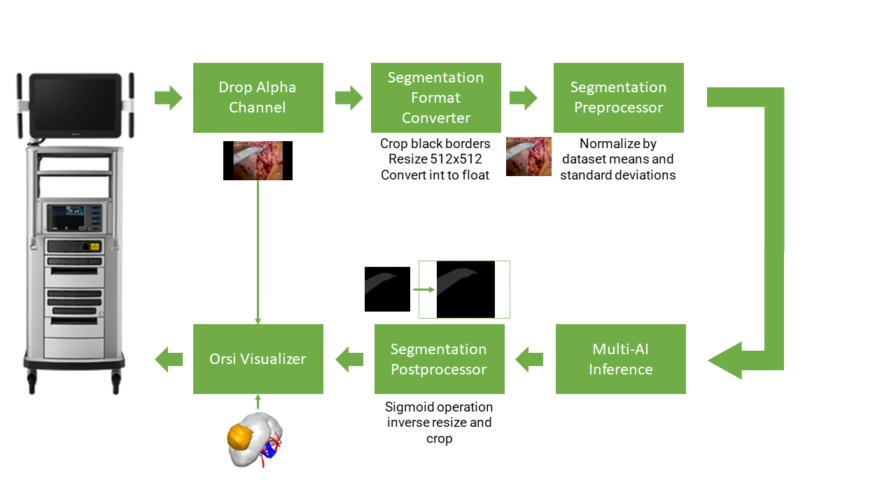

# Orsi Non Organic Structure Segmentation and AR sample app


<center> </center>
<center> Fig. 1: Application screenshot  </center><br>


## Introduction

3D models are used in surgery to improve patient outcomes. They provide information on patient specific anatomies that are not visible in the present surgical scene. Especially in robotic surgery these 3D models give great insights because they can be projected and aligned directly onto the endoscopic video. This augmented reality supports navigation for the surgeon in the console. The downside of the 3D model projection is that it occludes the surgical instruments, creating a possible hazardous situation for the patient. This application uses a deep learning segmentation model to identify non-organic items such as tools, clips and wires and projects them on top of the 3D model. This solves the occlusion problem and adds a sense of depth to the AR application. Figure 1 shows an in-app screenshot where the 3D model is aligned with the anatomy and the tools are segmented on top.

<center> </center>
<center> Fig. 2: 3D model of nutcracker case </center><br>

The application was successfully used to verify stent location during a nutcracker syndrome stent removal. Nutcracker syndrome is a rare vein compression disorder where the left renal vein is squeezed between the superior mesenteric artery and abdominal aorta, obstructing blood drainage and even risking blood to flow backwards, causing pain and blood in the urine. Typically, blood flow is restored through endovascular stenting. Although effective, over time the stent had migrated beyond the compression site, causing the symptoms to return and in addition posing an incidental obstruction for blood flow. The stent ofcourse had to be removed. Figure 2 shows a 3D model depicting the current situation.

## Pipeline

<center> </center>
<center> Fig. 3: Schematic overview of Holoscan application </center><br>

Towards realtime segmentation and AR overlay, a binary segmentation model for non-organic items was trained and deployed using Holoscan platform. Figure 3 shows a schematic overview of the application. After capturing the frame, the alpha channel is dropped by the [Format Converter](/operators/orsi/orsi_format_converter/format_converter.cpp) operator. Additionally, the black padding borders added by the robotic system are removed, the tensor is resized to 512x512 pixels and the tensor type is converted from int [0, 255] to float [0, 1]. In the [Segmentation Preprocessor](/operators/orsi/orsi_segmentation_preprocessor/segmentation_preprocessor.cpp) operator the tensor pixel values of every color channel are normalized using the corresponding means and standard deviations of the segmentation dataset. After model inference with the Multi-AI inference operator, a sigmoid layer is applied to the model predictions by the [Segmentation Postprocessor](/operators/orsi/orsi_segmentation_postprocessor/segmentation_postprocessor.cpp) resulting in a binary segmentation mask. Additionally, the resizing and cropping operations are inverted by first resizing and then adding black padding borders as to not compromise resolution. In the [Orsi Visualizer](/operators/orsi/orsi_visualizer/orsi_visualizer.cpp) operator the 3D model is rendered using the VTK library and composited onto the endoscopic image using OpenGL. The pixels corresponding to non-organic items are passed through the 3D model layer using a glsl shader program.

##  Controls

| Action | Control |
| -------- | ------- |
| Enable/Disable anonymization | B |
| Enable/Disable manipulations | T |
| Load 3D model orientation preset | CTRL + L |
| Save current 3D model orientation as preset **(will overwrite default preset)** | CTRL + S |
| Rotate 3D model (3 degrees of freedom)  | Left Click + Drag |
| Rotate 3D model (1 degree of freedom) | CTRL + Left Click + Drag |
| Zoom 3D model | Right Click + Drag |
| Translate 3D  model | SHIFT + Left Click + Drag |
| Enable/Disable 3D model | E |
| Enable/Disable segmentation overlay | O |
| Increase opacity 3D model | + |
| Decrease opacity 3D model | - |
| Toggle venous tree | 0 |
| Toggle venous stent zone | 1 |
| Toggle stent | 2 |


## Build app

```bash
./run build orsi_segmentation_ar
```

## Launch app

```bash
./run launch orsi_segmentation_ar cpp
```

or

```bash
./run launch orsi_segmentation_ar python
```

<center> </center>
