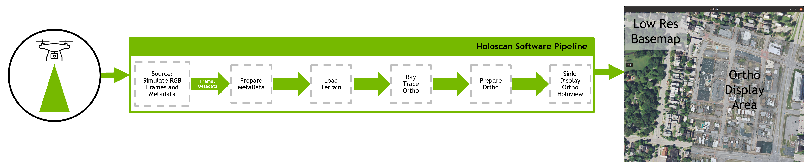
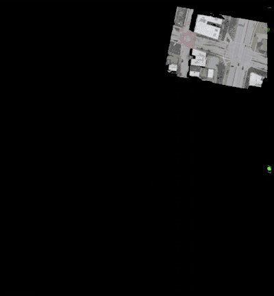

# GPU-Accelerated Orthorectification with NVIDIA OptiX

This application is an example of utilizing the nvidia OptiX SDK via the PyOptix bindings to create per-frame orthorectified imagery. In this example, one can create a visualization of mapping frames from a drone mapping mission processed with [Open Drone Map](https://opendronemap.org/). A typical output of a mapping mission is a single merged mosaic. While this product is useful for GIS applications, it is difficult to apply algorithms on a such a large single image without incurring additional steps like image chipping. Additionally, the mosaic process introduces image artifacts which can negativley impact algorithm performance. 

Since this holoscan pipeline processes each frame individually, it opens the door for one to apply an algorithm to the original un-modififed imagery and then map the result. If custom image processing is desired, it is recommended to insert custom operators before the Ray Trace Ortho operator in the application flow. 


<br>
Fig. 1 Orthorectification sample application workflow

Steps for running the application:

a) Download and Prep the ODM Dataset<br>
1. Download the [Lafayette Square Dataset](https://www.opendronemap.org/odm/datasets/) and place into ~/Data.

2. Process the dataset with ODM via docker command: <br>
```docker run -ti --rm -v ~/Data/lafayette_square:/datasets/code opendronemap/odm --project-path /datasets --camera-lens perspective --dsm```

If you run out of memory add the following argument to preserve some memory: ```--feature-quality medium```

b) Clone holohub and navigate to this application directory

c) Download [OptiX SDK 7.4.0](https://developer.nvidia.com/optix/downloads/7.4.0/linux64-x86_64) and extract the package in the same directory as the source code
(i.e. applications/orthorectification_with_optix).

d) Build development container <br>
1. ```DOCKER_BUILDKIT=1 docker build -t holohub-ortho-optix:latest .```

You can now run the docker container by: <br>
1. ```xhost +local:docker```
2. ```nvidia_icd_json=$(find /usr/share /etc -path '*/vulkan/icd.d/nvidia_icd.json' -type f 2>/dev/null | grep .) || (echo "nvidia_icd.json not found" >&2 && false)```
3. ```docker run -it --rm --net host --runtime=nvidia -v ~/Data:/root/Data  -v .:/work/ -v /tmp/.X11-unix:/tmp/.X11-unix  -v $nvidia_icd_json:$nvidia_icd_json:ro  -e NVIDIA_DRIVER_CAPABILITIES=graphics,video,compute,utility,display -e DISPLAY=$DISPLAY  holohub-ortho-optix```

Finish prepping the input data: <br>
1. ```gdal_translate -tr 0.25 0.25 -r cubic ~/Data/lafayette_square/odm_dem/dsm.tif ~/Data/lafayette_square/odm_dem/dsm_small.tif```
2. ```gdal_fillnodata.py -md 0 ~/Data/lafayette_square/odm_dem/dsm_small.tif ~/Data/lafayette_square/odm_dem/dsm_small_filled.tif```

Finally run the application: <br>
1. ```python ./python/ortho_with_pyoptix.py```

You can modify the applications settings in the file "ortho_with_pyoptix.py" 

```
sensor_resize = 0.25 # resizes the raw sensor pixels
ncpu = 8 # how many cores to use to load sensor simulation
gsd = 0.25 # controls how many pixels are in the rendering
iterations = 425 # how many frames to render from the source images (in this case 425 is max)
use_mosaic_bbox = True # render to a static bounds on the ground as defined by the DEM
write_geotiff = False 
nb=3 # how many bands to write to the GeoTiff
render_scale = 0.5 # scale the holoview window up or down
fps = 8.0 # rate limit the simulated sensor feed to this many frames per second
```

<br>
Fig. 2 Running the orthorectification sample application