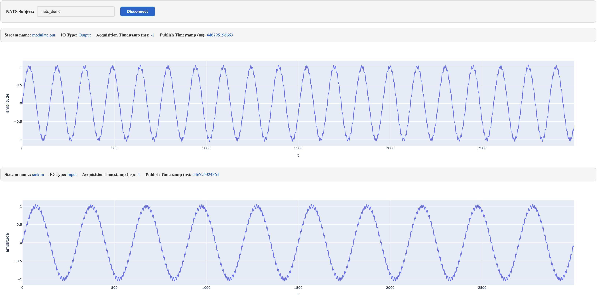
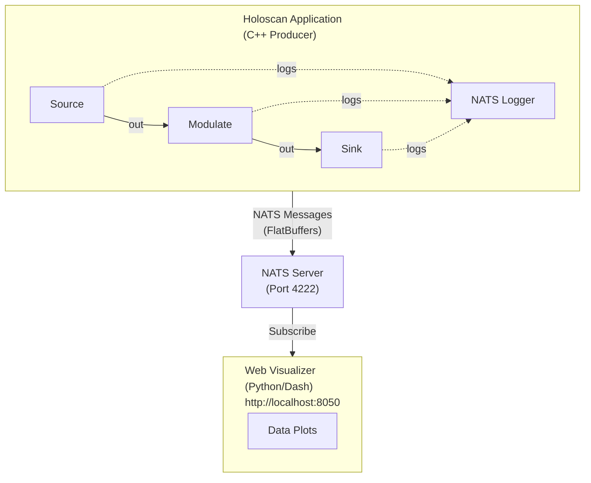

# Real-Time Data Stream Visualization with NATS and Web Dashboards

This example demonstrates real-time visualization of data from Holoscan applications using NATS messaging and web-based dashboards. It showcases how to stream tensor data from a Holoscan pipeline and visualize it dynamically in a browser.



## Overview

The example consists of three main components:

1. **C++ Data Producer**: A Holoscan application that generates data (sine waves) and publishes it to NATS
2. **NATS Server**: A message broker that handles real-time data streaming
3. **Python Web Visualizers**: Dash-based web applications that subscribe to NATS streams and display live plots

### Architecture



## Components

### C++ Application (`cpp/`)

The C++ application demonstrates a simple Holoscan pipeline with data logging:

- **SourceOp**: Generates sine waves with varying frequencies (10-20 Hz)
- **ModulateOp**: Adds high-frequency modulation (300 Hz) to the signal
- **SinkOp**: Receives the processed data
- **NatsLogger**: A custom data logger that publishes tensor data to NATS using FlatBuffers serialization

The application logs both inputs and outputs of operators, allowing visualization of data at each stage of the pipeline.

### Python Visualizers (`python/`)

Two visualization options are provided:

#### 1. Static Visualizer (`visualizer_static.py`)

- Displays predefined data streams: `source.out`, `modulate.in`, `modulate.out`, `sink.in`
- Best for applications with known, fixed operator topology
- All graphs are created upfront and updated as data arrives

The static visualizer can be used when the output data and format of the Holoscan pipeline is known or some data needs special formatting.

#### 2. Dynamic Visualizer (`visualizer_dynamic.py`)

- Automatically discovers and creates graphs for new data streams
- Ideal for applications with dynamic or unknown operator configurations
- Graphs are created on-the-fly as new unique IDs are detected

There is a script `start_visualizer.sh` which sets the required Python path to the flatbuffers definitions and starts the visualizer. The script takes a parameter, `dynamic` starts the dynamic visualizer and `static` starts the static visualizer.

Both visualizers display:
- Real-time line plots of tensor data
- Stream name (operator.port format)
- IO type (Input/Output)
- Acquisition timestamp (nanoseconds)
- Publish timestamp (nanoseconds)

### FlatBuffers Schemas (`schemas/`)

The data format is defined using FlatBuffers for efficient serialization:

- **message.fbs**: Top-level message structure with metadata
- **tensor.fbs**: Tensor data structure based on DLPack

## Prerequisites

### Python Dependencies

Install the required Python packages:

```bash
pip install -r requirements.txt
```

Required packages:
- `numpy>=1.24.0,<3.0` - Numerical computing
- `dash>=3.0.0,<4.0` - Web application framework
- `plotly>=6.0.0,<7.0` - Interactive plotting
- `nats-py>=2.0.0,<3.0` - NATS messaging client
- `flatbuffers>=25.9.23,<26.0.0` - FlatBuffers
- `pandas>=2.3.3,<3.0` - Data manipulation

## Usage

### Step 1: Start the NATS Server

In a terminal, start the NATS server using Docker:

```bash
cd applications/pipeline_visualization
./start_nats_server.sh
```

This will start a NATS server listening on `0.0.0.0:4222`.

### Step 2: Start the Visualizer

In a second terminal, start one of the Python visualizers:

```bash
cd applications/pipeline_visualization/visualizer
./start_visualizer.sh static   # or 'dynamic'
```

The web interface will be available at: **[http://localhost:8050](http://localhost:8050)**

### Step 3: Run the Holoscan Application

In a third terminal, run the C++ application:

```bash
# Run the Python version (default when --language is not specified)
./holohub run pipeline_visualization

# Or explicitly specify the language:
./holohub run pipeline_visualization --language python
./holohub run pipeline_visualization --language cpp
```

**Command-line Options:**
```text
Usage: ./pipeline_visualization [options]
Options:
  -h, --help            Display help information
  -d, --disable_logger  Disable NATS logger
  -c, --config          Config file path
  -u, --nats_url        NATS URL (default: nats://0.0.0.0:4222)
  -p, --subject_prefix  NATS subject prefix (default: nats_demo)
  -r, --publish_rate    Publish rate in Hz (default: 2.0)
```

**Example with custom settings:**
```bash
./holohub run pipeline_visualization --nats_url nats://0.0.0.0:4222 --subject_prefix my_demo --publish_rate 5.0
```

### Step 4: Visualize the Data

1. Open your web browser to [http://localhost:8050](http://localhost:8050)
2. Enter the subject name (default: `nats_demo`)
3. Click **Connect**
4. Watch the real-time data plots update!

The visualizer will display:
- **source.out**: Original sine wave from the source operator
- **modulate.in**: Input to the modulate operator (same as source.out)
- **modulate.out**: Modulated signal with high-frequency component
- **sink.in**: Final processed signal (same as modulate.out)

## Configuration

### NATS Logger Configuration (`pipeline_visualization.yaml`)

The NATS logger behavior can be configured via YAML:

```yaml
nats_logger:
  # Filter which operators to log (regex patterns)
  allowlist_patterns:
    - "*"
  denylist_patterns:
    - "*"
  log_inputs: true              # Log operator inputs
  log_outputs: true             # Log operator outputs
  log_metadata: true            # Include metadata in messages
  log_tensor_data_content: true # Include actual tensor data
```
## Data Format

### NATS Message Structure

Messages are published to the subject: `<subject_prefix>.data` (e.g., `nats_demo.data`)

Each message is a FlatBuffer-serialized `Message` containing:

```text
Message {
  unique_id: string          // Format: "operator_name.port_name"
  io_type: IOType            // kInput (0) or kOutput (1)
  acquisition_timestamp_ns: int64  // When data was acquired
  timestamp_ns: int64        // When message was published
  payload: Payload           // Union, currently always Tensor
}
```

### Unique ID Format

The `unique_id` field follows the format: `<operator_name>.<port_name>`

Examples:
- `source.out` - Output port of the source operator
- `modulate.in` - Input port of the modulate operator
- `modulate.out` - Output port of the modulate operator
- `sink.in` - Input port of the sink operator

## Troubleshooting

### NATS Connection Issues

**Problem**: `Cannot connect to NATS` error

**Solution**:
- Ensure the NATS server is running: `docker ps | grep nats`
- Check if port 4222 is available: `netstat -an | grep 4222`
- Verify the NATS URL matches in both the C++ app and visualizer

### Visualizer Not Updating

**Problem**: Web page loads but graphs don't update

**Solution**:
1. Check that the C++ application is running
2. Verify the subject name matches (default: `nats_demo`)
3. Click the "Connect" button in the web interface
4. Check browser console for JavaScript errors

### FlatBuffers Import Errors

**Problem**: `ModuleNotFoundError: No module named 'pipeline_visualization.flatbuffers'`

**Solution**:
- Ensure the FlatBuffers files were generated during build
- Set PYTHONPATH correctly:
  ```bash
  export PYTHONPATH=$PYTHONPATH:/path/to/build/applications/pipeline_visualization/flatbuffers/
  ```
- Verify the files exist in the build directory

### No Data Displayed

**Problem**: Graphs are empty or show no data

**Solution**:
- Check that `log_tensor_data_content: true` in the YAML config
- Verify the operator names match between the app and visualizer
- For static visualizer, ensure the unique IDs in the code match your operators
- For dynamic visualizer, wait a few seconds for auto-discovery

## Customization

### Adding Custom Operators

To visualize data from your own Holoscan operators:

1. Add the NATS logger to your application:
   ```cpp
   auto nats_logger = make_resource<NatsLogger>(
       "nats_logger",
       Arg("nats_url", "nats://0.0.0.0:4222"),
       Arg("subject_prefix", "my_app"));
   add_data_logger(nats_logger);
   ```

2. For static visualizer, update the `_unique_ids` list:
   ```python
   self._unique_ids = ["my_op.out", "my_other_op.in"]
   ```

3. For dynamic visualizer, no changes needed - it will auto-discover!

### Customizing Visualizations

The Plotly graphs can be customized by modifying the `px.line()` calls in the visualizer code:

```python
dcc.Graph(
    figure=px.line(
        x=np.arange(len(data)),
        y=data,
        labels={"x": "Sample", "y": "Amplitude"},
        title="My Custom Title",
        # Add more Plotly options here
    )
)
```

### Changing Update Rate

- **C++ side**: Use `--publish_rate` flag (default: 2 Hz)
- **Visualizer side**: Modify the `interval` parameter in milliseconds:
  ```python
  dcc.Interval(
      id="interval-component",
      interval=500,  # Update every 500ms (2 Hz)
  )
  ```

## Performance Considerations

- **Publish Rate**: Higher rates (>10 Hz) may cause latency in the web interface
- **Tensor Size**: Large tensors (>100K elements) may slow down serialization
- **Number of Streams**: The dynamic visualizer handles multiple streams, but too many (>20) may impact browser performance
- **NATS Queue**: Messages are queued if the visualizer can't keep up; monitor queue depth

## Advanced Usage

### Remote Visualization

To access the visualizer from another machine:

1. Start the visualizer with host `0.0.0.0` (already configured)
2. Ensure port 8050 is accessible through firewall
3. Access via: `http://<server-ip>:8050`

### Multiple Applications

To run multiple Holoscan apps simultaneously:

1. Use different subject prefixes for each app
2. Start multiple visualizer instances on different ports:
   ```python
   self._app.run(debug=True, host="0.0.0.0", port=8051)
   ```
