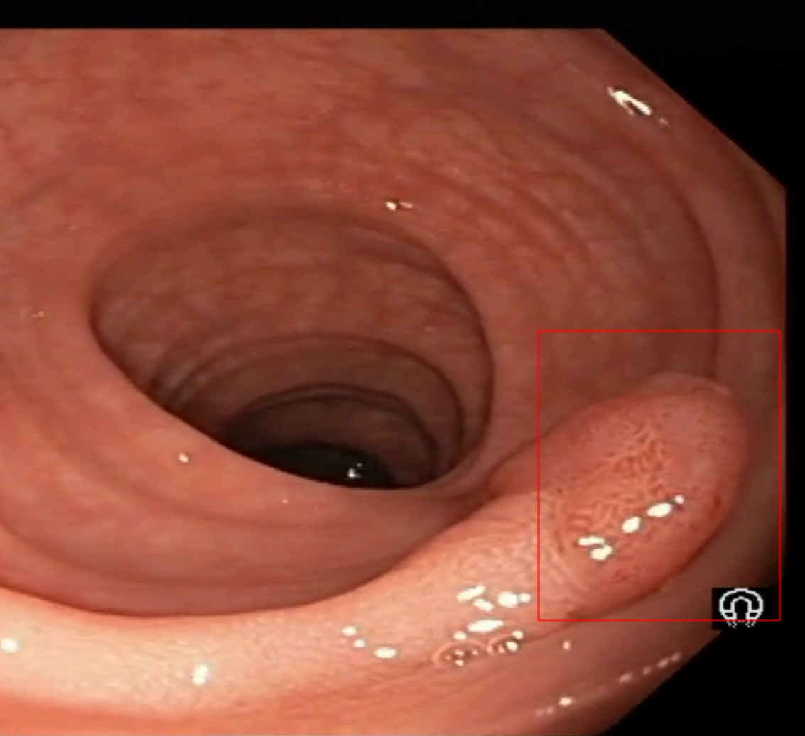

# Polyp Detection

This application demonstrates how to run polyp detection models on live video in real-time.




The model: [RT-DETR v2](https://github.com/lyuwenyu/RT-DETR) is trained on the [REAL-Colon](https://www.nature.com/articles/s41597-024-03359-0) dataset.

Compared to the `SSD` object detection model described in the [paper](https://www.nature.com/articles/s41597-024-03359-0), `RT-DETR` demonstrates improvements. The table below shows metrics for SSD obtained from Table 3 of the paper, and metrics for RT-DETR calculated on the same test set (using all test images from the `REAL-Colon` dataset).

| Method  | MAP@0.5 | MAP@0.5:0.95 |
|---------|---------|--------------|
| SSD     | 0.338   | 0.216        |
| RT-DETR | 0.452   | 0.301        |


## Run Instructions

For simplicity a DockerFile is available. To run this application:

```Bash
./holohub run polyp_detection
```

The [(NGC) Sample App Model for AI Polyp Detection](https://catalog.ngc.nvidia.com/orgs/nvidia/teams/clara-holoscan/models/polyp_detection_rt_detr_model) and the [(NGC) Sample App Data](https://catalog.ngc.nvidia.com/orgs/nvidia/teams/clara-holoscan/resources/holoscan_colonoscopy_sample_data) are automatically downloaded and converted to the correct format when first run the application.

If you want to manually convert the video data, please refer to the instructions for using the [convert_video_to_gxf_entities](https://github.com/nvidia-holoscan/holoscan-sdk/tree/main/scripts#convert_video_to_gxf_entitiespy) script.

If you want to run the `polyp_detection.py` script directly with the built docker container, please refer to the following instructions:

- Ensure that the `rtdetrv2_timm_r50_nvimagenet_pretrained_neg_finetune_bhwc.onnx` file is located in the directory specified by the `data` argument.
- Verify that the generated video files (`.gxf_index` and `.gxf_entities` files) are in the directory specified by the `video_dir` argument.
- Specify the correct video width and height using the `video_size` argument.

For example:
```Bash
python polyp_detection.py --data /path-to-onnx-model/ --video_dir /path-to-video/ --video_size "(width, height)"
```
