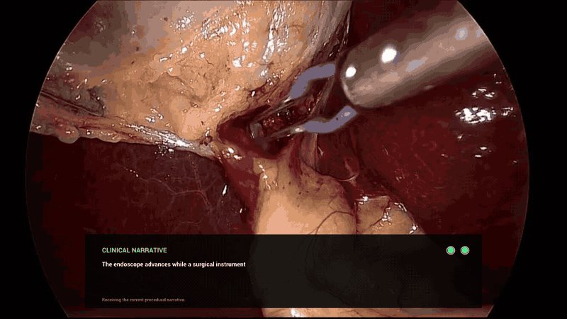
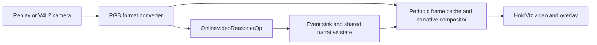

# Procedural Narrator

`procedural_narrator` displays a clinical video replay or V4L2 camera feed and
uses `OnlineVideoReasonerOp` to produce an ongoing narrative of visible actions
and changes. Video is submitted as a temporally ordered MP4 clip rather than as
unrelated still images.





## Display

The video remains the full-window canvas and the current statement appears in
one dark card at the bottom. The card is replaced as the observed procedure
changes; it is not a scrolling chat transcript. Narration remains solid white
while a slow-pulsing grey line beneath it reports collection and model activity.

Two circles in the card's upper-right corner show input and model status:

- The left circle is hollow without video and green while frames are arriving.
- The right circle is hollow while the model is ready, blinks while inference
  is in flight, and stays green while SSE results are arriving. An error makes
  it red.

## Prerequisites

- Holoscan SDK 4.4.0.
- An OpenAI-compatible `/v1/chat/completions` endpoint that accepts MP4
  `video_url` inputs, such as a service hosting `nvidia/Cosmos3-Edge`.
- A display for the HoloViz window.
- A V4L2-compatible camera for the `v4l2` mode.

### Start a Cosmos3-Edge endpoint

The [`nvidia/Cosmos3-Edge` model card](https://huggingface.co/nvidia/Cosmos3-Edge#vllm)
is the authoritative deployment reference. With its
`vllm/vllm-openai:cosmos3` container, this application's data-URL-only workflow
can use the following reasoner command:

```bash
vllm serve nvidia/Cosmos3-Edge \
  --host 0.0.0.0 \
  --port 8000 \
  --max-model-len 131072 \
  --mm-processor-kwargs \
    '{"do_resize": true, "min_pixels": 4096, "max_pixels": 16777216}' \
  --media-io-kwargs '{"video": {"num_frames": 256}}'
```

After vLLM reports that the server is ready, verify the endpoint:

```bash
curl --fail http://127.0.0.1:8000/v1/models
```

Run the service on the same host or on a network-reachable server. The
application sends base64-encoded MP4 clips to
`http://127.0.0.1:8000/v1/chat/completions` by default.
Video is sent to this configurable network endpoint. HTTP is accepted only for
`localhost` or a literal loopback address; every non-local endpoint must use
HTTPS.

Set `reasoner.endpoint` and `reasoner.model` in
[`procedural_narrator.yaml`](procedural_narrator.yaml). If authentication is
required, export the configured API-key variable:

```bash
export REASONER_API_KEY="<token>"
```

The standard `./holohub run` modes automatically forward this variable into
the application container.

For a temporary endpoint override, pass
`--run-args="--endpoint https://host:port/v1/chat/completions"`.

## Reasoning output and thinking mode

Cosmos3-Edge enables thinking by default and returns a reasoning preamble
ending in `</think>` before the final answer. The shipped configuration sets
`chat_template_kwargs.enable_thinking` to `false` because this application
displays an observational narrative rather than the model's internal reasoning.
The application also removes such a preamble defensively before display.

To enable Cosmos3-Edge thinking mode, update the reasoner configuration and
allow at least 4096 output tokens, as recommended by the model card:

```yaml
reasoner:
  max_tokens: 4096
  request_options:
    chat_template_kwargs:
      enable_thinking: true
```

Thinking mode increases output length and latency. Only enable it when another
consumer needs the full reasoning output. With the flag explicitly enabled,
Procedural Narrator buffers streamed text until the closing `</think>` delimiter
arrives, then displays only the concise narration. A response without that
delimiter is not shown.

## Run a replay

The default mode downloads and replays the standard Holohub surgical video:

```bash
./holohub build procedural_narrator --dryrun --verbose
./holohub build procedural_narrator
./holohub run procedural_narrator replayer --dryrun --verbose
./holohub run procedural_narrator replayer
```

## Run a camera

The `v4l2` mode maps the default camera, `/dev/video0`, into the application
container:

```bash
./holohub run procedural_narrator v4l2 --dryrun --verbose
./holohub run procedural_narrator v4l2
```

To use a different device without editing the YAML, map that device into the
container and pass the same path to the application:

```bash
./holohub run procedural_narrator v4l2 \
  --dryrun --verbose \
  --docker-opts="--env=REASONER_API_KEY --device=/dev/video2:/dev/video2" \
  --run-args="--video-device /dev/video2"
./holohub run procedural_narrator v4l2 \
  --docker-opts="--env=REASONER_API_KEY --device=/dev/video2:/dev/video2" \
  --run-args="--video-device /dev/video2"
```

`--docker-opts` replaces the mode's default Docker arguments, so the override
also repeats the API-key forwarding.

The default `v4l2_source.pixel_format` is `YUYV`. Check the formats advertised
by the selected camera before running:

```bash
v4l2-ctl --device=/dev/video0 --list-formats-ext
```

If `YUYV` is unavailable, change `pixel_format` in
[`procedural_narrator.yaml`](procedural_narrator.yaml) to a format supported by
the camera, such as `MJPG`, or use `auto` to let the source negotiate.

## Behaviour

The default four-second rolling window is sampled at four frames per second.
The model circle blinks after an encoded clip is dispatched and while the
application waits for a response. It turns green when SSE text starts arriving;
the canonical `completed` text replaces the partial response when the request
finishes. Collection and waiting messages never replace the latest narration;
they pulse beneath it until new streamed text arrives. The display repaints
independently of frame arrival, so streamed model state remains responsive and
a stalled source changes the video circle to hollow.

The generated text is observational output and is not a diagnosis, clinical
record, or substitute for clinician judgement.

## Validation status

| Configuration | Status |
| ------------- | ------ |
| NVIDIA GB10 (`aarch64`), Holoscan 4.4, replay, live Cosmos3-Edge endpoint and SSE display | Tested |
| A6000 RTX workstation (`x86_64`), Holoscan 4.4, replay, live Cosmos3-Edge endpoint and SSE display | Tested |
| Physical V4L2 camera | Not tested |
