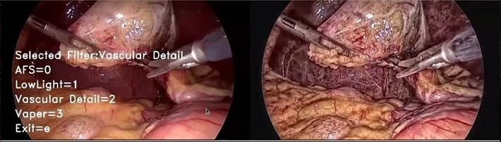

# ProHawk Video Replayer

This application utilizes the ProHawk restoration operator along with Holoscan's Video Replayer and Holoviz operators to enhance and restore medical imagery in real-time, offering superior image quality. The user-friendly interface of the application provides a range of filter options, enabling users to dynamically select the most suitable filter for optimal results.



## ProHawk Vision Restoration Operator

The ProHawk Vision Operator is a groundbreaking solution that is transforming both healthcare and manufacturing industries by revolutionizing computer vision technology with its patented restoration capabilities. It seamlessly integrates into the NVIDIA Holoscan full-stack infrastructure, fundamentally altering the way healthcare professionals diagnose and treat patients, while also optimizing manufacturing processes. In healthcare, the ProHawk Vision Operator Plugin automatically interprets medical imaging frames, identifies real-world conditions, and employs precise control over ProHawk Vision Restoration algorithms, all driven by an objective mathematical model using quantitative measurements to enhance accuracy in diagnoses and treatments by restoring degraded frames. In manufacturing, the ProHawk Vision Operator Plugin algorithms reveal manufacturing line defects ensuring product quality.

## Application Controls

The operator can be controlled with keyboard shortcuts:

- **AFS (0)** - Automatic Filter Selection (AFS) – Automatically and continuously adjust the image pixel values to maximize image detail and visibility.
- **LowLight (1)** - Lowlight preset filter that corrects lighting compromised imagery.
- **Vascular Detail (2)** - Vasculature Detail Preset Filter that reveals the fine details of vasculature structures without the need for dye or contrast agents.
- **Vapor (3)** - Vapor Preset Filter that removes vapor, smoke, and stream from the video.
- **Disable Restoration (d)** - Disable ProHawk Vision computer vision restoration.
- **Side-by-Side View (v)** - Display Side-by-Side (restored/non-restores) Video.
- **Display Menu Items (m)** - Display menus control items.
- **Quit (q)** - Exit the application

## Data

The following dataset is used by this application:
[📦️ (NGC) Sample App Data for AI-based Endoscopy Tool Tracking](https://catalog.ngc.nvidia.com/orgs/nvidia/teams/clara-holoscan/resources/holoscan_endoscopy_sample_data).


## Quick Start

To build this application within a container and run it, please use the following command:

```bash
./holohub run prohawk_video_replayer
```

For a separate build and run, please see the following instructions:

### Step by step build and run

From the Holohub main directory run the following command:

  ```bash
  ./holohub build-container prohawk_video_replayer
  ```

Then launch the container to build the application:

  ```bash
  ./holohub run-container prohawk_video_replayer --no-docker-build
  ```

Inside the container build the application:

  ```bash
  ./holohub build prohawk_video_replayer
  ```

Inside the container run the application:

- C++:
    ```bash
    ./holohub run prohawk_video_replayer --language=cpp --no-local-build
    ```
- Python:
    ```bash
    export PYTHONPATH=$PYTHONPATH:/workspace/holohub/build/python/lib/
    python <prohawk_app_dir>/python/prohawk_video_replayer.py
    ```

For more information about this application and operator please visit [https://prohawk.ai/prohawk-vision-operator/#learn](https://prohawk.ai/prohawk-vision-operator/#learn)
For technical support or other assistance, please don't hesitate to visit us at [https://prohawk.ai/contact](https://prohawk.ai/contact)
