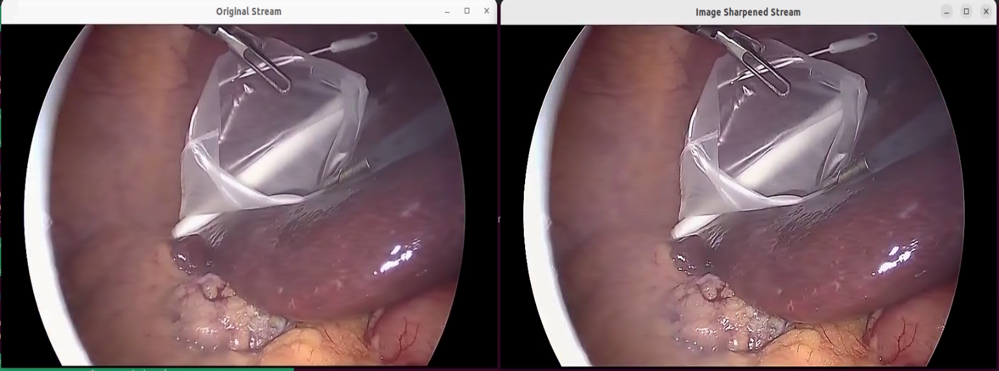

# PVA-Accelerated Image Sharpening

This application demonstrates the usage of [Programmable Vision Accelerator (PVA)](#about-pva) within a Holoscan
application. It reads a video stream, applies a 2D unsharp mask filter and renders it via the
visualizer. The unsharp mask filtering operation is done in PVA. Since the PVA is used for this
operation, the GPU workload is minimized. This example is a demonstration of how pre-processing, post-processing, and image processing tasks can be offloaded from a GPU, allowing it to concentrate on more compute-intensive machine learning and artificial intelligence tasks.

This example application processes a video stream, displaying two visualizer windows: one for the original stream and another for the stream enhanced with image sharpening via PVA.

## About PVA

PVA is a highly power-efficient VLIW processor integrated into NVIDIA Tegra platforms, specifically designed for advanced image processing and computer vision algorithms. The Compute Unified Programmable Vision Accelerator (CUPVA) SDK offers a comprehensive and unified programming model for PVA, enabling developers to create and optimize their own algorithms. For access to the SDK and further development opportunities, please contact NVIDIA.

## Content

- `main.cpp`: This file contains a C++ Holoscan application that demonstrates the use of an operator for loading and executing a pre-compiled PVA library dedicated to performing the unsharp masking algorithm on images. CUPVA SDK and license are not required to run this Holohub application.
- `pva_unsharp_mask/`: This directory houses the `pva_unsharp_mask.hpp` header file, which declares the `PvaUnsharpMask` class. The `PvaUnsharpMask` class includes an `init` API, invoked for the initial tensor, and a `process` API, used for processing input tensors. Pre-compiled algorithm library file, `libpva_unsharp_mask.a`, and the corresponding allowlist file, `cupva_allowlist_pva_unsharp_mask`, are automatically downloaded by the CMake scripts.
Please note that only PVA executables with signatures included in a secure allowlist database are permitted to execute on the PVA. This ensures that only verified and trusted executables are run, enhancing the security and integrity of the system.

## Algorithm Overview

The PVAVideoFilterExecutor operator performs an image sharpening operation in three steps:

1. Convert the input RGB image to the NV24 color format.
2. Apply a 5x5 unsharp mask filter on the luminance color plane.
3. Convert the enhanced image back to the RGB format.

Numerous algorithm examples leveraging the PVA can be found in the [Vision Programming Interface (VPI) library](https://developer.nvidia.com/embedded/vpi). VPI enables computer vision software developers to utilize multiple compute engines simultaneously&mdash;including CPU, GPU, PVA, VIC, NVENC, and OFA&mdash;through a unified interface. For comprehensive details, please refer to the [VPI Documentation](https://docs.nvidia.com/vpi/index.html).

## Compiling the application

Build the application inside docker

```
$ ./holohub build-container pva_video_filter --base-img nvcr.io/nvidia/clara-holoscan/holoscan:v2.1.0-dgpu 
# Check which version of CUPVA is installed on your platform at /opt/nvidia
$ ./holohub run-container pva_video_filter --no-docker-build --docker_opts "-v /opt/nvidia/cupva-<version>:/opt/nvidia/cupva-<version> --device /dev/nvhost-ctrl-pva0:/dev/nvhost-ctrl-pva0 --device /dev/nvmap:/dev/nvmap --device /dev/dri/renderD129:/dev/dri/renderD129"
```

Inside docker, add to your environment variable the following directories:
```
# inside docker
$ export LD_LIBRARY_PATH=$LD_LIBRARY_PATH:/usr/lib/aarch64-linux-gnu/tegra/:/opt/nvidia/cupva-2.5/lib/aarch64-linux-gnu/
```

Build the application inside docker:
```
$ ./holohub build pva_video_filter --local
```
## Running the application

The application takes an endoscopy video stream as input, applies the unsharp mask filter, and shows it in
HoloViz window.

Before running the application, deploy VPU application signature allowlist on target in your host (outside a container):
```bash
sudo cp <HOLOHUB_BUILD_DIR>/applications/pva_video_filter/cpp/pva_unsharp_mask/cupva_allowlist_pva_unsharp_mask /etc/pva/allow.d/cupva_allowlist_pva_unsharp_mask
sudo pva_allow
```

Run the same docker container you used to build your application

```
$ ./holohub run-container pva_video_filter --no-docker-build --docker_opts "-v /opt/nvidia/cupva-<version>:/opt/nvidia/cupva-<version> --device /dev/nvhost-ctrl-pva0:/dev/nvhost-ctrl-pva0 --device /dev/nvmap:/dev/nvmap --device /dev/dri/renderD129:/dev/dri/renderD129"

# inside docker
# don't forget the line below to export the environment variables
$ export LD_LIBRARY_PATH=$LD_LIBRARY_PATH:/usr/lib/aarch64-linux-gnu/tegra/:/opt/nvidia/cupva-2.5/lib/aarch64-linux-gnu/
$ ./holohub run pva_video_filter --local --no-local-build
```



