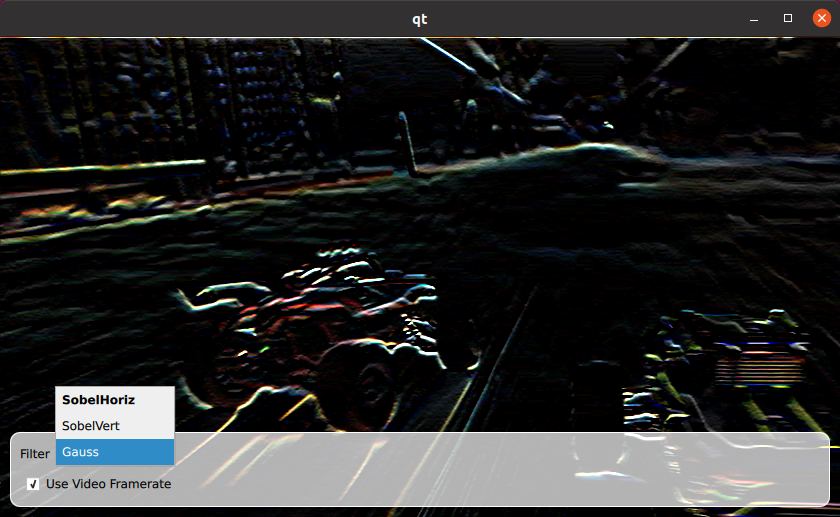
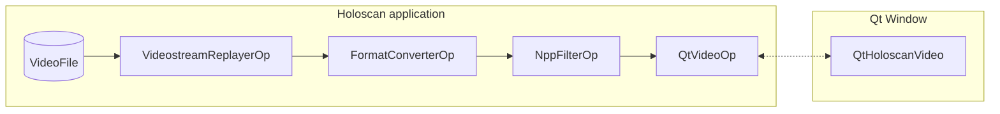

# Qt Video Replayer

<br>

This application demonstrates how to integrate Holoscan with a [Qt](https://www.qt.io/) application. It support displaying the video frames output by a Holoscan operator and changing operator properties using Qt UI elements.



The application uses the VideostreamReplayerOp to read from a file on disk, the FormatConverterOp to convert the frames from RGB to RGBA, the [NppFilterOp](../../operators/npp_filter/README.md) to apply a filter to the frame and the [QtVideoOp](../../operators/qt_video/README.md) operator to display the video stream in a Qt window.

The [QtHoloscanApp](./qt_holoscan_app.hpp) class, which extends the `holoscan::Application` class, is used to expose parameters of Holoscan operators as Qt properties.

For example the application uses a [QML Checkbox](https://doc.qt.io/qt-6/qml-qtquick-controls-checkbox.html) is used the set the `realtime` property of the `VideostreamReplayerOp` operator.

```
    CheckBox {
        id: realtime
        text: "Use Video Framerate"
        checked: holoscanApp.realtime
        onCheckedChanged: {
            holoscanApp.realtime = checked;
        }
    }
```

The [QtHoloscanVideo](../../operators/qt_video/qt_video_op.hpp) is a QQuickItem which can be use in the QML file. Multiple `QtHoloscanVideo` items can be placed in a Qt window.

```
import QtHoloscanVideo
Item {
    QtHoloscanVideo {
        objectName: "video"
    }
}
```

## Run Instructions

> **Note:** This application container is pinned to Holoscan SDK 3.2 since it requires CUDA Driver 550+ for running with Holoscan SDK 3.3+.

This application requires [Qt](https://www.qt.io/).

For simplicity a DockerFile is available. To run this application:

```bash
./holohub run qt_video_replayer
```
