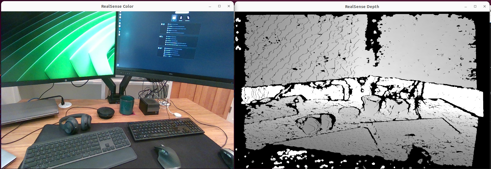

# Intel RealSense Camera Visualizer

Visualizes frames captured from an Intel RealSense camera.
<br>

# Build and Run
This application requires an Intel RealSense camera.

At the top level of the holohub run the following command:

```bash
./holohub run realsense_visualizer
```
