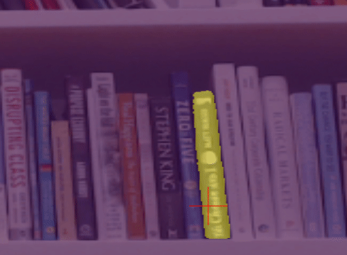

# 📷 Holoscan SAM2

This application demonstrates how to run [SAM2](https://github.com/facebookresearch/segment-anything-2) models on live video feed with the possibility of changing query points in real-time.

<p align="center">
  
</p>

The application currently uses a single query point as a foreground point that moves on the perimeter of a circle with a configured angular speed. 
The models returns three masks, the best mask is selected based on the model scores. For visualization, two options exist. Select between "logits" or "masks". 
- "logits": predictions of the network, mapped onto a colorscale that matches matplotlib.pyplot's "viridis" 
- "masks": binarized predictions

SAM2, recently announced by Meta, is the next iteration of the Segment Anything Model (SAM). This new version expands upon its predecessor by adding the capability to segment both videos and images.
This sample application wraps the ImageInference class, and applies it on a live video feed.

Note: This demo currently uses ["sam2_hiera_l.yaml"](https://huggingface.co/Efficient-Large-Model/Llama-3-VILA1.5-8b-AWQ), but any of the sam2 models work. You only need to adjust [segment_one_thing.yaml](./segment_one_thing.yaml).

## ⚙️ Setup Instructions
The app defaults to using the video device at `/dev/video0`

To debug if this is the correct device download `v4l2-ctl`:
```bash
sudo apt-get install v4l-utils
```
To check for your devices run:
```bash
v4l2-ctl --list-devices
```
This command will output something similar to this:
```bash
NVIDIA Tegra Video Input Device (platform:tegra-camrtc-ca):
        /dev/media0

vi-output, lt6911uxc 2-0056 (platform:tegra-capture-vi:0):
        /dev/video0

Dummy video device (0x0000) (platform:v4l2loopback-000):
        /dev/video3
```
Determine your desired video device and edit the source device in [segment_one_thing.yaml](segment_one_thing.yaml)

## 🚀 Build and Run Instructions

### ARM64 and x86
This application uses a custom Dockerfile based on a pytorch container.
Build and run the application using
```sh
 ./dev_container build_and_run sam2 --docker_file applications/sam2/Dockerfile --img holohub:sam2.1
``` 
Or first build the container, then launch it and run.

```sh
 ./dev_container build --docker_file applications/sam2/Dockerfile --img holohub:sam2.1
```
```sh
./dev_container launch --img holohub:sam2.1
```
```sh
./run launch sam2
```

### x86 only
If you are only using an x86 system, you may use a Dockerfile based on the Holoscan container. Replace the [Dockerfile](./Dockerfile) with this [alternative Dockerfile](./alternative_docker/Dockerfile). 
Then, from the Holohub main directory run the following command:
```sh
./dev_container build_and_run sam2
```

Alternatively build and run: 
```bash
./dev_container vscode sam2
```
Run the application in debug mode from vscode, or execute it by
```sh
python applications/sam2/segment_one_thing.py
```


You can choose to output "logits" or "masks" in the configuration of the postprocessor and holoviz operator [segment_one_thing.yaml](segment_one_thing.yaml)

## 💻 Supported Hardware
- x86 w/ dGPU
- IGX devKit w/ dGPU

## 🙌 Acknowledgements
- Meta, [SAM2](https://github.com/facebookresearch/segment-anything-2): for providing these models and inference infrastructure
