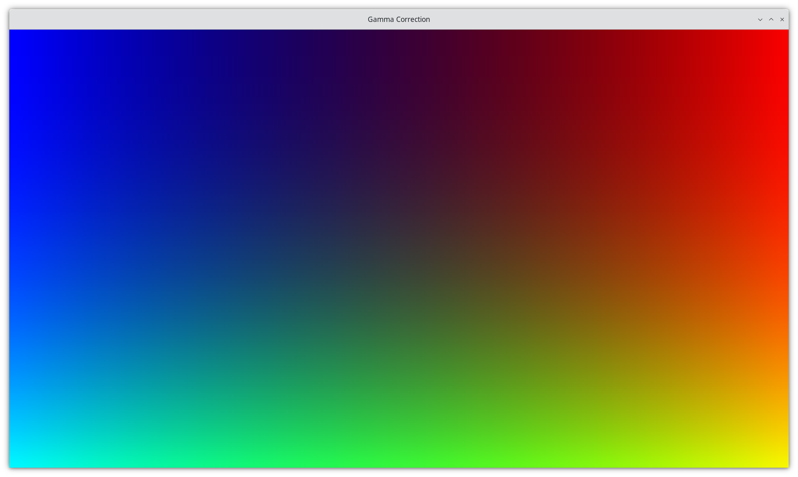
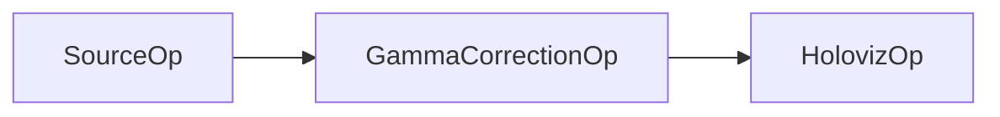

# Slang Gamma Correction Example

A Holoscan application demonstrating the integration of Slang shading language for GPU-accelerated gamma correction on image data.

## Overview

This application showcases how to use the Slang shading language operator (`SlangShaderOp`) within Holoscan applications for GPU-accelerated image processing. The example implements a pipeline that generates a test image with smooth color transitions, applies gamma correction using a Slang compute shader, and displays the result with proper sRGB color space handling.



### What is Gamma Correction?

Gamma correction is a non-linear operation used to encode and decode luminance or tristimulus values in video or still image systems. It's essential for:
- Correcting the non-linear response of display devices
- Ensuring proper color reproduction across different devices
- Converting between linear and sRGB color spaces
- Improving image quality and color accuracy

### What is Slang?

[Slang](https://github.com/shader-slang/slang) is a shading language that provides a modern, high-level interface for GPU programming. It supports both traditional graphics shaders and compute kernels, making it ideal for GPU-accelerated image processing in Holoscan applications.

## Application Structure

The application consists of four main components:

1. **SourceOp**: Generates a 64x64x3 RGB test image with smooth color transitions
2. **GammaCorrectionOp**: Processes the image using a Slang compute shader for gamma correction
3. **HolovizOp**: Displays the processed image with proper sRGB color space handling
4. **Slang Shader**: GPU-accelerated gamma correction kernel

### Pipeline Flow



## Prerequisites

- Holoscan SDK 3.5.0 or later
- CUDA-capable GPU (for GPU acceleration)
- Python 3.10+ (for Python implementation)
- C++ compiler with CUDA support (for C++ implementation)

## Supported Platforms

- x86_64
- aarch64

## Installation

1. Clone the HoloHub repository
2. Navigate to the slang_gamma_correction directory

## Usage

### Running the Application

```bash
# Run the C++ version
./holohub run slang_gamma_correction

# Run the Python version
./holohub run slang_gamma_correction --language=python
```

## Customization

### Modifying the Gamma Value

You can adjust the gamma correction parameter:

#### C++
```cpp
auto gamma_correction = make_operator<ops::GammaCorrectionOp>(
    "GammaCorrection",
    Arg("gamma", 1.8f),  // Change this value
    Arg("data_type", std::string("uint8_t")),
    Arg("component_count", 3));
```

#### Python
```python
gamma_correction = GammaCorrectionOp(
    self,
    name="GammaCorrection",
    gamma=1.8,  # Change this value
    data_type="uint8_t",
    component_count=3
)
```

## Related Documentation

- [Slang Language Reference](https://github.com/shader-slang/slang)
- [Gamma Correction Theory](https://en.wikipedia.org/wiki/Gamma_correction)
- [sRGB Color Space](https://en.wikipedia.org/wiki/SRGB)

## License

This project is licensed under the Apache License 2.0. See the LICENSE file for details.

## Contributing

Contributions are welcome! Please refer to the HoloHub contribution guidelines for more information.

