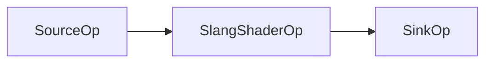

# Slang Simple Compute Kernel Example

A Holoscan application demonstrating the integration of Slang shading language for GPU-accelerated compute kernels.

## Overview

This application showcases how to use the Slang shading language operator (`SlangShaderOp`) within Holoscan applications for GPU-accelerated data processing. The example implements a simple pipeline that generates incrementing integer values, processes them through a Slang compute shader, and outputs the results.

### What is Slang?

[Slang](https://github.com/shader-slang/slang) is a shading language that provides a modern, high-level interface for GPU programming. It supports both traditional graphics shaders and compute kernels, making it ideal for GPU-accelerated data processing in Holoscan applications.

## Application Structure

The application consists of three main components:

1. **SourceOp**: Generates a single-element Tensor containing incrementing integer values (1, 2, 3, ...)
2. **SlangShaderOp**: Processes data using a Slang compute shader
3. **SinkOp**: Receives and prints the processed results

### Pipeline Flow



## Prerequisites

- Holoscan SDK 3.3.0 or later
- CUDA-capable GPU (for GPU acceleration)
- Python 3.8+ (for Python implementation)
- C++ compiler with CUDA support (for C++ implementation)

## Supported Platforms

- x86_64
- aarch64

## Installation

1. Ensure you have the Holoscan SDK installed
2. Clone the HoloHub repository
3. Navigate to the slang_simple directory

## Usage

### Running the Application

```bash
# Run the C++ version
./holohub run slang_simple

# Run the Python version
./holohub run slang_simple --language=python
```

## Slang Shader Code

The application uses a simple Slang compute shader (`simple.slang`) that adds a offset to each input element:

```slang
// Import the holoscan library
import holoscan;

// Create an input port named "input_buffer"
[holoscan::input("input_buffer")]
RWStructuredBuffer<int> input_buffer;

// Create an output port named "output_buffer"
[holoscan::output("output_buffer")]
// Use the size of the input buffer to allocate the output buffer
[holoscan::alloc::size_of("input_buffer")]
RWStructuredBuffer<int> output_buffer;

// Create a parameter named "offset"
[holoscan::parameter("offset")]
uniform int offset;

// Use the size of the input buffer to set the grid size
[holoscan::grid::size_of("input_buffer")]
[shader("compute")]
void add(uint3 gid : SV_DispatchThreadID)
{
   output_buffer[gid.x] = input_buffer[gid.x] + offset;
}
```

### Shader Features Demonstrated

- **Input/Output Buffers**: The shader defines input and output buffers using Holoscan annotations
- **Parameters**: A uniform parameter can be set from the host application
- **Grid Size**: The compute grid size is automatically set based on input buffer size
- **Simple Computation**: Each thread adds a offset to the corresponding input element, the offset is set by a parameter

Note that the data sent to the input of `SlangShaderOp` must be a data buffer (currently `holoscan::Tensor` and `nvidia::gxf::VideoBuffer` types are supported). For Python, any array-like objects implementing the `__dlpack__`, `__array_interface__` or `__cuda_array_interface__` are also supported.

## Expected Output

The application will output processed values showing the result of adding the offset (10) to each input value:

```
Received value: 11
Received value: 12
Received value: 13
...
Received value: 20
```

## Customization

### Modifying the Shader

You can modify the `simple.slang` file to implement different computations:

1. Change the computation in the `add` function
2. Add more parameters using `[holoscan::parameter("name")]`
3. Modify buffer types and sizes
4. Add more complex GPU algorithms

### Changing Parameters

In the application code, you can modify the parameter value:

#### C++
```cpp
auto slang = make_operator<ops::SlangShaderOp>("Slang",
                                               Arg("shader_source_file", "simple.slang"),
                                               Arg("parameter", 42),  // Change this value
                                               make_condition<CountCondition>(10));
```

#### Python
```python
slang = SlangShaderOp(self, name="Slang", shader_source_file="simple.slang")
slang.add_arg(parameter=42)  # Change this value
```

## Performance Considerations

- The Slang shader runs on the GPU, providing significant performance benefits for large datasets
- The compute grid is automatically sized based on input data dimensions

## Troubleshooting

### Common Issues

1. **Shader compilation errors**: Check the Slang shader syntax and Holoscan annotations

## Related Documentation

- [Slang Language Reference](https://github.com/shader-slang/slang)

## License

This project is licensed under the Apache License 2.0. See the LICENSE file for details.

## Contributing

Contributions are welcome! Please refer to the HoloHub contribution guidelines for more information.
