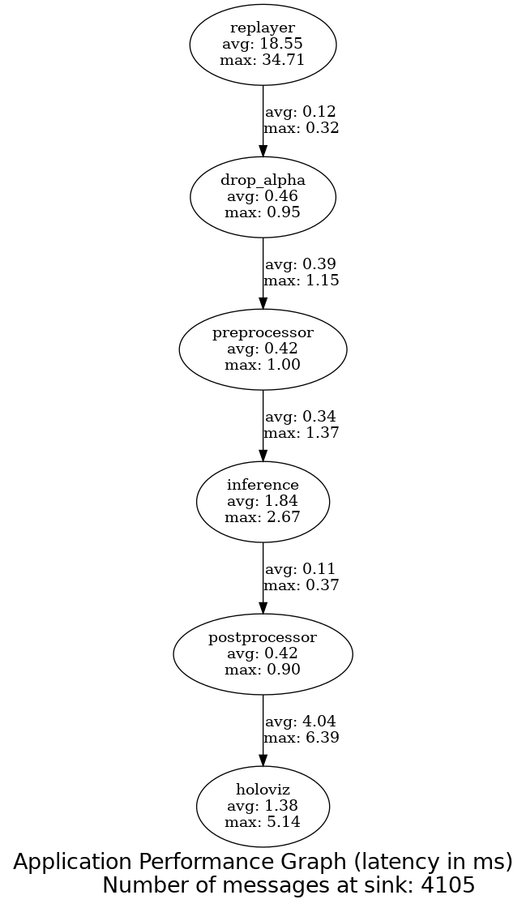

# Super Resolution Demo
This application demonstrates real-time video super resolution implemented through a holoscan
inference operator. The demo pipline with latency measurements looks like this:


*Latency measured using HSDK2.7 with cuda 12.6 and TRT 10.3.0 The inference latency will be higher if using TRT 8.6.0 instead*

This simple pipeline consists of a video being read from disk, pre-processed and downsampled for
ingestion into the inference operator which then upsamples the video frames for display in holoviz.

## Video Replayer
The video replayed from gxf entity files. Useful scripts for converting to and from gxf entities
are available on [GitHub](https://github.com/nvidia-holoscan/holoscan-sdk/tree/main/scripts#convert_video_to_gxf_entitiespy).
The directory and basename in the yaml config file should be updated to match it's location:
```
replayer:
  directory: <path/to/directory>
  basename: <basename>
```

## Preprocessing
After dropping the alpha channel the tensors are converted to float32 with an RGB channel ordering 
and resized to match the expected input of the tensor using the `FormatConverterOp`. Alternatively, 
downsampling and zero-padding could be used to match the input shape of the engine file. 

## Inference 

Engine files are obtained from secure link. Make sure to to update `sr_inference: model_path_map:` 
in the configuration file to match the name and location of the downloaded engine files. The engine 
file used should match the hardware and software being used for inference. Please note before 
HSDK 2.6 the TRT version in the base image was 8.6 and in HSDK 2.6 and 2.7 it is 10.3.

The TRT engine expects to receive a 544x960x3 float32 input and outputs a 1080x1920x3 float32 
tensor. The image is expected to be in RGB channel ordering and normalized on the range [-1,1].
This can be accomplished using the `FormatConverterOp` for preprocessing if necessary.

## Postprocessing and Display
`FormatConverterOp` is used again to convert the output to a `unit8` image scaled `0-255`.
The results are displayed using Holoviz.


## Build and Run Instructions

To build the dev container with a specific HSDK release the optional '--base_img' flag can be given
```sh
./dev_container build --base_img nvcr.io/nvidia/clara-holoscan/holoscan:v2.3.0-dgpu
```
The dev container can then be launch and the application built and run
```sh
./dev_container run
./run build sr_demo
./run launch sr_demo
```