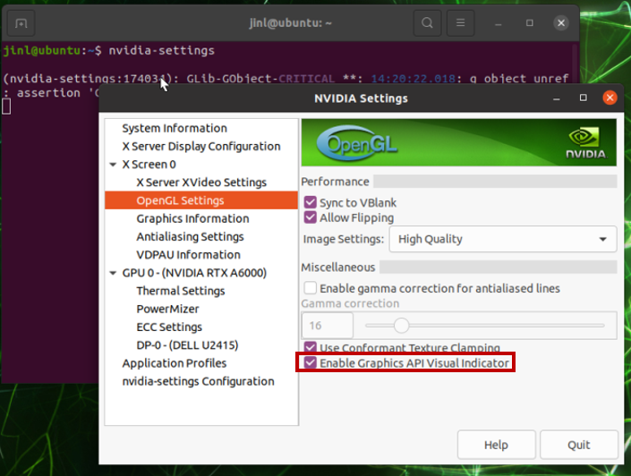
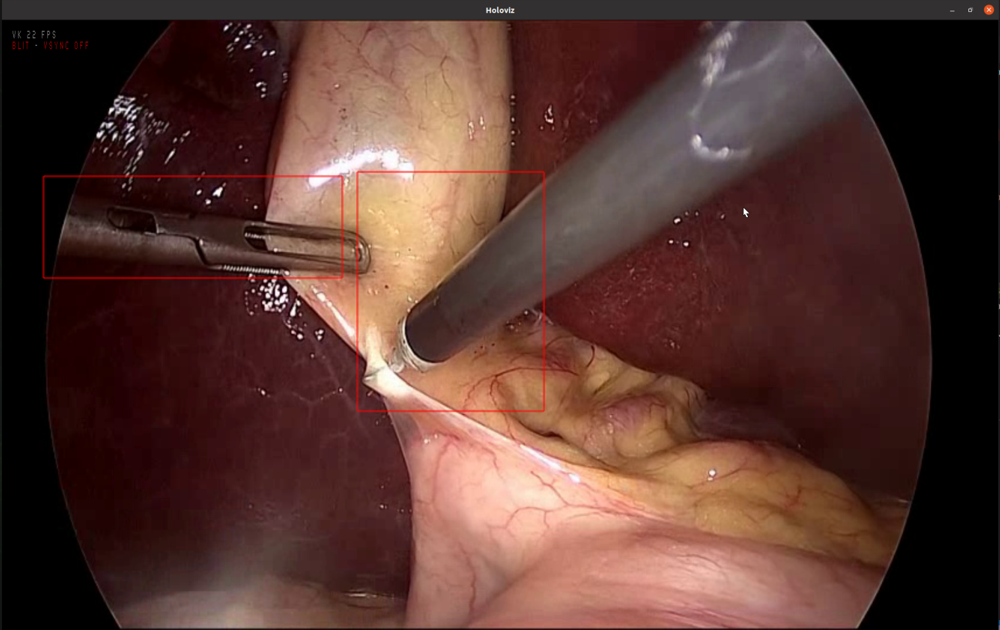
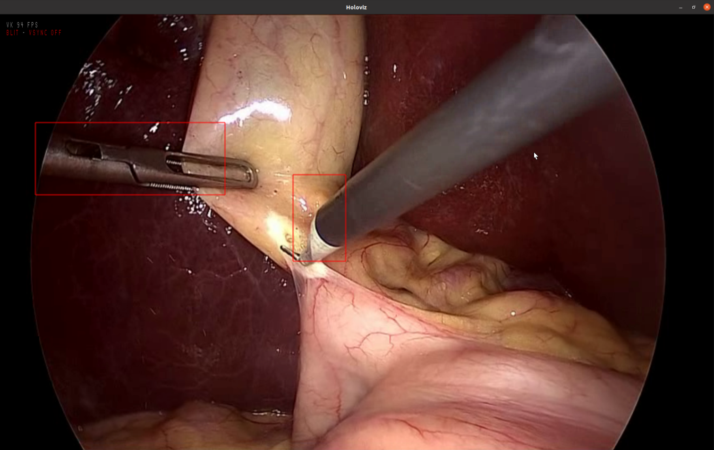
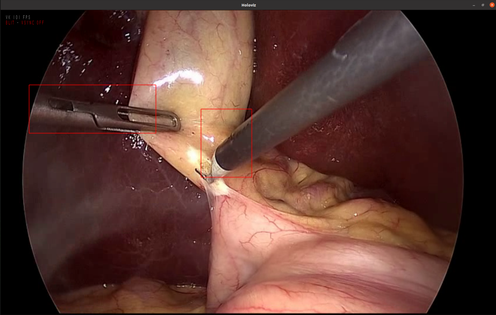
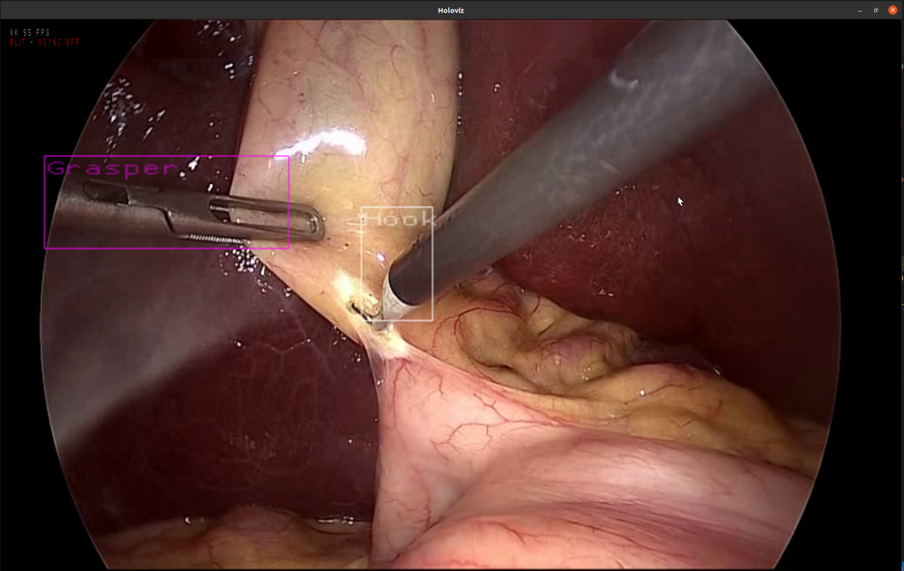

# Tutorial on Application Development
## Application Development Workflow Overview
The example model chosen for the bring-your-own-model (BYOM) process is the [SSD](https://github.com/NVIDIA/DeepLearningExamples/tree/master/PyTorch/Detection/SSD) model. We have the steps below where each step is an improvement on the previous.


**Step 1**: Create Python application in Holoscan SDK with near zero code modification from the training repo

**Step 2**: Optimize performance for postprocessing code from Step 1
 * **Route 1**: Import existing GPU-accelerated functionalities from familiar and popular frameworks such as PyTorch 
 * **Route 2**: Add existing GPU-accelerated layer to the ONNX model, and gain even more speedup, fewer postprocessing code in Holoscan


Next, we will dive into details on each of the steps outlined above, walk through the development process utilizing both the Python API, and take a look at how to utilize Holoviz to render rectangles and text labels.

### **Step 1**: Create Python application in Holoscan SDK with near zero code modification

#### **Data and Model**

We will run a SSD model on the Holoscan SDK's Endoscopy Tool Tracking reference app [sample data](https://catalog.ngc.nvidia.com/orgs/nvidia/teams/clara-holoscan/resources/holoscan_endoscopy_sample_data). 

When you're developing your own model you could train your own SSD model from your own data using the SSD [GitHub repo](https://github.com/NVIDIA/DeepLearningExamples/tree/master/PyTorch/Detection/SSD). 

SSD model used in step 1: `epoch24.onnx` from [NGC](https://catalog.ngc.nvidia.com/orgs/nvidia/teams/clara-holoscan/resources/ssd_surgical_tool_detection_model).

To bring your own video data, please first convert it to the tensor format. See this README for utilizing [convert_video_to_gxf_entities.py](https://github.com/nvidia-holoscan/holoscan-sdk/tree/main/scripts#convert_video_to_gxf_entitiespy).


**Note**: this model is for demonstrating the BYOM process only, it is not a generalizable model.

#### **App Development**

Python app: [`ssd_step1.py`](../ssd_step1.py)

Config file: [`ssd_endo_model.yaml`](../ssd_endo_model.yaml)

Here are some important SDK documentation for understanding the Python API:

 - [Holoscan Core Concepts](https://docs.nvidia.com/holoscan/sdk-user-guide/holoscan_core.html) for the definition of application, operator and more.

 - [Native Python Operator](https://docs.nvidia.com/holoscan/sdk-user-guide/holoscan_create_operator.html#native-python-operator) for understanding and creating a native Python API operator. This is for creating the `DetectionPostprocessorOp` in [`ssd_step1.py`](../ssd_step1.py).

 - [Interoperability between wrapped and native Python operators](https://docs.nvidia.com/holoscan/sdk-user-guide/holoscan_create_operator.html#interoperability-between-wrapped-and-native-python-operators) for how the `DetectionPostprocessorOp` can connect to other ops.
 
 - [Creating an Application](https://docs.nvidia.com/holoscan/sdk-user-guide/holoscan_create_app.html#) for creating a Python application. This is for creating the application in [`ssd_step1.py`](../ssd_step1.py).

We will create this app with Python postprocessing code borrowed from the model training repo and dropped into the Holoscan SDK. 

To start our application development process, we can first take a look at the [Ultrasound Reference Application](https://github.com/nvidia-holoscan/holohub/blob/main/applications/ultrasound_segmentation/python/ultrasound_segmentation.py) for inspiration on app creation, noting that each of the operators is a wrapped C++ operator. As the documentation on [Python Operators](https://docs.nvidia.com/holoscan/sdk-user-guide/holoscan_create_operator.html#python-operators) states, two types of operators exist in Holoscan: Native Python operators and Python wrappings of C++ Operators. In our step 1 application, we will utilize the [interoperability between wrapped and native Python operators](https://docs.nvidia.com/holoscan/sdk-user-guide/holoscan_create_operator.html#interoperability-between-wrapped-and-native-python-operators) to create postprocessing logic in a native Python operator, and connect that native Python operator the the upstream model inference operator and downstream visualization operator, both of which are Python wrappings of C++ operators. 

Deep learning model training repos usually include a script or a python notebook for running inference on sample images with the saved model checkpoint. In the SSD repo, there is [examples/inference.ipynb](https://github.com/NVIDIA/DeepLearningExamples/blob/master/PyTorch/Detection/SSD/examples/inference.ipynb). From the notebook, we can see that to to inference on an image:

 - The image is normalized to value range [-1, 1]
 - The model is expecting the input shape of [1, 3, 300, 300]
 - The postprocessing logic for the model checkpoint outputs is:

```
dboxes = dboxes300_coco()
encoder = Encoder(dboxes)
ploc, plabel = [val.float() for val in prediction]
encoded = encoder.decode_batch(ploc, plabel, criteria=0.5, max_output=20)
```

```
bboxes, classes, confidences = [x.detach().cpu().numpy() for x in encoded[0]]
```

```
best = np.argwhere(confidences > 0.3).squeeze()
```

```
for idx in best:
    left, top, right, bottom = bboxes[idx]
    x, y, w, h = [val*300 for val in [left, top, right-left, bottom-top]]
```
The values in `left, top, right, bottom = bboxes[idx]` are the values of the bounding boxes we will want in the end. They are in the value range of [0, 1].

So we will need to create a custom operator for postprocessing the model output. For near zero code change, bring the postprocessing logic from the training repo directly into a native Python Operator as seen in [`ssd_step1.py`](../ssd_step1.py), including any functions in [ssd/utils.py](https://github.com/NVIDIA/DeepLearningExamples/blob/master/PyTorch/Detection/SSD/ssd/utils.py) including definitions for `calc_iou_tensor, DefaultBoxes, dboxes300_coco, Encoder`, because the postprocessing logic depended on the imports `from ssd.utils import dboxes300_coco, Encoder` in the inference [notebook](https://github.com/NVIDIA/DeepLearningExamples/blob/master/PyTorch/Detection/SSD/examples/inference.ipynb). 

**Config file** 

The yaml file is an optional way of configuring a Python application. In [`ssd_step1.py`](../ssd_step1.py), we connect to the `ssd_endo_model.yaml` file via

```
config_file = os.path.join(os.path.dirname(__file__), "ssd_endo_model.yaml")
app = SSDDetectionApp(source=args.source)
app.config(config_file)
```

For detailed explanations see [Configuring an Application](https://docs.nvidia.com/holoscan/sdk-user-guide/holoscan_create_app.html#configuring-an-application) in the Documentation.

Let's take a look at the replayer configurations:

```
replayer:  # VideoStreamReplayer
  directory: "/workspace/holoscan-sdk/data/endoscopy/video"
  basename: "surgical_video"
  frame_rate: 0 # as specified in timestamps
  repeat: true # default: false
  realtime: false # default: true
  count: 0 # default: 0 (no frame count restriction)
```
Here the parameter `directory` is where our pre-converted GXF tensors are stored, `basename` specifies the name of the two files with `.gxf_entities` and `.gxf_index` file format, `frame_rate` if left to 0 means the app will match the framerate of the converted tensors, `repeat` if left to true means the app will replay the video repeatedly on a loop if `count` isn't specified, `realtime` if set to false means the application will run as fast as possible, and `count` is the max amount of frames to play, if set to 0 if will continue playing. If `repeat` is set to true and `count` is set to 0, the app will continue running until user exists it.

**Tensor Interoperability**

Let's walk through how to access the specific tensor outputs from our SSD model in this example. 

From looking at the ONNX model (via [netron.app](http://netron.app) or some other way), while the names of the output tensors are `OUTPUT__LOC` and `OUTPUT__LABEL`, it's not required in InferenceOp to explicitly state the output tensor names. Here we name the two output tensors `inference_output_tensor_loc` and `inference_output_tensor_label` for interacting with downstream operators. Therefore in the config yaml file we can specify

```
detection_inference:
  backend: "trt"
  pre_processor_map:
    "ssd": ["source_video"]
  model_path_map:
    "ssd": "/byom/models/endo_ssd/epoch24.onnx"
  inference_map:
    "ssd": ["inference_output_tensor_loc", "inference_output_tensor_label"]
  enable_fp16: true
```

Even though the ONNX model and the `detection_inference`  operator outputs multiple tensors, its output is 'one message' (one Entity object in GXF). You can see that it has one output port (one transmitter which is `transmitter`).

An Entity is like a map so it can include multiple tensor components. For the the reason, Holoscan is using an Entity (message) as TensorMap.
In this (two tensor output names), the downstream operator can define only one input port in the `setup()` method for the output port of InferenceOp:

```
def setup(self, spec: OperatorSpec):
  spec.input("in")
  spec.output("out")
```

In the native Python operator `DetectionPostprocessorOp`'s `compute()`, we can access them by

```
in_message = op_input.receive("in")

locs_tensor = in_message.get("inference_output_tensor_loc")
labels_tensor = in_message.get("inference_output_tensor_label")
```
Now `locs_tensor` and `labels_tensor` are of Holoscan tensor type. We can then convert them to whichever type we'd need in the postprocessing logic. Here we choose to convert them to PyTorch tensors:

```
if locs_tensor is not None:
    locs_pyt   = torch.tensor(locs_tensor).cuda()
if labels_tensor is not None:
    labels_pyt = torch.tensor(labels_tensor).cuda()
```

In the application definition, we can simply connect the native Python postprocessor to the wrapped C++ Holoscan operators like:

```
self.add_flow(detection_inference, detection_postprocessor, {("transmitter", "in")})
self.add_flow(detection_postprocessor, detection_visualizer, {("out", "receivers")})
```
Since there is only one output port `transmitter` from `detection_inference` and one input port to the `detection_postprocessor`, we can also do `add_flow` without specifying which port. From `detection_postprocessor` to `detection_visualizer` (Holoviz), we connect the `out` port from the postprocessor to Holoviz `receivers`. 

What if we want to pass multiple tensors from our postprocessor into Holoviz (or any other operator)? 

A good example is [examples/holoviz/python/holoviz_geometry.py](https://github.com/nvidia-holoscan/holoscan-sdk/blob/main/examples/holoviz/python/holoviz_geometry.py).

In `ssd_step1.py` we only output one tensor with the name `rectangles` to Holoviz, but even if we need to output multiple tensors from the postprocessor to Holoviz, we'd still only need to do `add_flow` once, because we can add multiple tensors to the output port in postprocessor. An example of the postprocessor needing to output multiple tensors to Holoviz in one output port is `ssd_step2_route2_render_labels.py`. We can keep the single output port in the postprocessor and then call `out_message.add` multiple times to specify each tensor by name. Then refer to the specified names in the HolovizOp tensors argument.


**Holoviz Rendering of Bounding Boxes**

The bounding boxes can be rendered as rectangles in Holoviz. 

When creating the Holoviz operator's instance, state that a tensor `"rectangles"` is expected in Holoviz within the list of expected Tensor names.

```
detection_visualizer = HolovizOp(
    self,
    name="detection_visualizer",
    tensors = [dict(name="", type="color"), dict(name="rectangles", type="rectangles", opacity = 0.5, line_width=4, color=[1.0, 0.0, 0.0, 1.0])],
    **self.kwargs("detection_visualizer"),
)
```
In `DetectionPostprocessorOp`'s `compute()`, add the bounding box tensor as following

```
# output
out_message = Entity(context)
output_tensor = hs.as_tensor(bboxes_output)

out_message.add(output_tensor, "rectangles")
op_output.emit(out_message, "out")
```
The `"rectangles"` type in Holoviz expects tensors of shape [1, n/2, 2], where n is the number of rectangles to render. The four values are for left, top, right, bottom and between 0 and 1 where the top left corner is [0,0]. 

**Note on Data Type** 

The tensor passed into Holoviz has to be of a support data type. If you are passing the correct bounding box values but nothing is showing up in Holoviz, or if we ever get this type of error message:

```
[2023-02-03 17:58:45.729] [holoscan] [error] [gxf_wrapper.cpp:68] Exception occurred for operator: 'holoviz' - Expected gxf::PrimitiveType::kFloat32 element type for coordinates, but got element type 10
```
it's likely that the tensors passed into Holoviz is not supported, so we need to make sure the data type is explicit by doing `astype` or something similar before passing the tensor from the postprocessor to Holoviz. Some examples of what that might look like when you develop your own postprocessor:

```
out_message.add(hs.as_tensor(bboxes.astype(np.float32)), "rectangles")
```
```
output_tensor = hs.as_tensor(np.zeros([1,2,2], dtype = np.float32))
```

**First time running the app**

In your first time running the app, you will encounter up to a few minutes of model conversion time for the ONNX model to be converted to TensorRT. This is true for each of the ONNX models in our single model apps and our multi AI apps.

#### **Language(s) Used**
Python API.

#### **Result**
With the application [`ssd_step1.py`](../ssd_step1.py), we have achieved a near zero code change from the model [training repo](https://github.com/NVIDIA/DeepLearningExamples/blob/master/PyTorch/Detection/SSD/examples/inference.ipynb) to deploying the model in Holoscan SDK! We should be seeing ~22 FPS on the NVIDIA IGX Orin DevKit. 

Please note that the FPS on each hardware will differ, but the overall relative speedup in this tutorial should be observed on any hardware.

The way we can check the FPS right now is by turning on the "Enable Graphics API Visual Indicator" option in window opened by `nvidia-settings` command, and when Holoviz displays via a window, the FPS us indicated on the top left corner. In future Holoscan SDK releases, there will be other latency measurement mechanisms.





### **Step 2**: Optimize performance for postprocessing code from Step 1

#### **NVTX Profiling**
We have documented in [using_NVTX_profiling.md](using_NVTX_profiling.md) the process of finding out where in ssd_step1.py the latency comes from.
Now that we have found the slow part of step 1 comes from the Non-Maximum Suppression (NMS), we have the target to speedup and we are ready to go with route 1 or route 2.
### **Step 2 Route 1**: Import existing GPU-accelerated functionalities from familiar and popular frameworks

#### **Data and Model**

Same as before.

#### **Language(s) Used**
Python API.

#### **App Development**
Python app: [`ssd_step2_route1.py`](../ssd_step2_route1.py)

Config file: [`ssd_endo_model.yaml`](../ssd_endo_model.yaml)

From [using the NVTX](#nvtx-profiling) profiling tool we can see that in step1, directly borrowing inference code from the training repo, the slowdown happens at the implementation of NMS. Therefore, we can turn to DL frameworks such as PyTorch, Tensorflow, or data science frameworks such as RAPIDS that we're already familiar with to see if there already exists GPU optimized implementations of the same functionality.<br>
Popular deep learning models usually have a high likelihood to have existing GPU optimized postprocessing logic. In this case, we find the NMS implementation in PyTorch: [https://pytorch.org/vision/0.14/generated/torchvision.ops.nms.html](https://pytorch.org/vision/0.14/generated/torchvision.ops.nms.html). <br>
However, it does not take in the same shape as our SSD model output -  bboxes of shape [8732,4] and scores of shape [8732,81]. Here 8732 is the number of anchors for boxes, and 81 is the number of classes. We are only interested in non-background classes, therefore we skip the first one of the 81. So we can expand the boxes to have shape [8732x80=698560, 4], the scores to have shape [698560], and only pass in bboxes with scores higher than 0.05 to `torchvision.ops.nms`.

If you compare the decode_single() function between [`ssd_step1.py`](../ssd_step1.py) and [`ssd_step2_route1.py`](../ssd_step2_route1.py), you can see that essentially we have replaced the NMS implementation using for loop plus while loop in step 1:

```
# from ssd_step1.py

for i, score in enumerate(scores_in.split(1, 1)):
    # skip background
    # print(score[score>0.90])
    if i == 0: continue
    # print(i)

    score = score.squeeze(1)
    mask = score > 0.05

    bboxes, score = bboxes_in[mask, :], score[mask]
    if score.size(0) == 0: continue

    score_sorted, score_idx_sorted = score.sort(dim=0)

    # select max_output indices
    score_idx_sorted = score_idx_sorted[-max_num:]
    candidates = []
    #maxdata, maxloc = scores_in.sort()

    while score_idx_sorted.numel() > 0:
        idx = score_idx_sorted[-1].item()
        bboxes_sorted = bboxes[score_idx_sorted, :]
        bboxes_idx = bboxes[idx, :].unsqueeze(dim=0)
        iou_sorted = calc_iou_tensor(bboxes_sorted, bboxes_idx).squeeze()
        # we only need iou < criteria
        score_idx_sorted = score_idx_sorted[iou_sorted < criteria]
        candidates.append(idx)

    bboxes_out.append(bboxes[candidates, :])
    scores_out.append(score[candidates])
    labels_out.extend([i]*len(candidates))
```
with the GPU optimized NMS implementation in PyTorch `torchvision.ops.nms`:

```
# from ssd_step2_route1.py

bboxes_nms = bboxes_in.expand((num_classes-1), num_anchors, 4).transpose(0,1)
bboxes_nms = bboxes_nms.flatten(end_dim=-2)
scores_nms = scores_in[:,1:].flatten() # let go of background class
# filter out any candidates with score lower than scores_threshold 
mask = scores_nms >= scores_threshold
bboxes_nms = bboxes_nms[mask]
scores_nms = scores_nms[mask]
# this is where we are saving time by using torchvision's implementation of Non-Maximum Suppression
indices = torchvision.ops.nms(boxes = bboxes_nms, scores = scores_nms, iou_threshold = criteria)[:max_output]

```
This is where we gain speedup. 

The same method of looking for GPU optimized implementations of postprocessing logic in existing frameworks (PyTorch, Tensorflow, RAPIDS, Cupy) can apply to any model's needs, and it is very easy to use any Python functions from those frameworks thanks to the tensor interoperability in the Python API, which was introduced in Holoscan SDK v0.4. When you bring your own models into Holoscan, you could import the GPU optimized functions in familiar frameworks directly to the Holoscan SDK in this way.


#### **Result**
With [`ssd_step2_route1.py`](../ssd_step2_route1.py), the app runs at ~90 FPS (see top left corner of the following screen capture) on the NVIDIA IGX Orin DevKit.



Note: To run the application at the same frame rate as the original video, modify the param `realtime` to be `true` in the yaml file for replayer instead of `false`.

```
 realtime: true
```

### **Step 2 Route 2**: Add existing GPU-accelerated layer to the ONNX model
#### **Language(s) Used**
Python API.
#### **Data and Model**
SSD model with additional NMS op: `epoch24_nms.onnx` from [NGC](https://catalog.ngc.nvidia.com/orgs/nvidia/teams/clara-holoscan/resources/ssd_surgical_tool_detection_model).

#### **Modifying ONNX Model to include NMS**
In this step, we will attempt to move the NMS postprocessing step out of the native Python API's postprocessor, and add a layer in the ONNX model itself to perform NMS.

See the difference between the two files [export_to_onnx_ssd.py](../scripts/export_to_onnx_ssd.py) and [export_to_onnx_ssd_nms.py](../scripts/export_to_onnx_ssd_nms.py) to see the preparations done to the original model outputs. <br>
After the original model outputs are transformed to the suitable format, we add the [TensorRT plugin `EfficientNMS_TRT`](https://github.com/NVIDIA/TensorRT/tree/main/plugin/efficientNMSPlugin) to the ONNX model via the option `--nms` in [graph_surgeon_ssd.py](../scripts/graph_surgeon_ssd.py). <br>
For model conversion details, please see the section [Model Conversion to ONNX](../README.md#model-conversion-to-onnx) for the endoscopy SSD dataset model. For similar BYOM use cases, you could browse all the available TensorRT plugins [in the repo](https://github.com/NVIDIA/TensorRT/tree/main/plugin) and choose the ones that suit your model's postprocessing logic. Sometimes when the TRT plugin won't take exactly the existing ONNX model output format, you could perform some simple transformations as illustrated in [export_to_onnx_ssd_nms.py](../scripts/export_to_onnx_ssd_nms.py) to make use of TRT plugin addition (in [graph_surgeon_ssd.py](../scripts/graph_surgeon_ssd.py)).


#### **Python API App Development**
Python app: [ssd_step2_route2.py](../ssd_step2_route2.py)

Config file: [`ssd_endo_model_with_NMS.yaml`](../ssd_endo_model_with_NMS.yaml)

After we get have added the NMS step to the ONNX model itself, the postprocessing logic that we need to perform within the Holoscan SDK is minimized. The postprocessor now has as self contained `compute()`:

```
def compute(self, op_input, op_output, context, scores_threshold=0.3):
    # Get input message
    in_message = op_input.receive("in")
    # Convert input to numpy array (using CuPy)
    bboxes = cp.asarray(in_message.get("inference_output_detection_boxes")).get() # (nbatch, nboxes, ncoord)
    scores = cp.asarray(in_message.get("inference_output_detection_scores")).get() # (nbatch, nboxes)
    # Threshold scores and prune boxes
    ix = scores.flatten() >= scores_threshold
    if np.all(ix == False):
        bboxes = np.zeros([1, 2, 2], dtype = np.float32) 
    else:
        bboxes = bboxes[:, ix, :]
        # Make box shape compatible with Holoviz
        bboxes = np.reshape(bboxes, (1, -1, 2))  # (nbatch, nboxes*2, ncoord/2)
    # Create output message
    out_message = Entity(context)
    out_message.add(hs.as_tensor(bboxes), "rectangles")
    op_output.emit(out_message, "out")
```

**Holoviz Rendering of Different Colors for Text Labels and Bounding Boxes**

Python app: [ssd_step2_route2_render_labels.py](../ssd_step2_route2_render_labels.py)

Config file: [`ssd_endo_model_with_NMS.yaml`](../ssd_endo_model_with_NMS.yaml)

Label file: [`endo_ref_data_labels.csv`](../endo_ref_data_labels.csv)

The label text can be rendered as text in Holoviz, alongside rectangle bboxes, with a different color for each detected class. 

If we want a different color for each rectangle/text label, we can do so at each frame following [SDK examples/holoviz/python/holoviz_geometry.py](https://github.com/nvidia-holoscan/holoscan-sdk/blob/main/examples/holoviz/python/holoviz_geometry.py). We can also create separate tensors for each color an input spec to the Holoviz operator definition's `tensors` like this

```
dict(name="red_rectangles",
  type="rectangles",
  color=[1., 0., 0., 1.],
  line_width=2),
dict(name="green_rectangles",
  type="rectangles",
  color=[0., 1., 0., 1.],
  line_width=2),
```
and then add the coordinates for each rectangle to the message in the native python operator's `compute()`

```
red_rectangle_coords = np.asarray(
  [(0.1, 0.2), (0.8, 0.5), (0.2, 0.4), (0.3, 0.6), (0.3, 0.5), (0.4, 0.7), (0.5, 0.7), (0.6, 0.9)],
  dtype=np.float32
)
red_rectangle_coords = red_rectangle_coords [np.newaxis, :, :]
out_message.add(hs.as_tensor(red_rectangle_coords), "red_rectangle")

# then the same for `green_rectangle`
```

For `"text"` type in Holoviz, each coordinate corresponds to a text string. For text rendering add the input spec to the Holoviz operator definition's `tensors`

```
dict(name="text_coords",
     type="text",
     color=[1., 1., 1., 1.],
     text=['text_1', 'text_2'])
```
and then add the coordinates for each text string in the native python operator

```
text_coords = np.asarray(
  [
    (0.1, 0.2, 0.05),
    (0.8, 0.5, 0.1)
  ],
  dtype=np.float32
)
text_coords = text_coords[np.newaxis, :, :]
out_message.add(hs.as_tensor(text_coords), "text_coords")
```
For the relationship between the number of coordinates and the `text`, if you have only one item text=['text'] and three coordinates then it renders text three times. If you have text=['text_1', 'text_2'] and three coordinates then it renders text_1 at the first coordinate, text_2 at the second and then text_2 again at the third.

For rendering dynamic text and colors, please see the SDK example at [examples/holoviz/python/holoviz_geometry.py](https://github.com/nvidia-holoscan/holoscan-sdk/blob/main/examples/holoviz/python/holoviz_geometry.py).

In our app [ssd_step2_route2_render_labels.py](../ssd_step2_route2_render_labels.py), we will create a separate tensor for each bbox class and each text class:

```
holoviz_tensors = [dict(name="", type="color")]
if len(label_dict) > 0:
    for l in label_dict:
        color = label_dict[l]["color"]
        color.append(1.0)
        text = [label_dict[l]["text"]]
        holoviz_tensors.append(dict(name="rectangles"+str(l), type="rectangles", opacity = 0.5, line_width=4, color=color))
        holoviz_tensors.append(dict(name="label"+str(l), type="text", opacity = 0.5, color=color, text = text))
else:
    holoviz_tensors.append(dict(name="rectangles", type="rectangles", opacity = 0.5, line_width=4, color=[1.0, 0.0, 0.0, 1.0]))
detection_visualizer = HolovizOp(
    self,
    name="detection_visualizer",
    tensors = holoviz_tensors,
    **self.kwargs("detection_visualizer"),
)
```
In `DetectionPostprocessorOp`'s `compute()`, add the bounding box tensor as following

```
# Create output message
out_message = Entity(context)
if len(self.label_dict) > 0:
    # we have split bboxs and text labels into categories
    for l in self.label_dict:
        out_message.add(hs.as_tensor(bbox_coords[l]), "rectangles"+str(l))
        out_message.add(hs.as_tensor(text_coords[l]), "label"+str(l))
else:
    # only transmit the bbox_coords
    out_message.add(hs.as_tensor(bbox_coords), "rectangles")
    
op_output.emit(out_message, "out")
```
In the case that `len(self.label_dict) > 0` meaning we want to use separate colors for bboxes and text labels in Holoviz, we keep the single output port in the postprocessor and then call `out_message.add` multiple times to specify each tensor by name. Then refer to the specified names in the HolovizOp tensors argument. When making the connection, we still only connect one output port from the postprocessor to Holoviz:

```
self.add_flow(detection_postprocessor, detection_visualizer, {("out", "receivers")})
```

The `"text"` type in Holoviz expects tensors of size [1, n, 2] or [1, n, 3], where n is the number of texts to render. The two values are for (left, top, size optionally) and between 0 and 1 where the top left corner is [0,0]. The size defaults to 0.05, and defines the size of the text to render.

**Configure Parameters from yaml file and command line**

Please see the two parameters that can be passed from [ssd_endo_model_with_NMS.yaml](../ssd_endo_model_with_NMS.yaml) to the python app.

```
detection_postprocessor:  # Postprocessor
  label_text_size: 0.04
  scores_threshold: 0.8
```
Please see the additions related to `labelfile` in [`ssd_step2_route2_render_labels.py `](../ssd_step2_route2_render_labels.py) for reading in a label file that specifies how many detection classes there are, their model output class, text label, and what colors to render each of the classes.

```
# from ssd_step2_route2_render_labels.py 
parser.add_argument(
    "-l",
    "--labelfile",
    default="",
    help=(
        "Optional arg for a csv file path containing the class labels. There "
        "should be 5 columns: [label value, label text, red, green, blue] "
        "where label value = the model output value for each class to display and should be int, "
        "label text = the text to display for this label, "
        "red/green/blue should = values between 0 and 1 for the display color "
        "for this class."
    ),
)
```

#### **Python API Result**
With [`ssd_step2_route2.py`](../ssd_step2_route2.py), the app runs at around 100 FPS; with [`ssd_step2_route2_render_labels.py`](../ssd_step2_route2_render_labels.py), the app runs at a little less around 95 FPS on a NVIDIA IGX Orin DevKit.



