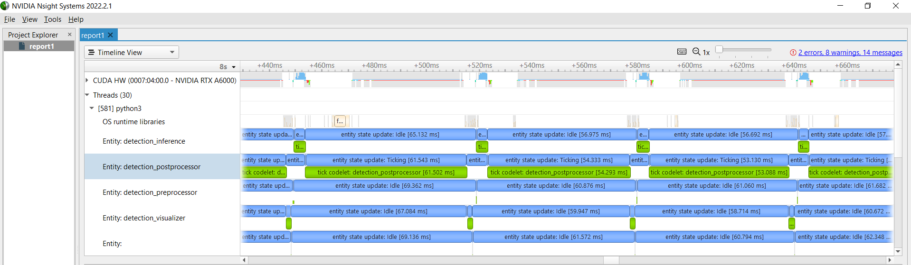
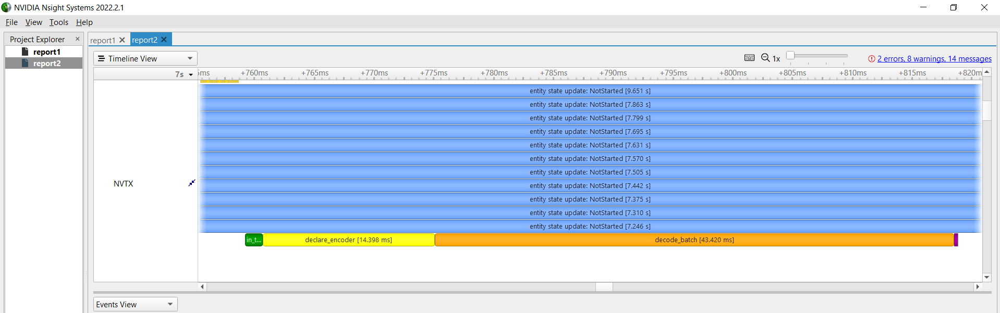
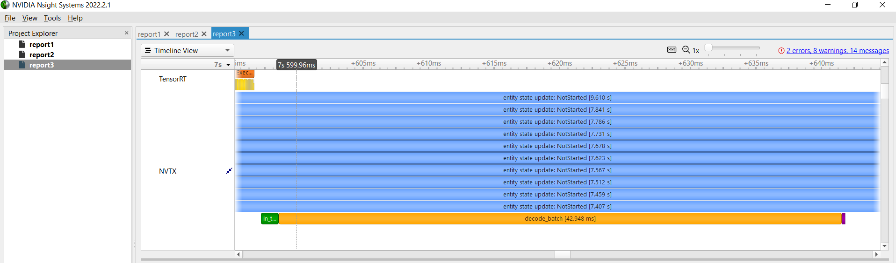
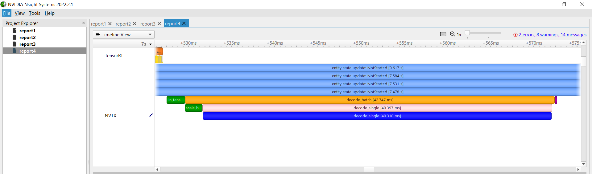
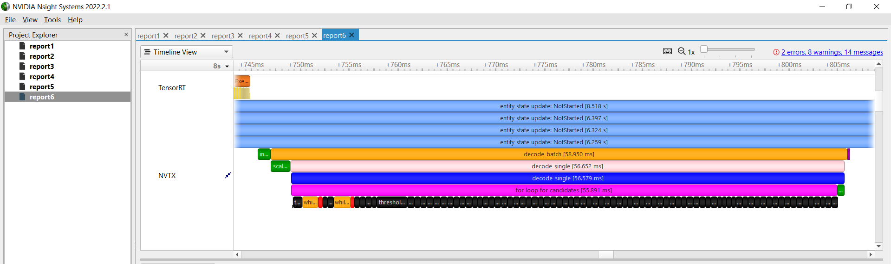
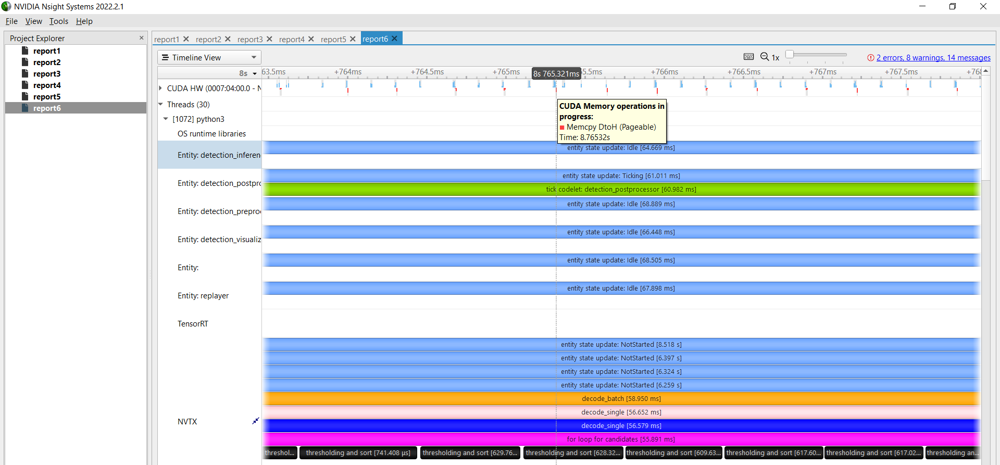
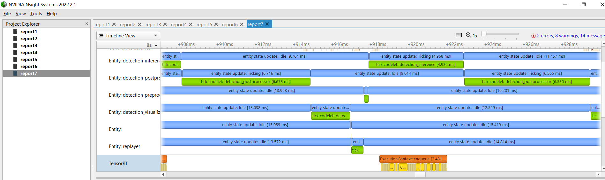

## Using NVTX Profiling on ssd_step1.py
*This file relates to the `Step 2: Optimize performance for postprocessing code from Step 1` section in the [README](README.md).*

First, see the profiling of 15 seconds of running the app without doing any code modification to the python app: 

```
nsys profile -d 15 python3 ssd_step1.py
```
Open the generated report `report*.nsys-rep` in NVIDIA Nsight Systems. 

Zooming in, we can already see that the postprocessor is taking ~60 ms by itself! 


We tag each part of the postprocessor with NVTX like the following, and running the command `nsys profile -d 15 python3 ssd_step1.py` again to get more details in the postprocessor's `compute()`.

```
def compute(self, op_input, op_output, context):
    with nvtx.annotate("in_tensor_interop", color = "green"):
        in_message = op_input.receive("in")


        locs_tensor = in_message.get("inference_output_tensor_loc")
        labels_tensor = in_message.get("inference_output_tensor_label")


        if locs_tensor is not None:
            locs_pyt   = torch.tensor(locs_tensor, ).cuda()
            #print(f"Received locs_pyt(pytorch): {locs_pyt}")
        if labels_tensor is not None:
            labels_pyt = torch.tensor(labels_tensor,).cuda()
            #print(f"Received labels_pyt(pytorch): {labels_pyt}")
    with nvtx.annotate("declare_encoder", color = "yellow"):
        dboxes = dboxes300_coco()
        encoder = Encoder(dboxes)


    with nvtx.annotate("decode_batch", color = "orange"):
        encoded = encoder.decode_batch(locs_pyt, labels_pyt, criteria=0.5, max_output=20)
    with nvtx.annotate("get_bboxes_from_decoded", color = "red"):
        bboxes, classes, confidences = [x.detach().cpu().numpy().astype(np.float32) for x in encoded[0]]
        best = np.argwhere(confidences > 0.3).squeeze()
    
        # Holoviz takes in rectangles of shapes [1, n/2, 2] where 
        # n is the number of rectangles to render. bboxes[idx] has 
        # four values in range [0,1], representing [left, top, right, bottom]
        bboxes_output = bboxes[best].reshape(1, -1, 2)
    
    # output
    with nvtx.annotate("out_tensor_interop", color = "purple"):
        out_message = Entity(context)
        output_tensor = hs.as_tensor(bboxes_output)
        out_message.add(output_tensor, "rectangles")
        op_output.emit(out_message, "out")

```

Run the same `nsys profile` profiling command again. We can see the most time goes into the highlighted part in orange: 
`encoded = encoder.decode_batch(locs_pyt, labels_pyt, criteria=0.5, max_output=20).`

The yellow part can be avoided by declaring in `__init__()` instead of every time in `compute()`. Then we will see: 

Let’s take a look at part highlighted in orange: `decode_batch()` and highlights its components further in green, pink, blue:

```
def decode_batch(self, bboxes_in, scores_in,  criteria = 0.45, max_output=200):
    with nvtx.annotate("scale_back_batch", color="green"):
        bboxes, probs = self.scale_back_batch(bboxes_in, scores_in)
    output = []
    with nvtx.annotate("decode_single", color="pink"):
        for bbox, prob in zip(bboxes.split(1, 0), probs.split(1, 0)):
            bbox = bbox.squeeze(0)
            prob = prob.squeeze(0)
            output.append(self.decode_single(bbox, prob, criteria, max_output))
    return output

# perform non-maximum suppression
@nvtx.annotate(color="blue")
def decode_single(self, bboxes_in, scores_in, criteria, max_output, max_num=200):
```
Then we can see that the majority comes from the one call to `decode_single()`. (one call since we have batch size 1).

Let's do some more digging into `decode_single()`, label its components further with magenta, orange, red, green:

```
# perform non-maximum suppression
@nvtx.annotate(color="blue")
def decode_single(self, bboxes_in, scores_in, criteria, max_output, max_num=200):
    # Reference to https://github.com/amdegroot/ssd.pytorch

    bboxes_out = []
    scores_out = []
    labels_out = []
    with nvtx.annotate("for loop for candidates", color="magenta"):
        for i, score in enumerate(scores_in.split(1, 1)):
            with nvtx.annotate("thresholding and sort", color="black"):
                # skip background
                # print(score[score>0.90])
                if i == 0: continue
                # print(i)

                score = score.squeeze(1)
                mask = score > 0.05

                bboxes, score = bboxes_in[mask, :], score[mask]
                if score.size(0) == 0: continue

                score_sorted, score_idx_sorted = score.sort(dim=0)

                # select max_output indices
                score_idx_sorted = score_idx_sorted[-max_num:]
                candidates = []
                #maxdata, maxloc = scores_in.sort()
            with nvtx.annotate("while loop to get candidates", color="orange"):
                while score_idx_sorted.numel() > 0:
                    idx = score_idx_sorted[-1].item()
                    bboxes_sorted = bboxes[score_idx_sorted, :]
                    bboxes_idx = bboxes[idx, :].unsqueeze(dim=0)
                    iou_sorted = calc_iou_tensor(bboxes_sorted, bboxes_idx).squeeze()
                    # we only need iou < criteria
                    score_idx_sorted = score_idx_sorted[iou_sorted < criteria]
                    candidates.append(idx)
            with nvtx.annotate("append three lists", color="red"):
                bboxes_out.append(bboxes[candidates, :])
                scores_out.append(score[candidates])
                labels_out.extend([i]*len(candidates))
    with nvtx.annotate("return", color="green"):
        if not bboxes_out:
            return [torch.tensor([]) for _ in range(3)]

        bboxes_out, labels_out, scores_out = torch.cat(bboxes_out, dim=0), \
            torch.tensor(labels_out, dtype=torch.long), \
            torch.cat(scores_out, dim=0)


        _, max_ids = scores_out.sort(dim=0)
        max_ids = max_ids[-max_output:]
        return bboxes_out[max_ids, :], labels_out[max_ids], scores_out[max_ids]
```
We can see that the for loop for non-maximum suppression that enumerates through each of the 81 classes for the scores_in tensor of shape [8732, 81] is taking up a lot of time, therefore we should look for a way to optimize the NMS implementation so we don't have the for loop. 

The reason we only see two iterations of the for loop having the orange plus red parts after the black part is because the original model was trained with only 7 classes for ground truth, and most of the 81 classes don't pass the thresholding step annotated in black. If we train a model with the full 81 classes and run on a video with various objects of various classes, after each black block there will be a larger orange and red block, resulting in a much longer processing time than ~60 ms. (For example, with the SSD model trained on the full 81 classes running on a traffic cam video full of people, cars, buses and more, the ~60 ms latency becomes ~160 ms).

If we zoom in closer and look at the CUDA memory activities, we can see there are a lot of copies between Device and Host. 


After searching online, we find that PyTorch has an optimized function we can utilize [https://pytorch.org/vision/stable/generated/torchvision.ops.nms.html#torchvision.ops.nms](https://pytorch.org/vision/stable/generated/torchvision.ops.nms.html#torchvision.ops.nms). With this implementation, we see the postprocessor gained a speedup from ~60 ms in `ssd_step1.py` to ~ 6 ms in `ssd_step2_route1.py`!


General use case: Whenever trying to find out the cause of latency, using NVTX to tag parts of the code is very simple to use. NVTX supports Python and C++ APIs. See the [GitHub page](https://github.com/NVIDIA/NVTX) for more info.
