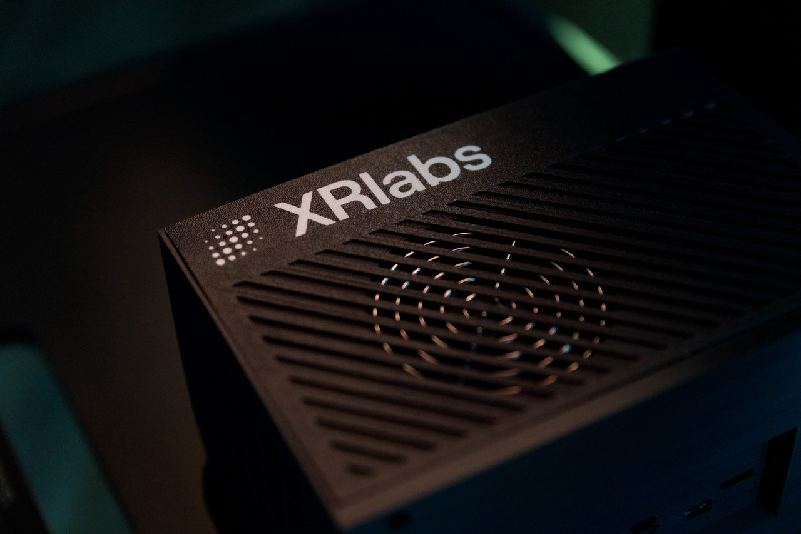

# ST 2110-20 Video Reception Demo



Demo application for receiving SMPTE ST 2110-20 uncompressed video streams over IP networks using the ST2110SourceOp operator.

## Overview

This application demonstrates ST 2110-20 video reception by:

1. Receiving ST 2110-20 RTP packets via Linux UDP sockets (multicast)
2. Reassembling packets into complete video frames
3. Converting from YCbCr-4:2:2-10bit to RGBA and/or NV12 using CUDA kernels
4. Displaying the video stream using Holoviz

## Quick Start

```bash
# Build and run with holohub CLI
./holohub run st2110_demo

# Or run a specific mode
./holohub run st2110_demo rgba   # RGBA output only
./holohub run st2110_demo nv12   # NV12 output only
```

**Before running**, configure your network settings in the YAML config file (see Configuration below).

## Prerequisites

- CUDA-capable NVIDIA GPU
- Network interface with multicast support
- ST 2110-20 video source streaming to the network

### ST 2110 Source

You need an ST 2110-20 compliant video source streaming to a multicast address, for example:

- Blackmagic Design equipment with ST 2110 output
- FFmpeg with RTP output
- Any professional broadcast encoder supporting ST 2110-20

## Configuration

Edit the configuration file to match your network setup:

```yaml
st2110_source:
  # Network parameters - update these for your setup
  multicast_address: "239.255.66.60"  # Your ST 2110 multicast address
  port: 16388                          # Your ST 2110 UDP port
  interface_name: "mgbe0_0"            # Your network interface name

  # Video parameters - match your ST 2110 source
  width: 1920
  height: 1080
  framerate: 50
  stream_format: "YCbCr-4:2:2-10bit"

  # Output format options
  enable_rgba_output: true   # Enable RGBA conversion for display
  enable_nv12_output: true   # Enable NV12 conversion for encoding
```

### Finding Your Network Interface

```bash
# List network interfaces
ip link show

# On Thor AGX, the MGBE interface is typically:
# mgbe0_0, mgbe1_0, mgbe2_0, or mgbe3_0
```

## Run Modes

The application supports multiple run modes via the holohub CLI:

| Mode | Command | Description |
|------|---------|-------------|
| default | `./holohub run st2110_demo` | Both RGBA and NV12 outputs displayed |
| rgba | `./holohub run st2110_demo rgba` | RGBA output only |
| nv12 | `./holohub run st2110_demo nv12` | NV12 output only |

## Network Setup

### System Configuration

Increase the socket buffer size for high-bandwidth streams:

```bash
# Temporary (until reboot)
sudo sysctl -w net.core.rmem_max=268435456
sudo sysctl -w net.core.rmem_default=268435456

# Permanent (add to /etc/sysctl.conf)
echo "net.core.rmem_max=268435456" | sudo tee -a /etc/sysctl.conf
echo "net.core.rmem_default=268435456" | sudo tee -a /etc/sysctl.conf
```

### Multicast Routing

Ensure multicast traffic is routed to the correct interface:

```bash
# Add multicast route for your interface
sudo ip route add 239.0.0.0/8 dev mgbe0_0

# Verify multicast group membership
ip maddr show dev mgbe0_0
```

### Firewall

Allow UDP traffic on your ST 2110 port:

```bash
sudo ufw allow 16388/udp
```

## Expected Behavior

When working correctly:

1. Two Holoviz windows open: one for RGBA, one for NV12 (in default mode)
2. Console logs showing frame reception on all enabled outputs
3. Frame rate matches your source (e.g., 50 FPS for 1080p50)

Press **ESC** or **Ctrl+C** to quit.

## Troubleshooting

### No Video Displayed

1. **Verify ST 2110 source is streaming:**
   ```bash
   # Check for multicast traffic
   sudo tcpdump -i mgbe0_0 dst 239.255.66.60 and udp port 16388 -c 10
   ```

2. **Check interface name in config matches your system:**
   ```bash
   ip link show
   ```

3. **Verify multicast routing:**
   ```bash
   ip route show | grep 239
   ```

### Packet Drops / Frame Tearing

- Increase socket buffer size (see Network Setup above)
- Reduce other network traffic on the interface
- Check CPU load - ensure sufficient resources available

### "Cannot import ST2110SourceOp" Error

Ensure you've run the application via the holohub CLI, which handles building dependencies:
```bash
./holohub run st2110_demo
```

### Color Issues

- Verify `stream_format` in config matches your source (10-bit vs 8-bit)
- The operator assumes BT.709 colorimetry

## Related Documentation

- [ST2110 Operator Documentation](../../operators/st2110_source/README.md)
- [Holoscan SDK Documentation](https://docs.nvidia.com/holoscan/)
