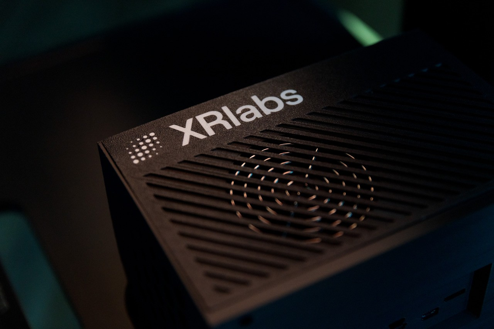

# ST 2110-20 Video Reception Demo



Demo application for receiving SMPTE ST 2110-20 uncompressed video streams over IP networks using the ST2110SourceOp operator.

## Overview

This application demonstrates ST 2110-20 video reception by:

1. Receiving ST 2110-20 RTP packets via Linux UDP sockets (multicast)
2. Reassembling packets into complete video frames
3. Converting from YCbCr-4:2:2-10bit to RGBA and/or NV12 using CUDA kernels
4. Displaying the video stream using Holoviz

## Quick Start

```bash
# Build and run with holohub CLI
./holohub run st2110_demo

# Or run a specific mode
./holohub run st2110_demo rgba   # RGBA output only
./holohub run st2110_demo nv12   # NV12 output only
```

**Before running**, configure your network settings in the YAML config file (see [Configuration](#configuration) below).

## Prerequisites

- CUDA-capable NVIDIA GPU
- Network interface with multicast support
- ST 2110-20 video source (see [Testing with GStreamer](#testing-with-gstreamer) for a software-based source)

## Build Instructions

```bash
# Build the demo application (includes the st2110_source operator)
./holohub build st2110_demo
```

## Configuration

Edit `applications/st2110_demo/st2110_demo_config.yaml` to match your network setup:

```yaml
st2110_source:
  # Network parameters - update these for your setup
  multicast_address: "239.255.66.60"  # Your ST 2110 multicast address
  port: 16388                          # Your ST 2110 UDP port
  interface_name: "eth0"               # Your network interface name

  # Video parameters - match your ST 2110 source
  width: 1920
  height: 1080
  framerate: 50
  stream_format: "YCbCr-4:2:2-10bit"

  # Output format options
  enable_rgba_output: true   # Enable RGBA conversion for display
  enable_nv12_output: true   # Enable NV12 conversion for encoding
```

### Finding Your Network Interface

```bash
# List network interfaces
ip link show

# Common interface names:
#   eth0, ens1f0     - standard Ethernet
#   mgbe0_0          - NVIDIA Thor AGX MGBE
#   enp1s0f0np0      - ConnectX SmartNIC
```

## Run Modes

The application supports multiple run modes via the holohub CLI:

| Mode | Command | Description |
| ---- | ------- | ----------- |
| default | `./holohub run st2110_demo` | Both RGBA and NV12 outputs displayed |
| rgba | `./holohub run st2110_demo rgba` | RGBA output only |
| nv12 | `./holohub run st2110_demo nv12` | NV12 output only |

## Network Setup

### Socket Buffer Size

Increase the socket buffer size for high-bandwidth streams:

```bash
# Temporary (until reboot)
sudo sysctl -w net.core.rmem_max=268435456
sudo sysctl -w net.core.rmem_default=268435456

# Permanent (add to /etc/sysctl.conf)
echo "net.core.rmem_max=268435456" | sudo tee -a /etc/sysctl.conf
echo "net.core.rmem_default=268435456" | sudo tee -a /etc/sysctl.conf
```

### Multicast Routing

Ensure multicast traffic is routed to the correct interface:

```bash
# Replace <interface> with your network interface name
sudo ip route add 239.0.0.0/8 dev <interface>

# Verify multicast group membership
ip maddr show dev <interface>
```

### Firewall

Allow UDP traffic on your ST 2110 port:

```bash
sudo ufw allow 16388/udp
```

## Testing with GStreamer

You can test the operator without professional ST 2110 hardware by using GStreamer to generate a synthetic RTP video stream. This requires two machines (or two network namespaces) connected over a network.

### Sender Setup

On the sending machine, install GStreamer and start a test stream:

```bash
# Install GStreamer (Ubuntu/Debian)
sudo apt-get install -y gstreamer1.0-tools gstreamer1.0-plugins-base \
                        gstreamer1.0-plugins-good

# Configure multicast routing on the sender's interface
sudo ip route add 239.0.0.0/8 dev <interface>

# Start a 1080p25 UYVY test pattern (bouncing ball)
gst-launch-1.0 videotestsrc pattern=ball ! \
  "video/x-raw,format=UYVY,width=1920,height=1080,framerate=25/1" ! \
  rtpvrawpay ! \
  udpsink host=239.255.66.60 port=16388 \
    multicast-iface=<interface> auto-multicast=true
```

### Receiver Setup

On the receiving machine, configure the network and update the demo config:

```bash
# Increase socket buffer
sudo sysctl -w net.core.rmem_max=268435456
sudo sysctl -w net.core.rmem_default=268435456

# Configure multicast routing
sudo ip route add 239.0.0.0/8 dev <interface>
```

Update `st2110_demo_config.yaml` to match the GStreamer sender:

```yaml
st2110_source:
  multicast_address: "239.255.66.60"
  port: 16388
  interface_name: "<interface>"
  width: 1920
  height: 1080
  framerate: 25
  stream_format: "YCbCr-4:2:2-8bit"   # UYVY is 8-bit YCbCr-4:2:2
  enable_rgba_output: true
  enable_nv12_output: false
```

Then run the demo:

```bash
./holohub run st2110_demo rgba
```

### Verifying Packet Reception

To confirm multicast packets are arriving on the receiver:

```bash
sudo tcpdump -i <interface> dst 239.255.66.60 and udp port 16388 -c 10
```

> **Note:** GStreamer's `rtpvrawpay` produces RFC 4175 RTP packets, which are similar but not identical to SMPTE ST 2110-20. For full end-to-end frame display, use a professional ST 2110 source (e.g., Blackmagic Design equipment).

## Expected Behavior

When working correctly with a compatible ST 2110 source:

1. Holoviz windows open showing the video stream
2. Console logs showing frame reception stats
3. Frame rate matches your source (e.g., 50 FPS for 1080p50)

Press **ESC** or **Ctrl+C** to quit.

## Troubleshooting

### No Video Displayed

1. **Verify source is streaming:**

   ```bash
   sudo tcpdump -i <interface> dst 239.255.66.60 and udp port 16388 -c 10
   ```

2. **Check interface name** in config matches your system: `ip link show`

3. **Verify multicast routing:** `ip route show | grep 239`

4. **Disable reverse path filtering** if packets appear in tcpdump but the app reports 0 packets:

   ```bash
   sudo sysctl -w net.ipv4.conf.<interface>.rp_filter=0
   sudo sysctl -w net.ipv4.conf.all.rp_filter=0
   ```

### Packet Drops / Frame Tearing

- Increase socket buffer size (see [Network Setup](#network-setup))
- Reduce other network traffic on the interface
- Check CPU load - ensure sufficient resources available

### "Cannot import ST2110SourceOp" Error

Ensure the demo has been built:

```bash
./holohub build st2110_demo
```

### Color Issues

- Verify `stream_format` in config matches your source (10-bit vs 8-bit)
- The operator assumes BT.709 colorimetry

## Related Documentation

- [ST2110 Source Operator](../../operators/st2110_source/README.md)
- [Holoscan SDK Documentation](https://docs.nvidia.com/holoscan/)
