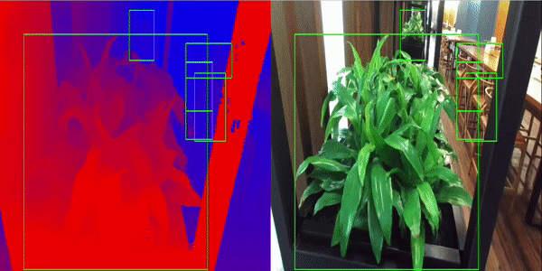

# Stereo Vision

<p align="center">
  
</p>

## Overview

A demo pipeline showcasing stereo disparity estimation.

## Description

This pipeline takes video from a stereo camera and estimates disparity using DNN ESS. The disparity map is displayed through Holoviz.

## Requirements

This application requires a V4L2 stereo camera or recorded stereo video as input. A video acquired from a StereoLabs ZED
camera is downloaded when running the `get_data_and_models.sh` script when building the application.
A script for obtaining the calibration for StereoLabs cameras is also provided.
Holoscan SDK >=2.0,<=2.5 is required for TensorRT 8.6 compatibility.
### Camera Calibration

The default calibration will work for the sample video. If using a stereolabs camera the calibration
can be retrieved using `get_zed_calibration.py` and the devices serial number.

```sh
python3 get_zed_calibration.py -s [Serial Number]
```

### Input video

For the input video stream, either use a v4l2 stereo camera such as those produced by stereolabs or included recorded video.
The `stereo-plants.mp4` video is provided [here](https://catalog.ngc.nvidia.com/orgs/nvidia/teams/clara-holoscan/resources/holoscan_stereo_video) and will be downloaded and converted to the necessary format when building the application.

The source device in `stereo_vision.yaml` should be modified to match the device the v4l2 video is
using. This can be found using `v4l2-ctl --list-devices`.


## Models

This demo requires the ESS DNN Stereo Disparity available from the NGC catalog for disparity estimation. This model is downloaded when you build the application.

### ESS DNN

The ESS engine files generated in this demo application is specific to TRT8.6; make sure
you build the devcontainer with a compatible `base_img` as shown in the <b>Build and Run Instructions</b> section.

## Build and Run Instructions

Run the following command to build and run application using the recorded video:
```sh
./holohub run stereo_vision --base_img nvcr.io/nvidia/clara-holoscan/holoscan:v2.4.0-dgpu
```

To run the application using a v4l2 compatible stereo camera, run:
```sh
./holohub run stereo_vision --base_img nvcr.io/nvidia/clara-holoscan/holoscan:v2.4.0-dgpu --run-args="--source v4l2"
```
