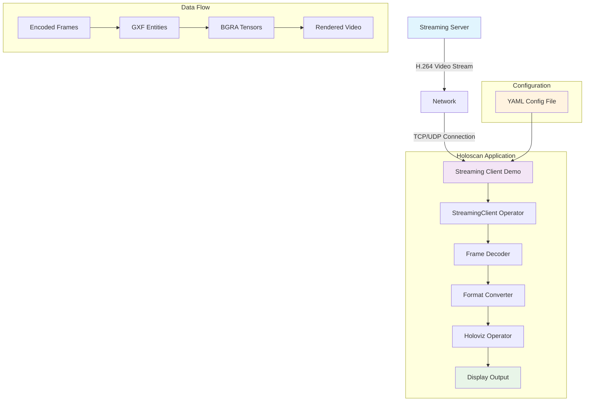

# Streaming Client Demo

This application demonstrates how to use the Holoscan SDK to create a streaming client application that can receive video streams from a streaming server.

## Application Architecture



## Key Features

- 🎥 **Real-time Video Streaming**: Receives H.264 encoded video streams with ultra-low latency
- 🔗 **Bidirectional Communication**: Supports both receiving and sending video frames
- 🖥️ **GPU-Accelerated Processing**: Leverages CUDA for high-performance video decoding and rendering
- ⚙️ **Configurable Parameters**: Customizable frame dimensions, frame rate, and server connection settings
- 🎯 **Holoscan Integration**: Built using Holoscan operators for modular, high-performance streaming
- 📊 **Memory Management**: Efficient memory handling with bounds checking and zero-padding

## Requirements

- NVIDIA GPU
- CUDA 12.1 or higher
- Holoscan SDK 3.2.0 or higher

## Setup Instructions

**⚠️ Important**: Before building this application, you must first download the required streaming client binaries from NGC.

**📖 For detailed setup instructions, see**: [Streaming Client Operator Setup](../../operators/streaming_client/README.md#dependencies)

Quick summary:
```bash
# Download the Holoscan Client Cloud Streaming library from NGC
ngc registry resource download-version nvidia/holoscan_client_cloud_streaming:0.1
# Move to the operator's lib directory
mv holoscan_client_cloud_streaming operators/streaming_client/lib
```

## Building the Application

To build the application, run:

```bash
./holohub build streaming_client_demo
```

## Running the Application

To run the application:

```bash
./holohub run streaming_client_demo
```

### Command Line Options

- `-h, --help`: Show help message
- `-c, --config <file>`: Configuration file path (default: streaming_client_demo.yaml)
- `-d, --data <directory>`: Data directory (default: environment variable HOLOSCAN_INPUT_PATH or current directory)

## Configuration

The application can be configured using a YAML file. By default, it looks for `streaming_client_demo.yaml` in the current directory.

## Related Documentation

### Applications
- [Streaming Server Demo Application](../streaming_server_demo/README.md)

### Operators  
- [Streaming Client Operator](../../operators/streaming_client/README.md) - Detailed setup, dependencies, and troubleshooting instructions
- [Streaming Server Operator](../../operators/streaming_server/README.md) - Server-side streaming operator documentation 