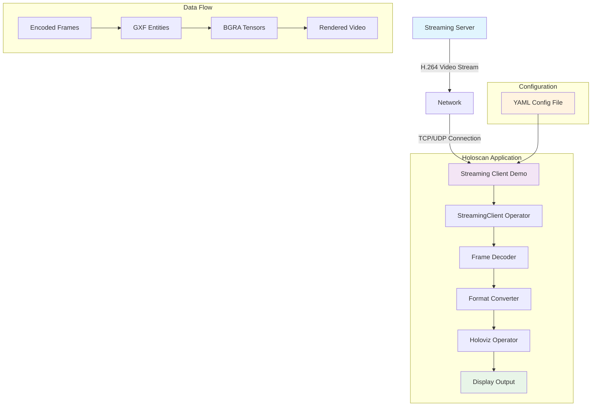

# Streaming Client Demo

This application demonstrates how to use the Holoscan SDK to create a streaming client application that can receive video streams from a streaming server.

## Application Architecture



## Key Features

- 🎥 **Real-time Video Streaming**: Receives H.264 encoded video streams with ultra-low latency
- 🔗 **Bidirectional Communication**: Supports both receiving and sending video frames
- 🖥️ **GPU-Accelerated Processing**: Leverages CUDA for high-performance video decoding and rendering
- ⚙️ **Configurable Parameters**: Customizable frame dimensions, frame rate, and server connection settings
- 🎯 **Holoscan Integration**: Built using Holoscan operators for modular, high-performance streaming
- 📊 **Memory Management**: Efficient memory handling with bounds checking and zero-padding

## Requirements

- NVIDIA GPU
- CUDA 12.1 or higher
- Holoscan SDK 3.2.0 or higher

## Setup Instructions

**⚠️ Important**: Before building this application, you must first download the required streaming client binaries from NGC.

**📖 For detailed setup instructions, see**: [Streaming Client Operator Setup](../../operators/streaming_client/README.md#dependencies)

Quick summary:

```bash
# Download using NGC CLI
cd <your_holohub_path>/operators/streaming_client
ngc registry resource download-version nvidia/holoscan_client_cloud_streaming:0.1
unzip -o holoscan_client_cloud_streaming_v0.1/holoscan_client_cloud_streaming.zip

# Copy the appropriate architecture libraries to lib/ directory
# For x86_64 systems:
cp lib/x86_64/* lib/
# For aarch64 systems:
# cp lib/aarch64/* lib/

# Clean up architecture-specific directories and NGC download directory
rm -rf lib/x86_64 lib/aarch64
rm -rf holoscan_client_cloud_streaming_v0.1
```

After successful extraction and setup, your `operators/streaming_client` directory structure should look like this:

```
├── CMakeLists.txt
├── FindHoloscanStreaming.cmake
├── include
│   ├── StreamingClient.h
│   └── VideoFrame.h
├── lib
│   ├── libcrypto.so.3
│   ├── libcudart.so.12
│   ├── libcudart.so.12.0.107
│   ├── libNvStreamBase.so
│   ├── libNvStreamingSession.so
│   ├── libNvStreamServer.so
│   ├── libPoco.so
│   ├── libssl.so.3
│   ├── libStreamClientShared.so
│   └── libStreamingClient.so
├── metadata.json
├── NOTICE.txt
├── python
│   ├── CMakeLists.txt
│   └── streaming_client.cpp
├── README.md
├── streaming_client.cpp
├── streaming_client.hpp
└── streaming_client_operator-config.cmake.in
```

## Running the Application

To run the application:

```bash
./holohub run streaming_client_demo
```

### Command Line Options

- `-h, --help`: Show help message
- `-c, --config <file>`: Configuration file path (default: streaming_client_demo.yaml)
- `-d, --data <directory>`: Data directory (default: environment variable HOLOSCAN_INPUT_PATH or current directory)

## Configuration

The application can be configured using a YAML file. By default, it looks for `streaming_client_demo.yaml` in the current directory.

## Related Documentation

### Applications

Please note that , in order for the `streming_client` to be able to establish a bidirectional connection with the `streaming_server`, the streaming_server_demo app must be build and run first and then the stremaing_client_demo app.

- [Streaming Server Demo Application](../streaming_server_demo/README.md)

### Operators  
- [Streaming Client Operator](../../operators/streaming_client/README.md) - Detailed setup, dependencies, and troubleshooting instructions
- [Streaming Server Operator](../../operators/streaming_server/README.md) - Server-side streaming operator documentation 