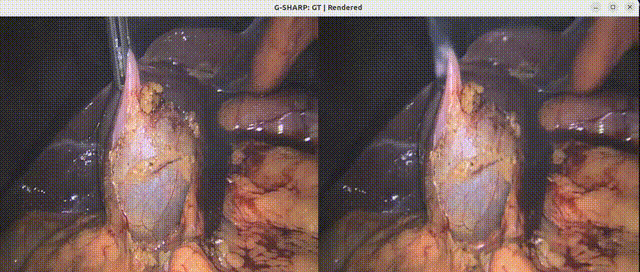
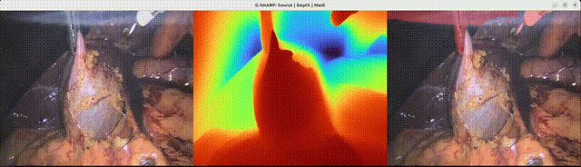
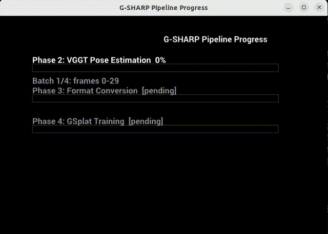
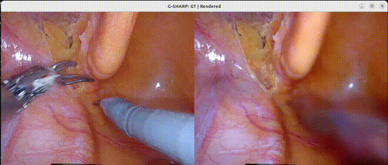

# G-SHARP: Gaussian Splatting for Holographic Anatomical Reconstruction Pipeline

This application demonstrates real-time 3D surgical scene reconstruction by combining **Holoscan SDK** for high-performance streaming, **3D Gaussian Splatting** for neural 3D representation, and **temporal deformation networks** for accurate modeling of dynamic tissue.



The application provides a complete end-to-end pipeline — from raw surgical video frames to real-time 3D reconstruction — with no manual preprocessing. Researchers and developers can use it to train custom models on their own endoscopic data and visualize results with GPU-accelerated rendering.

Features of this application include:

- **Fully Automated Pipeline:** Five-phase pipeline (depth, segmentation, poses, training, rendering) with zero manual preprocessing
- **Real-time Visualization:** Stream reconstructed scenes at **>30 FPS** using Holoscan HoloViz
- **High-Quality Reconstruction:** Achieves **35+ dB PSNR** with **~50,000 Gaussians** on surgical video
- **Temporal Deformation:** Per-frame tissue modeling captures dynamic deformation over time
- **Tool Segmentation:** MedSAM3-based tool masks automatically exclude instruments from reconstruction
- **Auto-Download:** Sample data and all model checkpoints download automatically on first build

It takes input from a directory of sequential PNG frames (e.g., endoscopic video). It processes the input through DA2 depth estimation, MedSAM3 segmentation, VGGT camera pose estimation, and GSplat training. And it outputs a real-time 3D Gaussian Splatting reconstruction with temporal deformation.

It is ideal for use cases such as:

- Surgical scene understanding and visualization
- Tool-free tissue reconstruction for analysis
- Research in surgical vision and 3D reconstruction
- Development of real-time surgical guidance systems

## Quick Start

### Step 1: Clone the HoloHub Repository

```bash
git clone https://github.com/nvidia-holoscan/holohub.git
cd holohub
```

### Step 2: Read and Agree to the Terms and Conditions of the EndoNeRF Sample Dataset

1. Read and agree to the [Terms and Conditions](https://docs.google.com/document/d/1P6q2hXoGpVMKeD-PpjYYdZ0Yx1rKZdJF1rXxpobbFMY/edit?usp=share_link) for the EndoNeRF dataset.
2. The EndoNeRF sample dataset, DA2 checkpoint, and MedSAM3 checkpoint are downloaded automatically when building the application.
3. Optionally, for manual download of the dataset, refer to the [Data](#data) section below.
4. Optionally, if you do not agree to the terms and conditions, set the `HOLOHUB_DOWNLOAD_DATASETS` environment variable to `OFF` and manually download the dataset and place it in the correct location by following the instructions in the [Data](#data) section below.

    ```bash
    export HOLOHUB_DOWNLOAD_DATASETS=OFF
    ```

### Step 3: Run the Full Pipeline

To run the complete pipeline (depth + segmentation + poses + training + live viewer):

```bash
./holohub run surgical_scene_recon full
```

The first run builds the Docker container and downloads all data and checkpoints automatically. This may take several minutes.

### Step 4: View Results

After training completes, the live render viewer opens automatically, showing side-by-side ground truth and reconstructed frames at 30 FPS. Close the window to exit.

To re-render from existing training output without re-training:

```bash
./holohub run surgical_scene_recon render
```

## Pipeline Overview

G-SHARP runs five sequential phases to reconstruct a 3D scene from surgical video frames:

| Phase | Component | Framework | Description |
| ----- | --------- | --------- | ----------- |
| **1** | DA2 depth + MedSAM3 segmentation | Holoscan streaming | Dense monocular depth estimation and surgical tool segmentation |
| **2** | VGGT camera pose estimation | Standalone PyTorch | Batch camera extrinsic and intrinsic estimation |
| **3** | EndoNeRF format assembly | Python script | Assembles depth, masks, and poses into training-ready format |
| **4** | GSplat training with deformation network | Standalone PyTorch | Two-stage Gaussian Splatting: coarse (static) then fine (deformation) |
| **5** | Live render viewer | Holoscan streaming | Real-time side-by-side GT vs rendered visualization |

### Phase 1: DA2 Depth + MedSAM3 Segmentation

Phase 1 runs as a Holoscan streaming application. Each frame passes through Depth Anything V2 for dense monocular depth and MedSAM3 for surgical tool segmentation, all in a single streaming pass.



### Pipeline Progress Monitor

The pipeline reports progress through a live monitor window:



## Run Modes

All commands are from the **HoloHub repo root**:

| Mode | Command | Description |
| ---- | ------- | ----------- |
| **Full pipeline** | `./holohub run surgical_scene_recon full` | All five phases: DA2+MedSAM3 → VGGT → EndoNeRF → training → live viewer. |
| **Train only** | `./holohub run surgical_scene_recon train` | Phases 1–4 (no viewer; exits after training). |
| **Render only** | `./holohub run surgical_scene_recon render` | Phase 5 only (live viewer on existing output). |
| **Verify train** | `./holohub run surgical_scene_recon verify_train` | Short run for CI/testing: 20 training iters, 5 coarse, no viewer, headless. |

Examples:

```bash
# Full pipeline with live viewer (requires display)
./holohub run surgical_scene_recon full

# Train only, then later run the viewer
./holohub run surgical_scene_recon train
./holohub run surgical_scene_recon render

# Quick sanity check (no display needed)
./holohub run surgical_scene_recon verify_train
```

To pass extra arguments to the app (e.g. more iterations), use `--run-args`:

```bash
./holohub run surgical_scene_recon full --run-args="--training-iterations 7000 --coarse-iterations 1000"
```

## Data

### Automatic Download (Default)

All data and checkpoints are downloaded automatically on first build:

| Asset | Source | License | Size |
| ----- | ------ | ------- | ---- |
| EndoNeRF "pulling" frames (50 images) | [Google Drive](https://drive.google.com/drive/folders/1vvKkdi0UiA3-7q0NykQEIE3bkbkuwUF5) | [Terms](https://docs.google.com/document/d/1P6q2hXoGpVMKeD-PpjYYdZ0Yx1rKZdJF1rXxpobbFMY/edit?usp=share_link) | ~20 MB |
| Depth Anything V2 (Small) | [HuggingFace](https://huggingface.co/depth-anything/Depth-Anything-V2-Small) | Apache-2.0 | ~95 MB |
| MedSAM3 checkpoint | [HuggingFace](https://huggingface.co/ChongCong/Medical-SAM3) | MIT | ~9.3 GB |

The application downloads the EndoNeRF "pulling" dataset by default, providing a ready-to-run experience out of the box.

### Dataset Layout

```text
<HOLOHUB_ROOT>/data/surgical_scene_recon/
├── frames/          ← PNG images (downloaded or your own)
├── da2/depth_anything_v2_vits.pth
└── medsam3/checkpoint.pt
```

### Using Your Own Data

To use your own surgical video frames instead of the default EndoNeRF dataset:

1. Place your PNG frames in `data/surgical_scene_recon/frames/`. Filenames should sort alphabetically in temporal order (e.g., `frame-000000.color.png`, `frame-000001.color.png`, ...).
2. Checkpoints (DA2 and MedSAM3) are downloaded automatically. If they already exist on disk, the download is skipped.

```bash
mkdir -p data/surgical_scene_recon/frames
cp /path/to/your/*.png data/surgical_scene_recon/frames/
```

### Manual Download

To skip automatic downloads and supply your own data manually:

```bash
export HOLOHUB_DOWNLOAD_DATASETS=OFF
mkdir -p data/surgical_scene_recon/frames data/surgical_scene_recon/da2 data/surgical_scene_recon/medsam3
cp /path/to/your/*.png data/surgical_scene_recon/frames/
wget -O data/surgical_scene_recon/da2/depth_anything_v2_vits.pth \
  https://huggingface.co/depth-anything/Depth-Anything-V2-Small/resolve/main/depth_anything_v2_vits.pth
# Download MedSAM3 checkpoint (~9.3 GB) from https://huggingface.co/ChongCong/Medical-SAM3
```

**Automatically managed (do not place in your data dir):** VGGT-1B is downloaded from HuggingFace on first run (cache at `~/.cache/huggingface`). VGG-16 for LPIPS is pre-cached in the Docker image at build time.

## Models Used by the `surgical_scene_recon` Application

The `surgical_scene_recon` application uses a five-model pipeline:

| Model | Purpose | License |
| ----- | ------- | ------- |
| Depth Anything V2 (Small) | Dense monocular depth estimation | Apache-2.0 |
| MedSAM3 | Surgical tool segmentation | MIT |
| VGGT-1B | Camera pose estimation (extrinsics + intrinsics) | Meta License |
| 4D Gaussian Splatting | Neural 3D scene representation | MIT / Apache-2.0 |
| HexPlane Deformation Network | Temporal tissue deformation modeling | MIT / Apache-2.0 |

### Gaussian Splatting Model

- Architecture: 3D Gaussians with learned position, scale, rotation, opacity, and color
- Initialization: Multi-frame point cloud (~30,000–50,000 points)
- Renderer: `gsplat` library (CUDA-accelerated differentiable rasterization)
- Spherical Harmonics degree 3 (16 coefficients per Gaussian for view-dependent color)

### Temporal Deformation Network

- Architecture: HexPlane 4D spatiotemporal grid + MLP decoder
- Input: 3D position + normalized time value [0, 1]
- Output: Deformed position, scale, rotation, and opacity per Gaussian
- Training: Two-stage (coarse: static base, fine: with deformation)

## About the Model Training Process

The application trains in two stages:

1. **Coarse Stage** — learns the base static Gaussian model without deformation.
2. **Fine Stage** — adds the temporal deformation network for dynamic tissue modeling.

The training uses:

- **Multi-modal Data:** RGB images, depth maps, tool segmentation masks
- **Loss Functions:** RGB loss, depth loss, TV loss, masking losses
- **Optimization:** Adam optimizer with batch-size scaled learning rates
- **Tool Removal:** Segmentation masks applied during training for tissue-only reconstruction

Training outputs are saved to `<output-dir>/phase4_training/trained_model/`:

- `ckpts/fine_best_psnr.pt` — Best checkpoint (use for rendering)
- `ckpts/fine_step00XXX.pt` — Regular step checkpoints
- `renders/` — Saved render frames

## Performance

Tested Configuration:

- **GPU:** NVIDIA RTX 6000 Ada Generation
- **Container:** Holoscan SDK 4.0.0

### Pipeline Timing

| Phase | Description | Time |
| ----- | ----------- | ---- |
| Phase 1 | DA2 + MedSAM3 streaming inference | ~24 s (63 frames) |
| Phase 2 | VGGT batch pose estimation | ~15 s |
| Phase 3 | EndoNeRF format conversion | ~1.5 s |
| Phase 4 | GSplat training (1400 iter) | ~2.5 min |
| Phase 5 | Live render viewer | Real-time |
| **Total** | **End-to-end (63 frames)** | **~3.5 min** |

### Quality Metrics

| Metric | Value |
| ------ | ----- |
| PSNR | **35–38 dB** |
| Rendering FPS | **>30 FPS** (real-time) |
| Gaussians | ~35,000–65,000 splats |
| Training iterations | 1400 (200 coarse + 1200 fine) |

### EndoNeRF "Pulling" Dataset Results

The default EndoNeRF "pulling" dataset (50 frames, 640×512) provides a ready-to-run benchmark:



## Output Structure

After a full run, `<output-dir>/` contains:

```text
<output-dir>/
├── phase1_raw/
│   ├── images/          # Resized input frames
│   ├── depth/           # DA2 depth maps (*.npy)
│   └── masks/           # MedSAM3 segmentation masks (*.png)
├── phase2_vggt/
│   ├── poses.npy        # Camera extrinsics (4x4 matrices)
│   └── intrinsics.npy   # Camera intrinsics
├── phase3_endonerf/
│   ├── images/          # Final frames in EndoNeRF layout
│   ├── depth/           # Scaled depth maps
│   ├── masks/           # Binary masks
│   └── poses_bounds.npy # LLFF-format camera parameters
├── phase4_training/
│   └── trained_model/
│       └── ckpts/
│           ├── fine_best_psnr.pt   # Best checkpoint by PSNR
│           └── fine_step*.pt       # Step checkpoints
└── progress.json        # Live progress (updated during run)
```

## Requirements

### Hardware

- **NVIDIA GPU** with CUDA 12+ and Vulkan support (tested on RTX 6000 Ada)
- **~30 GB free disk space** for Docker containers
- **Display** configured for X11 (for Phase 1 / Phase 5 visualization)

### Software

- **Docker** with [NVIDIA Container Toolkit](https://docs.nvidia.com/datacenter/cloud-native/container-toolkit/latest/install-guide.html)
- **Holoscan SDK** 3.8.0 or later (automatically provided in containers)

## Application Integration Testing

We provide integration tests.

To test the application, run:

```bash
./holohub test surgical_scene_recon --verbose
```

Run a **single test** by name:

```bash
./holohub test surgical_scene_recon --ctest-options="-R surgical_scene_recon_test_all_imports -VV"
```

## Command Line Arguments

| Argument | Description | Default |
| -------- | ----------- | ------- |
| `--data-dir` | Directory containing input PNG frames | **Required** |
| `--output-dir` | Base output directory for all pipeline artifacts | **Required** |
| `--training-iterations` | Total GSplat training iterations | `1400` |
| `--coarse-iterations` | Coarse stage iterations (fixed camera) | `200` |
| `--no-deformation` | Disable deformation network (static scene) | `False` |
| `--batch-size` | VGGT batch size (frames per batch) | `30` |
| `--depth-scale` | Depth scale factor (100 = centimeters) | `100.0` |
| `--fps` | Render viewer playback FPS | `30` |
| `--headless` | Run Holoscan apps without visualization | `False` |
| `--skip-phase1` | Skip Phase 1 (reuse existing depth/masks) | `False` |
| `--skip-phase2` | Skip Phase 2 (reuse existing VGGT poses) | `False` |
| `--skip-phase3` | Skip Phase 3 (reuse existing EndoNeRF data) | `False` |
| `--skip-training` | Skip Phase 4 (no training) | `False` |
| `--skip-viewer` | Skip Phase 5 (no live viewer) | `False` |
| `--da2-checkpoint` | DA2 `.pth` checkpoint | Auto (data dir) |
| `--da2-encoder` | DA2 encoder variant (`vits`, `vitb`, `vitl`) | `vits` |
| `--sam3-checkpoint` | MedSAM3 `.pt` checkpoint | Auto (data dir) |

## Incremental Runs

Use `--skip-*` flags to re-run only specific phases. For example, to re-train with more iterations while reusing Phase 1–3 output:

```bash
./holohub run surgical_scene_recon full --run-args="--skip-phase1 --skip-phase2 --skip-phase3 --training-iterations 7000 --coarse-iterations 1000"
```

## Troubleshooting

### Problem: "FileNotFoundError: No PNG files found"

- **Cause:** Frames not in the correct location
- **Solution:** Ensure PNG frames are in `data/surgical_scene_recon/frames/`
- **Verify:** `ls data/surgical_scene_recon/frames/*.png | head`

### Problem: "Unable to find image holohub-surgical_scene_recon"

- **Cause:** Container not built yet
- **Solution:** Remove `--no-docker-build` flag (let CLI build automatically)
- **Or:** Manually build: `./holohub build-container surgical_scene_recon`

### Problem: Holoviz window doesn't appear

- **Cause:** X11 forwarding not enabled
- **Solution:** Run `xhost +local:docker` before running
- **Verify:** Check `echo $DISPLAY` shows a value

### Problem: GPU out of memory

- **Cause:** Another process using GPU memory
- **Solution:** Check `nvidia-smi` and stop other processes
- **Or:** Reduce training batch or frame count

### Problem: MedSAM3 checkpoint download fails or is 0 bytes

- **Cause:** Network issue or HuggingFace rate limiting
- **Solution:** Manually download from [ChongCong/Medical-SAM3](https://huggingface.co/ChongCong/Medical-SAM3) and place at `data/surgical_scene_recon/medsam3/checkpoint.pt`
- **Verify:** `ls -lh data/surgical_scene_recon/medsam3/checkpoint.pt` (should be ~9.3 GB)

### Problem: Google Drive data download fails

- **Cause:** Google Drive rate limiting for automated downloads
- **Solution:** Download the EndoNeRF "pulling" images manually from [Google Drive](https://drive.google.com/drive/folders/1vvKkdi0UiA3-7q0NykQEIE3bkbkuwUF5) and place them in `data/surgical_scene_recon/frames/`

## Acknowledgements

### Citation

If you use this work, please cite the following:

- G-SHARP:

  ```bibtex
  @article{nath2025g,
    title={G-SHARP: Gaussian Surgical Hardware Accelerated Real-time Pipeline},
    author={Nath, Vishwesh and Tejero, Javier G and Li, Ruilong and Filicori, Filippo and Azizian, Mahdi and Huver, Sean D},
    journal={arXiv preprint arXiv:2512.02482},
    year={2025}
  }
  ```

- EndoNeRF:

  ```bibtex
  @inproceedings{wang2022endonerf,
    title={EndoNeRF: Neural Rendering for Stereo 3D Reconstruction of Deformable Tissues in Robotic Surgery},
    author={Wang, Yuehao and Yifan, Wang and Tao, Rui and others},
    booktitle={MICCAI},
    year={2022}
  }
  ```

- 3D Gaussian Splatting:

  ```bibtex
  @article{kerbl20233d,
    title={3d gaussian splatting for real-time radiance field rendering},
    author={Kerbl, Bernhard and Kopanas, Georgios and Leimk{\"u}hler, Thomas and Drettakis, George},
    journal={ACM Transactions on Graphics},
    year={2023}
  }
  ```

- `gsplat` Library:

  ```bibtex
  @software{ye2024gsplat,
    title={gsplat},
    author={Ye, Vickie and Turkulainen, Matias and others},
    year={2024},
    url={https://github.com/nerfstudio-project/gsplat}
  }
  ```

### Third-Party Dependencies and Licenses

This application uses several third-party libraries. **By building and running this application, you acknowledge and accept the license terms of these libraries.**

#### VGGT (Visual Geometry Grounded Transformer)

- **Source**: <https://github.com/facebookresearch/vggt>
- **License**: [Meta License](https://github.com/facebookresearch/vggt) (see repository for license terms)
- **Installation**: Pip-installed from source at Docker build time
- **Model weights**: `facebook/VGGT-1B` from HuggingFace

> **Important**: The VGGT code and model weights are released under a custom Meta license. By using VGGT, you agree to be bound by its terms. The `facebook/VGGT-1B` checkpoint is licensed for **non-commercial use** only. A separate `facebook/VGGT-1B-Commercial` checkpoint is available for commercial use — see the [VGGT repository](https://github.com/facebookresearch/vggt) for details.

#### SAM3 (Segment Anything Model 3)

- **Source**: <https://github.com/facebookresearch/sam3>
- **License**: [SAM License](https://github.com/facebookresearch/sam3/blob/main/LICENSE)
- **Installation**: Pip-installed from source at Docker build time

> **Important**: SAM3 is released under a custom SAM License. By using SAM3, you agree to be bound by its terms. A MedSAM3 checkpoint suitable for this pipeline can be downloaded from [ChongCong/Medical-SAM3](https://huggingface.co/ChongCong/Medical-SAM3) on Hugging Face.

#### Depth Anything V2

- **Source**: <https://github.com/DepthAnything/Depth-Anything-V2>
- **License**: Apache-2.0 (code and Small model)
- **Bundled**: `models/depth_anything_v2/`

> The Small model (`depth_anything_v2_vits.pth`) used by this application is Apache-2.0 licensed. Base/Large/Giant models are CC-BY-NC-4.0.

#### EndoGaussian / GSplat Training

- **Source**: Derived from [EndoGaussian](https://github.com/yifliu3/EndoGaussian)
- **License**: MIT (upstream EndoGaussian) + Apache-2.0 (NVIDIA modifications)
- **Bundled**: `training/`

> The bundled training code is a custom derivative that replaces the original CUDA rasterizer with the `gsplat` library. It is not a direct copy of the upstream repository.

#### Additional Python Libraries

| Library | License | URL |
| ------- | ------- | --- |
| PyTorch | BSD-3-Clause | <https://github.com/pytorch/pytorch> |
| CuPy | MIT | <https://github.com/cupy/cupy> |
| gsplat | Apache-2.0 | <https://github.com/nerfstudio-project/gsplat> |
| LPIPS | BSD-2-Clause | <https://github.com/richzhang/PerceptualSimilarity> |
| HuggingFace Hub | Apache-2.0 | <https://github.com/huggingface/huggingface_hub> |
| einops | MIT | <https://github.com/arogozhnikov/einops> |
| timm | Apache-2.0 | <https://github.com/huggingface/pytorch-image-models> |

### License

This application is licensed under Apache 2.0. See individual files for specific licensing:

- Application code: Apache 2.0 (NVIDIA)
- Training utilities: MIT License (EndoGaussian Project)
- Spherical harmonics utils: BSD-2-Clause (PlenOctree)
