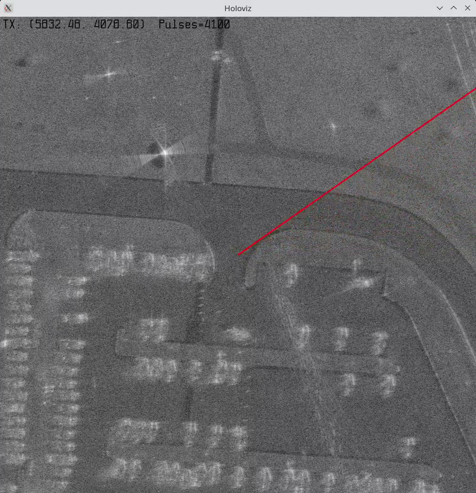

# Streaming Synthetic Aperture Radar

## Description

This application is a demonstration of using Holoscan to construct Synthetic Aperture Radar (SAR) imagery from a data collection.  In current form, the data is assumed to be precollected and contained in a particular binary format.  It has been tested with 2 versions of the publicly available GOTCHA volumetric SAR data collection.  Python-based converters are included to manipulate the public datasets into the binary format expected by the application.  The application implements Backprojection for image formation.
<!-- , in both Python and C++.  The Python implementation is accelerated via CuPy, and is backwardly compatible with Numpy.  The C++ implementation is accelerated with MatX.
-->


## Requirements
* Holoscan (>=0.5)
* Python implementation:
    * Python3
    * CuPy or Numpy
    * Pillow
* Scripts in ``deploy/`` will build and execute a docker environment that meets the requirements for systems using nvidia-docker
<!-- 
    * C++:
        * CUDA Toolkit
* Requirements are conveniently met by building and deploying the Holoscan development container [add link]
--> 

## Obtain and Format GOTCHA Dataset
* Navigate to https://www.sdms.afrl.af.mil/index.php?collection=gotcha 
* Click the DOWNLOAD link below the images
* Log in.  You may need to create an account to do so
* Under "GOTCHA Volumetric SAR Data Set Challenge Problem" download "Disc 1 of 2".
    * The data in "Disc 2 of 2" is compatible with this demo but not used
* Unpack the contents of "Disc 1 of 2" into the ``data/`` directory.  This should create a subdirectry named ``GOTCHA-CP_Disc1/``
* ``cd data``
* ``python3 cp-large_convert.py``
* This should create a data file named ``gotcha-cp-td-os.dat`` that has a file size 2766987672 bytes, and a md5sum of 554b509c2d5c2c3de8e5643983a9748d

## Build and Use Docker Container (Optional)
* This demonstration is distributed with tools to build a docker container that meets the demonstration's system requirements.  This approach will only work properly with nvidia-docker
* From the demonstration root directory:
* ```cd deploy```
* ```bash build_application_container.sh``` - this will build the container
* ```bash run_application_container.sh``` - this will launch a container that meets the demonstration system requirements

## Build and Execute
<!-- * Place ```.dat``` files in ```data/``` -->
* Python: 
    * ```python3 holosar.py```

The application will create a window with the resolved SAR image, and update after each group of 100 pulses received.  The image represents the strength of reflectivity at points on the ground within the imaging window.  The text at the top of the window indicates the (X,Y) position of the collecting radar at the most recent pulse, along with the total count of pulses received.  The red line points in the direction of the collection vehicle's location at the most recent pulse.  

A screen grab is included below for reference:



<!-- 
* C++:
    * ```cd cpp```
    ```mkdir build && cd build```
    ```cmake ..```
    ```make```
    ```./holosar```
* The application will generate one or more image files (depending on configuration) containing the SAR imagery.  For the backprojection algorithm, there will be image files for various number of ingested pulses, showing the evolution of the formed SAR imagery.  For Polar Format Algorithm, only complete images will be emitted.
--> 
