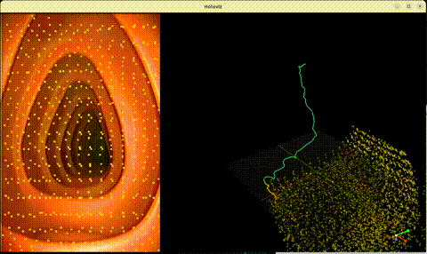

# Tracks2Endo4D

A GPU-accelerated application for real-time 3D point tracking and camera parameter estimation from video, built on [NVIDIA Holoscan](https://developer.nvidia.com/holoscan-sdk).



## Overview

Tracks2Endo4D combines state-of-the-art point tracking with 3D reconstruction to:

- **Track arbitrary points** across video frames using persistent 2D point tracking
- **Reconstruct 3D structure** from 2D tracks in a single feed-forward pass
- **Estimate camera parameters** including intrinsics (focal length, principal point) and extrinsics (camera pose/trajectory)

## Architecture

### Core Technologies

| Component        | Description                                                                                                             | Link                                                                        |
| ---------------- | ----------------------------------------------------------------------------------------------------------------------- | --------------------------------------------------------------------------- |
| **TapNext**      | "Tracking Any Point" reformulated as next-token prediction for robust long-range point tracking                         | [GitHub](https://github.com/google-deepmind/tapnet)                         |
| **TracksTo4D**   | NVIDIA Research's encoder-based method that infers 3D structure and camera motion from 2D tracks without 3D supervision | [Project Page](https://tracks-to-4d.github.io/)                             |
| **Holoscan SDK** | NVIDIA's platform for building high-performance streaming AI applications                                               | [Documentation](https://docs.nvidia.com/holoscan/sdk-user-guide/index.html) |

## Requirements

### Hardware

- **NVIDIA GPU** with CUDA 12+ and Vulkan support
- **Display** configured for X11 (for visualization)

### Software

- **Docker** with [NVIDIA Container Toolkit](https://docs.nvidia.com/datacenter/cloud-native/container-toolkit/latest/install-guide.html)
- **Holoscan SDK `>= v3.0`**: The Holohub container handles this dependency automatically.

### Models

This application uses the following AI models:

| Model           | Description                             | Source                                             |
| --------------- | --------------------------------------- | -------------------------------------------------- |
| TapNext Init    | Initialization model for point tracking | Converted from PyTorch to ONNX during Docker build |
| TapNext Forward | Forward pass model for point tracking   | Converted from PyTorch to ONNX during Docker build |
| TracksTo4D      | 3D reconstruction from 2D tracks        | Downloaded with sample data from NGC               |

The TapNext models are **not** hosted as pre-built ONNX files. Instead, the [Dockerfile](./Dockerfile) clones the [TapNet repository](https://github.com/deepmind/tapnet), downloads the official PyTorch checkpoint, and converts the models to ONNX format on the fly during the Docker image build. All ONNX models are then converted to TensorRT engines (BF16 precision) at CMake build time.

### Sample Data

Sample video data and the TracksTo4D model are automatically downloaded from NGC during the build process.

- 📦 [Download Data (NGC)](https://registry.ngc.nvidia.com/orgs/nvstaging/teams/holoscan/resources/holoscan_tracking_sample_data) - Pre-trained models and sample
videos

## Quick Start Guide

The entire application runs inside a Docker container. The first run builds the container image (which includes the PyTorch-to-ONNX conversion for TapNext models), downloads sample data, converts ONNX models to TensorRT, and launches the application:

```sh
./holohub run tracks2endo4d
```

This command will:

1. Build the Docker container image (includes TapNext ONNX conversion from PyTorch)
2. Launch the container
3. Download sample data and the TracksTo4D model from NGC
4. Copy the TapNext ONNX models (generated during the Docker build) into the data directory
5. Convert all ONNX models to TensorRT engines (BF16 precision)
6. Build and run the application

The build produces the following TensorRT engine files:

| ONNX Model             | TensorRT Engine               |
| ---------------------- | ----------------------------- |
| `tapnext_init.onnx`    | `tapnext_init.bf16.engine`    |
| `tapnext_forward.onnx` | `tapnext_forward.bf16.engine` |
| `tracksto4d.onnx`      | `tracksto4d.bf16.engine`      |

> **Important:** TensorRT engines are GPU-architecture specific. You must rebuild when switching to a different GPU.

### Subsequent Runs

Once the Docker image is built and TensorRT engines have been generated, subsequent runs reuse them. To skip the TensorRT conversion on subsequent runs:

```sh
./holohub run tracks2endo4d --configure-args "-DCONVERT_ENGINE=OFF"
```

## Advanced Usage

### Using Holohub Container

First, launch the Holohub container:

```sh
./holohub run-container tracks2endo4d
```

### Building the Application

Once your environment is set up, you can build the workflow using the following command:

```sh
./holohub build tracks2endo4d
```

To force TensorRT engine re-conversion (e.g., after switching GPUs):

```sh
./holohub build tracks2endo4d --configure-args "-DCONVERT_ENGINE=ON"
```

### Running the Application

#### From Outside the Container

Run the application using the Holohub container (builds if needed):

```sh
./holohub run tracks2endo4d
```

To skip the build step:

```sh
./holohub run tracks2endo4d --no-build
```

#### From Inside the Container

You can also run the application directly:

```sh
cd <HOLOHUB_SOURCE_DIR>/applications/tracks2endo4d
python3 tracks2endo4d_app.py --data <DATA_DIR> --model <MODEL_DIR>
```

> **TIP:** You can get the exact "Run command" along with "Run environment" and "Run workdir" by executing:
>
> ```bash
> ./holohub run tracks2endo4d --dryrun --local
> ```

### CMake Build Options

This application supports the following CMake options that can be passed via `--configure-args`:

| Option           | Description                                          | Default |
| ---------------- | ---------------------------------------------------- | ------- |
| `CONVERT_ENGINE` | Convert ONNX models to TensorRT engines during build | `ON`    |

Example usage:

```sh
./holohub build tracks2endo4d --configure-args "-DCONVERT_ENGINE=OFF"
```

### Command Line Arguments

The application accepts the following command line arguments:

| Argument      | Description                                         | Default                                           |
| ------------- | --------------------------------------------------- | ------------------------------------------------- |
| `--source`    | Source of video input: `replayer` or `aja`          | `replayer`                                        |
| `-d, --data`  | Path to data directory containing videos            | Uses the `HOLOHUB_DATA_PATH` environment variable |
| `-m, --model` | Path to model directory containing TensorRT engines | Uses the `HOLOHUB_DATA_PATH` environment variable |
| `--viz-2d`    | Enable 2D visualization overlay                     | False                                             |

## Configuration

The application is configured via [config.yaml](./config.yaml). Key parameters include:

| Section           | Parameter            | Description                             |
| ----------------- | -------------------- | --------------------------------------- |
| `replayer`        | `basename`           | Video file basename (without extension) |
| `replayer`        | `frame_rate`         | Playback frame rate                     |
| `window`          | `window_size`        | Temporal window for tracking            |
| `window`          | `overlap_size`       | Overlap between consecutive windows     |
| `window`          | `grid_size`          | Grid size for point sampling            |
| `preprocessor_3d` | `calibration_matrix` | Camera intrinsic matrix (if known)      |
| `tapnext`         | `model_file_path_*`  | Paths to TensorRT engines               |

## Using Your Own Videos

To use custom videos, you must first convert them to GXF entity format. The conversion script is included in the Holoscan Docker container.

See the official instructions in the Holoscan SDK repo:
📄 [convert_video_to_gxf_entities.py](https://github.com/nvidia-holoscan/holoscan-sdk/tree/main/scripts#convert_video_to_gxf_entitiespy)

Once converted, update the `replayer/basename` parameter in [config.yaml](./config.yaml) to point to your new video file (without extension).

## Using AJA Card as I/O

To use an AJA capture card for real-time input:

```sh
./holohub run tracks2endo4d --run-args "--source aja"
```

> **Note:** The AJA video buffer dtype is set to `rgba8888` by default. If your camera is not providing an alpha channel, you can change it to `rgb888` by modifying `in_dtype` in the `aja_format_converter` section of the [config.yaml](./config.yaml) file.

## References

- **TracksTo4D**: Kasten, Y., Lu, W., & Maron, H. (2024). *Fast Encoder-Based 3D from Casual Videos via Point Track Processing*. NeurIPS 2024. [https://tracks-to-4d.github.io/](https://tracks-to-4d.github.io/)

- **TapNet/TapNext**: Zholus, A., Doersch, C., Yang, Y., Koppula, S., Patraucean, V., He, X. O., ... & Goroshin, R. (2025). *TAPNext: Tracking Any Point (TAP) as Next Token Prediction*. arXiv preprint arXiv:2504.05579. [https://github.com/google-deepmind/tapnet](https://github.com/google-deepmind/tapnet)

- **Holoscan SDK**: [https://developer.nvidia.com/holoscan-sdk](https://developer.nvidia.com/holoscan-sdk)
