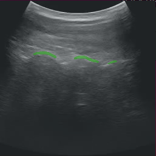
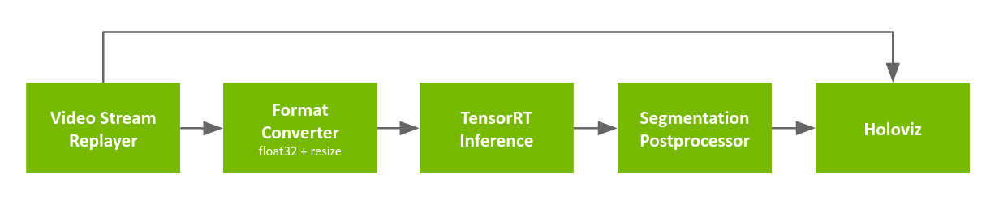
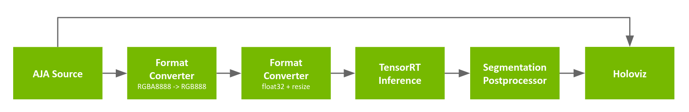

# Ultrasound Bone Scoliosis Segmentation

This section describes the details of the ultrasound segmentation sample application as well as how to load a custom inference model into the application for some limited customization. Out of the box, the ultrasound segmentation application comes as a "video replayer", "AJA source" or "QCAP source", where the user can replay a pre-recorded ultrasound video file included in the holoscan container or stream data from an AJA capture device or a YUAN capture device directly through the GPU respectively.

This application performs an automatic segmentation of the spine from a trained AI model for the purpose of scoliosis visualization and measurement.

This application is available in C++ and Python API variants.

 
Fig. 1 Spine segmentation of ultrasound data ([NGC Resource](https://catalog.ngc.nvidia.com/orgs/nvidia/teams/clara-holoscan/resources/holoscan_ultrasound_sample_data))

### Video Stream Replayer Input

 
Fig. 2 Segmentation application workflow with replay from file

The pipeline uses a recorded ultrasound video file (generated by `convert_video_to_gxf_entities` script) for input frames. Each input frame in the file is loaded by [Video Stream Replayer](https://docs.nvidia.com/clara-holoscan/sdk-user-guide/holoscan_operators_extensions.html#operators) and passed to the following two branches:
- In the first branch, the input frames are directly passed to [Holoviz](https://docs.nvidia.com/clara-holoscan/sdk-user-guide/holoscan_operators_extensions.html#operators) for rendering in the background.
- In the second branch, the frames go through the [Format Converter](https://docs.nvidia.com/clara-holoscan/sdk-user-guide/holoscan_operators_extensions.html#operators) to convert the data type of the image from `uint8` to `float32` and resize the image before it is fed into the segmentation model using [TensorRT Inference](https://docs.nvidia.com/clara-holoscan/sdk-user-guide/holoscan_operators_extensions.html#operators). The result is then ingested by the [Segmentation Postprocessor](https://docs.nvidia.com/clara-holoscan/sdk-user-guide/holoscan_operators_extensions.html#operators) which extracts the masks from the inference output, before [Holoviz](https://docs.nvidia.com/clara-holoscan/sdk-user-guide/holoscan_operators_extensions.html#operators) renders them as overlays.

### AJA Card input

 
Fig. 3 Segmentation application workflow with input from AJA video source

The pipeline is similar to the one using the recorded video, with the exceptions below:
- the input source is replaced with [AJA Source](https://docs.nvidia.com/clara-holoscan/sdk-user-guide/holoscan_operators_extensions.html#operators) (pixel format is `RGBA8888` with a resolution of 1920x1080)
- a [Format Converter](https://docs.nvidia.com/clara-holoscan/sdk-user-guide/holoscan_operators_extensions.html#operators) is added in the inference pipeline to convert from `RGBA8888` *(note: could have updated the configuration of the next Format Converter when using AJA instead of adding another operator in the pipeline)*

### YUAN Card input

 
Fig. 3 Segmentation application workflow with input from AJA video source

The pipeline is similar to the one using the recorded video, with the exceptions below:
- the input source is replaced with [QCAP Source] (pixel format is `RGB888` with a resolution of 3840x2160)

### Holoscan SDK version

Ultrasound segmentation application in HoloHub required version 0.6 of the Holoscan SDK.
If the Holoscan SDK version is 0.5 or lower, following code changes must be made in the application:

* In cpp/main.cpp: `#include <holoscan/operators/inference/inference.hpp>` is replaced with `#include <holoscan/operators/multiai_inference/multiai_inference.hpp>`
* In cpp/main.cpp: `ops::InferenceOp` is replaced with `ops::MultiAIInferenceOp`
* In cpp/CMakeLists.txt: update the holoscan SDK version from `0.6` to `0.5`
* In cpp/CMakeLists.txt: `holoscan::ops::inference` is replaced with `holoscan::ops::multiai_inference`
* In python/CMakeLists.txt: update the holoscan SDK version from `0.6` to `0.5`
* In python/multiai_ultrasound.py: `InferenceOp` is replaced with `MultiAIInferenceOp`
