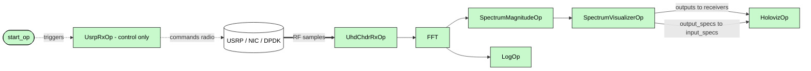
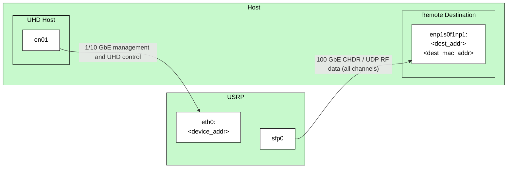
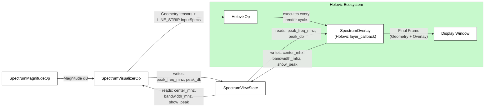
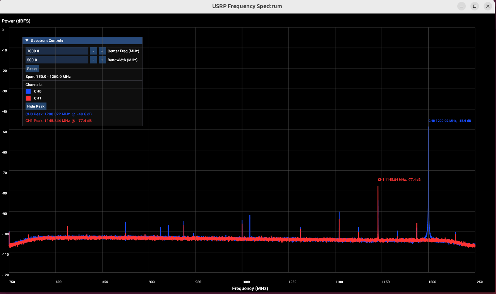

# USRP Spectrum Viewer

## Overview

The USRP Spectrum Viewer application receives RF samples from a USRP radio, ingests CHDR packets through DAQIRI, converts them into GPU tensors, performs FFT-based spectral analysis, computes power in dB, and renders the resulting spectrum with Holoviz.

The processing pipeline is shown below. `UsrpRxOp` is a **control-only** operator. It commands the radio to start streaming but emits no tensors. The RF samples reach `UhdChdrRxOp` out-of-band over the NIC (via DPDK/DAQIRI), **not** through a Holoscan port, so there is no Holoscan data-flow edge between `UsrpRxOp` and `UhdChdrRxOp`.



### USRP References

The application uses the UHD API to configure and control the USRP, then receives the resulting CHDR/UDP stream through DAQIRI. Consult the following before adapting the radio and network settings:

- [USRP Hardware Driver and UHD Manual](https://files.ettus.com/manual/)
- [UHD Configuration and Device Arguments](https://files.ettus.com/manual/page_configuration.html)
- [USRP Hardware Documentation](https://www.ettus.com/all-products/)

### Acronyms

| Acronym | Meaning |
| ------- | ------- |
| CHDR | Condensed Hierarchical Datagram (USRP communication protocol) |
| DPDK | Data Plane Development Kit |
| FFT | Fast Fourier Transform |
| NIC | Network Interface Card |
| UHD | USRP Hardware Driver |
| USRP | Universal Software Radio Peripheral |

## Requirements

The following equipment is required to run the application:

- A USRP device capable of streaming CHDR/UDP data to the host NIC, e.g., a USRP X410 or X440
- An x86_64 PC with decent performance running Ubuntu Linux 24.04
  - NVIDIA/Mellanox ConnectX-6 Dx or better
  - NVIDIA RTX A4000 or better
- Alternatively, a NVIDIA DGX Spark can be used as well
- A QSFP+ cable capable of 100GbE transmission

> [!IMPORTANT]
> The settings in `config.yaml` must be tailored to your system, including USRP device arguments, NIC PCIe address, host IP address, destination ports, and MAC addressing.

### First-Time Machine Setup

Before configuring or running this application, prepare the host:

- **High-performance networking:** this application receives the USRP CHDR/UDP stream through DAQIRI and DPDK, placing the RF payload directly into GPU-accessible memory. Complete the [High Performance Networking tutorial](../../tutorials/high_performance_networking/README.md) (hugepages, NIC/DPDK binding) first. This is required, not optional.

- **Socket buffer limits:** increase the kernel socket buffers used by the UHD control path. If UHD warns about send/receive buffer sizes or you see dropped packets, run:

  ```bash
  sudo sysctl -w net.core.rmem_max=2500000
  sudo sysctl -w net.core.wmem_max=2500000
  ```

  These apply to the current boot only; add them to `/etc/sysctl.conf` to persist.

- **USRP FPGA image:** load an FPGA image that supports your streaming rate with `uhd_image_loader`. See the [USRP X4xx manual](https://files.ettus.com/manual/page_usrp_x4xx.html) for the loading procedure, and [Limitations](#limitations) for the images used during testing.

## Configuration

Each major stage of the pipeline has its own configuration section in `config.yaml`.
The operator-specific options and their meaning are documented in each folder-level README:

1. [`daqiri`](https://github.com/NVIDIA/daqiri)
2. [`usrp_rx`](./usrp_rx/README.md)
3. [`uhd_chdr_rx`](./uhd_chdr_rx/README.md)
4. [`fft`](../../operators/fft/README.md)
5. [`spectrum_magnitude`](./spectrum_magnitude/README.md)
6. [`spectrum_visualizer`](./spectrum_visualizer/README.md)
7. [`holoviz`](https://github.com/nvidia-holoscan/holoscan-sdk/blob/e64af8f270896599ec4c7e53a25acef12dbb3934/examples/holoviz/README.md?plain=1#L4)
8. [`log`](./log/README.md)

### USRP Receive Configuration

The `usrp_rx` section configures the control-plane connection to the radio. When `enabled` is `true`, `UsrpRxOp` opens the device identified by `args`, configures the sample rate, RF center frequency, and gain for every selected channel, and starts one UHD receive streamer per channel. Each streamer sends its UDP/CHDR packets to the
matching `dest_ports` entry on `dest_addr`, `channels` and `dest_ports` must have the same number of entries. Their positions form the mapping between a radio channel and a DAQIRI receive queue; for example, channel 0 uses port 1234 and channel 1 uses port 1235 below.

> [!IMPORTANT]
> `enabled` defaults to `false` so the application never tries to open a radio with the placeholder addresses shipped in `config.yaml`. Replace the placeholder `args`, `dest_addr`, and `dest_mac_addr` values with your hardware's settings, then set `enabled: true` to start in-app USRP control.
>
> Before starting the application, make the `spectrum_viz` reference settings describe the RF stream configured in `usrp_rx`:
>
> ```yaml
> usrp_rx:
>   freq: 1000000000.0       # Hz: actual USRP center frequency
>   rate: 500000000.0        # samples/s: FFT sample rate
>
> spectrum_viz:
>   ref_center_mhz: 1000.0   # must equal usrp_rx.freq / 1e6
>   ref_bandwidth_mhz: 500.0 # must equal the FFT sample rate / 1e6
> ```
>
> If these values do not match the received RF stream, the spectrum still renders, but its frequency labels and peak-frequency readout are incorrect.

### UHD Streaming Path

The USRP uses separate network paths for control and high-rate CHDR data. The host runs UHD control through its management interface, while DAQIRI/DPDK receives the packet stream through the high-speed interface configured as `sdr_data`.



The addresses shown above illustrate the physical topology from the supplied setup diagram. Configure the matching USRP address and data destination in `usrp_rx`; replace the example addresses with those assigned to the USRP and host in your environment.

```yaml
usrp_rx:
    enabled: true
    # UHD device address and optional device settings.
    args: "addr=<device_addr>,master_clock_rate=500000000"
    rate: 500000000.0
    freq: 1000000000.0
    gain: 0.0
    channels: [0, 1]

    # Destination for the USRP's CHDR/UDP streams.
    dest_addr: <dest_addr>
    dest_ports: [1234, 1235]
    adapter: "sfp0"
    dest_mac_addr: <dest_mac>
    keep_hdr: true
    spp: 1024
    mtu: 8064
    start_delay_seconds: 0.05
```

### Shared Visualization State

This application uses a shared `SpectrumViewState` object to communicate between:

1. the Holoviz overlay callback, which owns the interactive center-frequency and bandwidth controls
2. `SpectrumVisualizerOp`, which remaps spectrum bins into screen-space coordinates and reports peak frequency / power information

### Visualization High-Level Flow

At a high level, the visualization subsystem has two separate paths that meet inside `HolovizOp`:

1. the geometry path, where `SpectrumVisualizerOp` converts the dB spectrum into line-strip coordinates and draw specifications
2. the shared-state path, where the overlay callback and the visualizer exchange pan, zoom, peak-toggle, and peak-result values through `SpectrumViewState`



### Memory Layout

The CHDR ingest path uses DAQIRI-managed memory regions. DAQIRI splits every received packet into three segments and places each segment according to the matching queue's `memory_regions` list. This avoids copying the RF sample payload through host memory before GPU processing.

For channel 1, the configured queue associates the packet segments with the following regions:

```yaml
daqiri:
    cfg:
        memory_regions:
            - name: "Headers_RX_CPU"
                kind: "huge"
                affinity: 0
                access: [local]
                num_bufs: 12500
                buf_size: 42       # Ethernet + IPv4 + UDP headers
            - name: "CH1_CHDR_Headers_RX_CPU"
                kind: "huge"
                affinity: 0
                access: [local]
                num_bufs: 12500
                buf_size: 64       # CHDR header
            - name: "CH1_Data_RX_GPU"
                kind: "device"
                affinity: 0
                access: [local]
                num_bufs: 12500
                buf_size: 4096     # 1024 complex SC16 samples

        interfaces:
            - name: sdr_data
                address: 0000:41:00.0
                rx:
                    queues:
                        - name: "Channel 1 data"
                            id: 0
                            cpu_core: 10
                            batch_size: 2500
                            memory_regions:
                                - "Headers_RX_CPU"          # segment 0
                                - "CH1_CHDR_Headers_RX_CPU" # segment 1
                                - "CH1_Data_RX_GPU"         # segment 2
```

The second queue follows the same layout with `CH2_CHDR_Headers_RX_CPU` and `CH2_Data_RX_GPU`. Thus, each incoming packet is divided into:

1. Ethernet, IP, and UDP headers in a CPU huge-page region.
2. The CHDR header in a CPU huge-page region.
3. The RF sample payload in a GPU device-memory region.

The `batch_size` must agree with `uhd_chdr_rx` batching. The current configuration uses 20 packets per output and 125 outputs per batch, so $20 \times 125 = 2500$ packets are collected per DAQIRI queue batch. `UhdChdrRxOp` gathers the segment-2 GPU pointers and converts the SC16 payload to complex float samples in a GPU tensor with shape:

`[num_outputs_per_batch][num_packets_per_output * num_complex_samples_per_packet]`

With the default settings, this is a `125 x 20480` complex-sample tensor per channel:
$20 \times 1024 = 20480$ samples per output and $125$ outputs per batch.

### Output

At runtime, Holoviz displays a live spectrum view with:

- one rendered line strip per configured RF channel,
- dB-scaled vertical axis labels,
- frequency labels along the horizontal axis,
- an ImGui control panel for center frequency and bandwidth, including a channel-color legend,
- an optional peak frequency / power readout.



> [!NOTE]
> The screenshot above shows a single visible spectrum trace. With the 2-channel configuration, Holoviz renders one color-coded line strip per configured channel,
> and the control panel legend maps each color to its channel; the traces can overlap when both channels observe the same band.

## Build & Run

From the Holohub workspace root:

1. Build the networking dev container:

   ```bash
   ./holohub build-container --docker-file pkg/holoscan-networking/Dockerfile --img holohub-networking:4.5.0
   ```

2. Build the application:

   ```bash
   ./holohub build usrp_spectrum_viewer --docker-opts "-u root --privileged -v /mnt/huge:/mnt/huge"
   ```

3. Run the application:

   ```bash
   ./holohub run usrp_spectrum_viewer --docker-opts "-u root --privileged -v /mnt/huge:/mnt/huge"
   ```

## Troubleshooting

### Run on a local display, not a remote desktop

Holoviz renders the live spectrum with Vulkan on the GPU over a remote desktop (VNC/RDP/X-forwarding), every rendered frame is copied off the GPU and streamed over the network, so the display becomes slow and choppy. For a smooth view, run the application on a monitor attached to the host. A remote session is fine for
editing config and launching the app, but not for watching the live spectrum.

## Known Issues

- **No runtime retuning of the USRP.** The Holoviz `Center Freq` and `Bandwidth` controls are display-only (pan/zoom). They do not retune the radio once streaming has started. To change the actual RF tuning, edit `usrp_rx.freq` / `usrp_rx.rate` in `config.yaml` and restart the application.
- **Only 2 channels are tested.** The color palette and legend support up to 4 channels, but the application has only been validated with 2. Running 4 channels also needs matching `config.yaml` entries (extra DAQIRI queues, `memory_regions`, and `dest_ports`) and has not been verified.

## Limitations

- **Hardware tested:** USRP X410 and X440 with UHD 4.10 over a Mellanox ConnectX-6 Dx NIC. Other radios, NICs, or UHD versions may work but are unverified.
The FPGA images used during testing were:

  | USRP | FPGA image |
  | ---- | ---------- |
  | X410 | `CG_400` |
  | X440 | `CG_1600` |

- **Fixed bandwidth:** the reference configuration assumes a 500 MHz sample rate (`spectrum_viz.ref_bandwidth_mhz: 500`). Using a different rate requires matching changes in `usrp_rx` and `spectrum_viz`.

- **No FFT windowing:** the FFT runs on the raw samples with no window function, so spectral leakage (side lobes) is present. Applying a window such as Hann or Blackman is not currently implemented.

## Folder Summary

- `usrp_rx/`: Configures the USRP and starts or stops UHD streaming.
- `uhd_chdr_rx/`: Receives DAQIRI bursts and converts CHDR payloads into batched complex tensors.
- `spectrum_magnitude/`: Converts complex FFT output into averaged per-bin power in dB.
- `spectrum_visualizer/`: Converts dB power bins into Holoviz line geometry and reports peak values.
- `spectrum_overlay/`: Provides the Holoviz callback for ImGui controls, axis labels, and annotations.
- `log/`: Optional throughput and tensor inspection utilities.

## Notes

- `UsrpRxOp` is a control operator. It starts the radio stream but does not emit tensors itself.
- `UhdChdrRxOp` is the packet-to-tensor bridge and is the main ingest point for RF sample data.
- `SpectrumVisualizerOp` emits both geometry tensors and matching Holoviz draw specifications.
