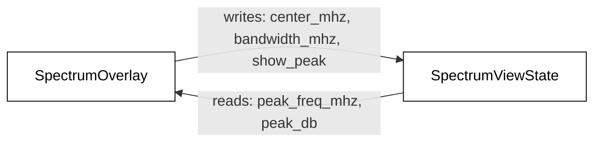

# Spectrum Overlay Helper Function

## Overview

The Holoviz overlay helper used by the application.

## Role In The Pipeline

The overlay is not a Holoscan operator. Instead, it is a callback attached to `HolovizOp`. The callback draws:

- the ImGui controls for center frequency, bandwidth, and peak display,
- the axis titles and tick labels,
- the background grid,
- the optional per-channel peak annotations.

It shares pan/zoom and peak state with `SpectrumVisualizerOp` through `SpectrumViewState`.

## Diagram Notes

The overlay diagrams should be read as UI and annotation diagrams, not as data-processing diagrams. `SpectrumOverlay` does not create the plotted spectrum line itself. The actual line geometry comes from `SpectrumVisualizerOp` and is sent directly to `HolovizOp`. The overlay only adds controls, labels, grid lines, and optional peak text on top of that geometry.

### SpectrumOverlay And SpectrumViewState

The shared-state diagram is correct when it shows two different directions of information flow:

1. `SpectrumOverlay` writes `center_mhz`, `bandwidth_mhz`, and `show_peak`
2. `SpectrumOverlay` reads `peak_freq_mhz` and `peak_db`

This split is important because the overlay owns the interactive controls, but it does not compute the peak itself. It only requests peak detection and then displays the per-channel results returned by `SpectrumVisualizerOp`.

### Layer Callback Execution

The callback runs serially each frame inside a single `layer_callback` invocation. It draws in order:

1. the ImGui layer for the control panel (center frequency, bandwidth, show-peak toggle)
2. the geometry layer for the grid lines and axis labels
3. the peak annotation, drawn only when `show_peak` is enabled

The three stages are not independent parallel tasks; each runs after the previous one completes, and the peak annotation is skipped entirely when the toggle is off.

```mermaid
flowchart LR
    RL["HoloViz Render Loop"] --> EC["Execute SpectrumOverlay Callback"]
    subgraph IC["1 - ImGui Controls"]
        IC1["Center Frequency"] --> IC2["Bandwidth"] --> IC3["Show Peak toggle"]
    end
    subgraph GA["2 - Grid and Axis Rendering"]
        GA1["Grid lines"] --> GA2["Frequency (x) labels"] --> GA3["Power (y) labels"]
    end
    subgraph PA["3 - Peak Annotation"]
        PA1["Peak frequency text"] --> PA2["Peak power text"]
    end

    EC --> IC1
    IC3 --> GA1
    GA3 --> PK{"show_peak<br/>enabled?"}
    PK -->|Yes| PA1
    PK -->|No| CO["Combine layers →<br/>HoloViz Render Layers"]
    PA2 --> CO
    CO --> OS["Output Screen"]

    classDef white fill:#ffffff,stroke:#000,color:#000;
    class RL,EC,IC1,IC2,IC3,GA1,GA2,GA3,PA1,PA2,PK,CO,OS white;
    style IC fill:#c7f9cc,stroke:#000,color:#000;
    style GA fill:#c7f9cc,stroke:#000,color:#000;
    style PA fill:#c7f9cc,stroke:#000,color:#000;
```

### What The Overlay Actually Draws

When the callback runs, it first draws the `Center Freq`, `Bandwidth`, `Reset`, and `Show Peak` controls. After updating `SpectrumViewState`, it draws the background grid, the `Frequency (MHz)` and `Power (dBFS)` axis titles, the numeric tick labels, and, when enabled, the peak text near the plotted line.

## Key Files

- `spectrum_overlay.hpp`: overlay configuration struct and callback factory declaration.
- `spectrum_overlay.cpp`: callback implementation and UI-local state.

## Notes

- This helper follows a lightweight "callback factory" style so `main.cpp` stays focused on composition.
- UI-local state lives inside the callback closure, while cross-component state stays in `SpectrumViewState`.
