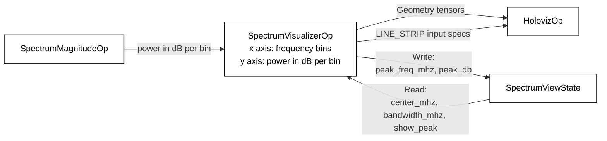
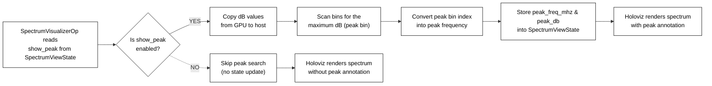
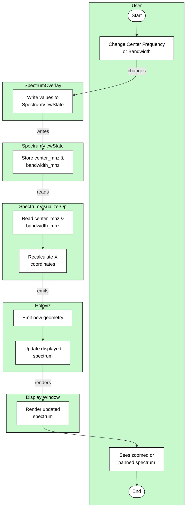

# Spectrum Visualizer Operator

## Overview

The operator that converts a 1-D power spectrum (in dB) into Holoviz-compatible line geometry.

## Role In The Pipeline

`SpectrumVisualizerOp` takes the per-bin dB power values from `SpectrumMagnitudeOp` and maps them into screen coordinates. It builds one `(num_bins, 2)` tensor per channel, where each row is an `(x, y)` point for a `LINE_STRIP` layer in Holoviz.

It also optionally detects the strongest peak of each channel in the current spectrum and publishes the per-channel peak frequency and dB level back to the UI overlay through shared state.

## Diagram Notes

The visualizer diagrams are easiest to understand if they are read as two related workflows:

1. the normal rendering path, where input dB power bins become Holoviz line geometry
2. the optional peak path, which runs only when `show_peak` is enabled in `SpectrumViewState`

In the normal rendering path, `SpectrumVisualizerOp` receives one 1-D dB power spectrum from `SpectrumMagnitudeOp`, normalizes each dB bin into a screen-space y coordinate, recomputes the x coordinates from the current center frequency and bandwidth, and packs the final `(x, y)` coordinates into one device tensor per channel. It also emits matching `LINE_STRIP` draw specifications so `HolovizOp` knows how to render each channel.

When reading the visualizer data-flow diagram, it is important to distinguish between frequency-domain data and display geometry. The input to this operator is a power spectrum in dB, but the output is not another spectrum tensor. The output is render-ready geometry plus Holoviz metadata.

### Peak Detection Flow

The peak workflow starts by reading `show_peak` from `SpectrumViewState`. If the flag is disabled, the operator skips the extra peak-search work and only emits geometry. If the flag is enabled, the operator copies the current dB bins from device memory to the host, scans them on the CPU to find the maximum bin for that channel, converts that bin index into an absolute frequency using the reference center frequency and bandwidth, and writes the resulting `peak_freq_mhz` and `peak_db` values for that channel's slot back into `SpectrumViewState`.

If your diagram shows a peak annotation after the `show_peak == false` branch, that should be corrected. In the actual code, peak values are only recomputed and displayed when the peak toggle is enabled.

### Pan And Zoom Flow

The pan and zoom diagram should emphasize that changing the center frequency or bandwidth does not change the incoming dB values. Instead, the overlay writes the new view parameters into `SpectrumViewState`, and `SpectrumVisualizerOp` uses those values to recompute the x coordinates of the line geometry on the next `compute()` call. The y coordinates still come from the normalized dB spectrum.

## Key Files

- `spectrum_visualizer.hpp`: operator declaration, shared state hook, and rendering constants.
- `spectrum_visualizer.cu`: dB normalization, pan/zoom mapping, Holoviz tensor packing, and peak detection.
- `spectrum_view_state.hpp`: shared state exchanged between the overlay callback and the visualizer operator.

## Notes

- The operator owns the data-to-geometry conversion.
- The UI itself is not implemented here; it lives in `../spectrum_overlay/`.
