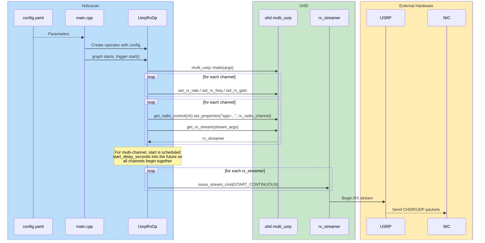

# USRP RX Operator

## Overview

This folder contains the operator responsible for configuring the USRP radio and starting or stopping [UHD Remote streaming](https://files.ettus.com/manual/page_stream.html#stream_remote)

## Role In The Pipeline

`UsrpRxOp` is the control-plane entrypoint for the application. It applies rate, frequency, gain, packet sizing, and destination settings from `config.yaml`, then instructs the USRP to stream UDP packets toward the NIC that DAQIRI/DPDK is monitoring.

Unlike the downstream operators, it does not emit data tensors. Its `compute()` method is intentionally empty because the useful work happens in `start()` and `stop()`.

## Key Files

- `usrp_rx.hpp`: operator declaration and parameter list.
- `usrp_rx.cpp`: UHD setup, channel validation, stream creation, and start/stop commands.

## Streaming Control Flow Diagram

The following diagram shows how `UsrpRxOp` configures the radio, starts UHD streaming, and directs packet traffic toward the host NIC for downstream ingest.

## Important Parameters

- `enabled`: turn in-app USRP control on or off.
- `args`: UHD device arguments used to discover and configure the radio.
- `rate`, `freq`, `gain`: RF tuning parameters.
- `channels`, `dest_ports`: channel-to-port mapping for outgoing UDP streams. Both lists must contain unique values and have the same length.
- `dest_addr`, `adapter`, `dest_mac_addr`, `keep_hdr`, `spp`, `mtu`: streaming format and egress configuration. `keep_hdr` must be true, and `spp` must match `uhd_chdr_rx.num_complex_samples_per_packet`.
