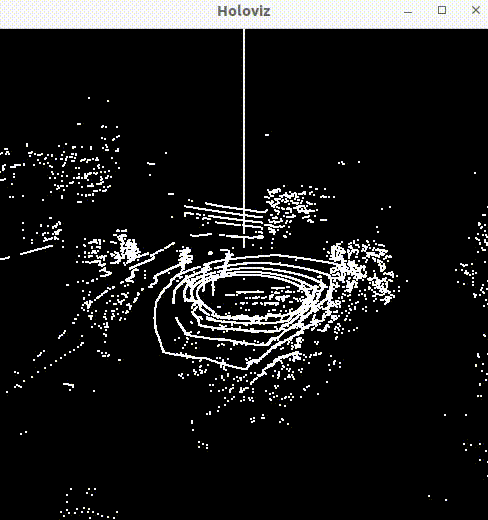
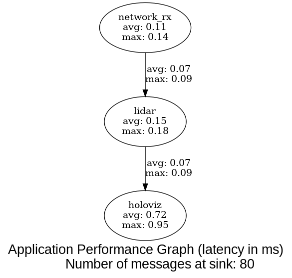
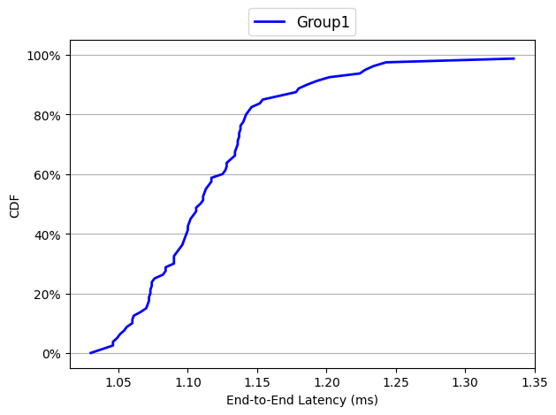

# Velodyne VLP-16 Lidar Viewer



## Overview

In this application we demonstrate how to use Holoscan SDK for low-latency lidar processing.
We receive lidar packets from a Velodyne VLP-16 lidar sensor, convert packet information to
a rolling Cartesian point cloud on GPU, then visualize the results with HoloViz.

## Background

"Lidar" (LIght Detection And Ranging) is a technique by which "light", typically of
wavelengths in the infrared spectrum, is used to determine the position of reflective
surfaces surrounding a sensor. A 3D lidar sensor often employs a stacked vertical array of
infrared laser emitters and sources that it spins rapidly. Similar to radar, the strength and
timing of reflected lasers can be used to generate a 360-degree 3D point cloud view of the surrounding
environment, with each point corresponding to an estimated point of reflection.

For demonstration purposes we selected the Velodyne VLP-16 lidar sensor as our input source.
We adapted existing packet processing code from NVIDIA DeepMap SDK into a custom Holoscan operator,
`VelodyneLidarOp`, and connected it with the existing `BasicNetworkOp` and `HoloVizOp` operators
to provide a complete viewing pipeline. We performed initial benchmarking on an NVIDIA IGX devkit.

## Requirements

This application is intended to run on a Holoscan SDK support platform, namely a Linux x64
system or an NVIDIA IGX developer kit.

To run the application you need a live or replayer source to stream Velodyne VLP-16 packet
data to the application. That may be either:
- A Velodyne VLP-16 lidar sensor. Review the [VLP-16 user manual](https://data.ouster.io/downloads/velodyne/user-manual/vlp-16-user-manual-revf.pdf)
- A VLP-16 `.pcap` recording file and a packet replayer software.
  - Visit Kitware's VeloView [Velodyne Lidar collection](https://www.paraview.org/veloview/#download) for sample VLP-16 `.pcap` files.
  - Visit the third party [Wireshark wiki](https://gitlab.com/wireshark/wireshark/-/wikis/Tools#traffic-generators) for a curated list of software options for generating traffic from `.pcap` files.

## Running the Application

First, start your lidar stream source. If you are using a VLP-16 lidar sensor, review the [VLP-16
user manual](https://data.ouster.io/downloads/velodyne/user-manual/vlp-16-user-manual-revf.pdf) for instructions on how to properly set up your network configuration.

Then, build and start the Holoscan lidar viewing application:

```sh
./dev_container build_and_run velodyne_lidar_app
```

## Benchmarks

We performed benchmarking on an NVIDIA IGX developer kit with an A4000 GPU. (Note that an A6000 GPU is standard for IGX.) We used the [holoscan_flow_benchmarking](../../benchmarks/holoscan_flow_benchmarking/) project to collect and summarize performance. The performance for each component in the Holoscan SDK pipeline is shown in the image below.

Key statistics:

| | |
| - | - |
| Minimum Latency | 1.03 milliseconds |
| Average Latency | 1.12 milliseconds |
| Maximum Latency | 1.34 milliseconds |

By comparison, the VLP-16 lidar publishes packets at a rate of approximately 1.33 milliseconds per packet.





## Frequently Asked Questions (FAQ)

### How does the application work?

The application flow is as follows:

1. A UDP packet is emitted from the Velodyne VLP-16 lidar sensor and received on port 2368 in the Holoscan `BasicNetworkOp` operator.
2. The packet payload is forwarded to the Holoscan `VelodyneLidarOp` operator. The operator decodes the packet
according to the Velodyne lidar specification, where the VLP-16 packet defines 384 spherical points from laser firings. The operator converts the spherical points to Cartesian points on the GPU device and adds the resulting cloud to a rolling, accumulated point cloud.
3. The Velodyne operator forwards the rolling point cloud to HoloViz, which renders the GPU point cloud to the screen.

### What are some limitations of the application?

This application is intended as a simple demonstration of how a lidar sensor can be integrated for input to Holoscan SDK for low latency processing. It does not propose any novel features. Some limitations compared with more complete lidar solutions are:
- No cloud filtering -- all zero-ranged points are kept in the buffer and visualized.
- No advanced inference techniques -- the cloud is simply translated and visualized.
- No RDMA -- VLP-16 lidar packets are received via the host ethernet interface on the IGX or x86_64 machine and then copied to the GPU device.
- Monochrome visual -- HoloViz operator cloud support is currently limited to one color.

Each of these limitations is merely a result of our scope of work, and could be overcome with additional attention.

### Why is HoloViz not responding?

In most cases this indicates that the Holoscan application is not receiving UDP packets.
There are several reasons that this could be the case:
- The VLP-16 lidar sensor is not turned on, or the ethernet cable is disconnected.
  The sensor typically takes approximately 30 seconds between powering on and transmitting packets.
- The VLP-16 lidar sensor network interface is not properly configured to receive packets. You can use a tool
  such as [Wireshark](https://www.wireshark.org/) to review live packets on the network interface. Review the [VLP-16
  user manual](https://data.ouster.io/downloads/velodyne/user-manual/vlp-16-user-manual-revf.pdf) for troubleshooting.
- The HoloHub application is not properly configured. Review the [`lidar.yaml`](cpp/lidar.yaml) configuration
  and confirm that the port and IP address match the VLP-16 configuration.

## Acknowledgements

This operator was developed in part with support from the NVIDIA nvMap team and adapts portions
of the NVIDIA DeepMap SDK.
