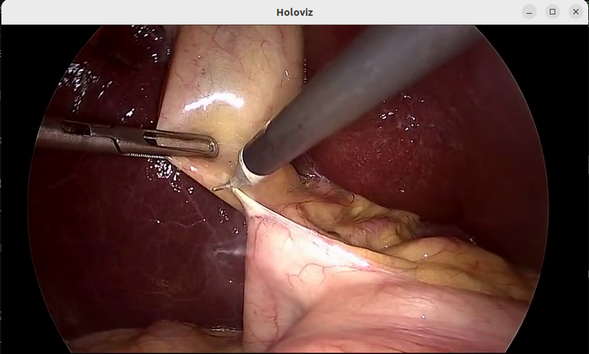

# Video Streaming Demo

This unified application demonstrates how to use the Holoscan SDK to create both streaming client and server applications for bidirectional video communication. This demo application demonstrates bidirectional video communication between client and server with real-time visualization.

  
*Fig. 1: Example of surgical video streaming with bidirectional communication showing the client receiving and displaying frames from the server.*

## Overview

The video streaming demo provides:

- **Streaming Client**: Captures video from V4L2 cameras or video files and streams to a server
- **Streaming Server**: Comprehensive server architecture with three main components:
  - **StreamingServerResource**: Manages server connections and client lifecycle
  - **StreamingServerUpstreamOp**: Receives video streams from clients
  - **StreamingServerDownstreamOp**: Sends video frames back to clients (passthrough/echo mode)
- **Bidirectional Communication**: Both sending and receiving video frames
- **Multiple Source Support**: V4L2 cameras, video replay files

## Requirements

- NVIDIA GPU
- CUDA 12.x (currently not working with CUDA 13.x)
- Holoscan SDK 3.5.0+
- V4L2 camera (optional, for live streaming)

### Client Dependencies

Download the client streaming binaries from NGC:

```bash
# Navigate to the client operator directory
cd <your_holohub_path>/operators/video_streaming/streaming_client_enhanced

# Download using NGC CLI
ngc registry resource download-version "nvidia/holoscan_client_cloud_streaming:0.2"
unzip -o holoscan_client_cloud_streaming_v0.2/holoscan_client_cloud_streaming.zip -d holoscan_client_cloud_streaming

# Clean up
rm -rf holoscan_client_cloud_streaming_v0.2
```

### Server Dependencies

Download the server streaming binaries from NGC:

```bash
# Navigate to the server operator directory  
cd <your_holohub_path>/operators/video_streaming/streaming_server_enhanced

# Download using NGC CLI
ngc registry resource download-version "nvidia/holoscan_server_cloud_streaming:0.2"
unzip -o holoscan_server_cloud_streaming_v0.2/holoscan_server_cloud_streaming.zip -d holoscan_server_cloud_streaming

# Clean up
rm -rf holoscan_server_cloud_streaming_v0.2
```

## Running the Applications

The unified application provides both client and server applications.

> [!IMPORTANT] Both client and server applications require Holoscan SDK 3.5.0. Set the SDK version environment variable before running the applications in each terminal, or use the `--base-img` option to specify the base image.
>
> ```bash
> # Set SDK version environment variable
> export HOLOHUB_BASE_SDK_VERSION=3.5.0
> ```

> [!NOTE] The client requires OpenSSL 3.4.0, which is installed inside the custom Dockerfile.

### 1. Start the Streaming Server

```bash
./holohub run video_streaming
```

### 2. Start the Streaming Client (in another terminal)

- **Option A: V4L2 Camera (Webcam)**, which uses `streaming_client_demo.yaml` and captures video from webcam with 640x480 resolution.

  ```bash
  ./holohub run video_streaming client_v4l2
  ```

- **Option B: Video Replayer**, which uses `streaming_client_demo_replayer.yaml` and replays a pre-recorded video file with 854x480 resolution.

  ```bash
  ./holohub run video_streaming client_replayer
  ```

## Python Applications

Both server and client applications are available in Python using the Holoscan Python bindings. The Python implementations are fully compatible with their C++ counterparts and can be used interchangeably.

### Requirements

- Python 3.8 or higher
- Holoscan SDK 3.5.0+ with Python bindings
- Build with `-DHOLOHUB_BUILD_PYTHON=ON` flag
- Custom Dockerfile with OpenSSL 3.4.0

### Running Python Server

```bash
# From holohub root directory - runs with default settings (854x480 @ 30fps)
./holohub run video_streaming server_python \
  --docker-file applications/video_streaming/Dockerfile \
  --docker-opts='-e EnableHybridMode=1' \
  --configure-args='-DHOLOHUB_BUILD_PYTHON=ON'
```

**Default Configuration:**
- Port: 48010
- Resolution: 854x480
- Frame Rate: 30 fps
- Pipeline: StreamingServerUpstreamOp → StreamingServerDownstreamOp (passthrough/echo mode)

### Running Python Client

**Video Replayer Mode (Default - 854x480):**
```bash
# From holohub root directory - runs with video file playback
./holohub run video_streaming client_python \
  --docker-file applications/video_streaming/Dockerfile \
  --docker-opts='-e EnableHybridMode=1' \
  --configure-args='-DHOLOHUB_BUILD_PYTHON=ON'
```

**V4L2 Camera Mode (640x480):**
```bash
# From holohub root directory - runs with V4L2 camera (webcam)
./holohub run video_streaming client_python_v4l2 \
  --docker-file applications/video_streaming/Dockerfile \
  --docker-opts='-e EnableHybridMode=1' \
  --configure-args='-DHOLOHUB_BUILD_PYTHON=ON'
```

**Default Client Configurations:**

**Video Replayer Mode:**
- Source: Video file (surgical_video)
- Resolution: 854x480
- Frame Rate: 30 fps
- Server: 127.0.0.1:48010

**V4L2 Camera Mode:**
- Source: /dev/video0 (webcam)
- Resolution: 640x480
- Frame Rate: 30 fps
- Server: 127.0.0.1:48010

**Important:** Ensure the server is configured to match the client's resolution for optimal performance.

### Python Bindings

The Python applications use these Holoscan operator bindings:

**Server Components:**
- `holohub.streaming_server_enhanced.StreamingServerResource` - Manages server connections and WebRTC
- `holohub.streaming_server_enhanced.StreamingServerUpstreamOp` - Receives frames from clients
- `holohub.streaming_server_enhanced.StreamingServerDownstreamOp` - Sends frames to clients

**Client Components:**
- `holohub.streaming_client_enhanced.StreamingClientOp` - Bidirectional client streaming

**Holoscan Core Operators:**
- `holoscan.operators.VideoStreamReplayerOp` - Video file playback
- `holoscan.operators.V4L2VideoCaptureOp` - Webcam capture
- `holoscan.operators.FormatConverterOp` - Format conversion (RGBA→RGB→BGR)
- `holoscan.operators.HolovizOp` - Visualization

### Python Server Example

```python
from holohub.streaming_server_enhanced import (
    StreamingServerDownstreamOp,
    StreamingServerResource,
    StreamingServerUpstreamOp,
)

class StreamingServerApp(Application):
    def compose(self):
        # Create shared streaming server resource
        streaming_resource = StreamingServerResource(
            self,
            name="streaming_server_resource",
            port=48010,
            width=854,
            height=480,
            fps=30,
            enable_upstream=True,
            enable_downstream=True,
        )

        # Upstream operator (receives from clients)
        upstream_op = StreamingServerUpstreamOp(
            self,
            name="upstream_op",
            streaming_server_resource=streaming_resource
        )

        # Downstream operator (sends to clients)
        downstream_op = StreamingServerDownstreamOp(
            self,
            name="downstream_op",
            streaming_server_resource=streaming_resource
        )

        # Connect: upstream -> downstream (passthrough/echo mode)
        self.add_flow(upstream_op, downstream_op, {("output_frames", "input_frames")})
```

**Key Points:**
- Both operators share the same `StreamingServerResource` to manage WebRTC connections
- The upstream operator receives frames from clients on its `output_frames` port
- The downstream operator receives those frames on its `input_frames` port and sends them back to clients
- This creates a simple passthrough/echo streaming pipeline

### Python Client Example

**Video Replayer Mode:**
```python
from holohub.streaming_client_enhanced import StreamingClientOp
from holoscan.operators import (
    FormatConverterOp,
    HolovizOp,
    VideoStreamReplayerOp,
)

class StreamingClientApp(Application):
    def compose(self):
        # Create video source (replayer)
        replayer = VideoStreamReplayerOp(
            self,
            name="replayer",
            directory="/workspace/holohub/data/endoscopy",
            basename="surgical_video",
            frame_rate=30,
        )

        # Create format converter (RGB to BGR)
        format_converter = FormatConverterOp(
            self,
            name="format_converter",
            in_dtype="rgb888",
            out_dtype="rgb888",
            out_tensor_name="tensor",
        )

        # Create streaming client
        streaming_client = StreamingClientOp(
            self,
            name="streaming_client",
            server_ip="127.0.0.1",
            port=48010,
            width=854,
            height=480,
            fps=30,
            send_frames=True,
            receive_frames=True,
        )

        # Create visualization (optional)
        holoviz = HolovizOp(
            self,
            name="holoviz",
            width=854,
            height=480,
        )

        # Connect the pipeline
        self.add_flow(replayer, format_converter, {("output", "source_video")})
        self.add_flow(format_converter, streaming_client)
        self.add_flow(streaming_client, holoviz, {("output_frames", "receivers")})
```

**V4L2 Camera Mode:**
```python
from holohub.streaming_client_enhanced import StreamingClientOp
from holoscan.operators import (
    FormatConverterOp,
    HolovizOp,
    V4L2VideoCaptureOp,
)

class StreamingClientApp(Application):
    def compose(self):
        # Create video source (V4L2 camera)
        v4l2_source = V4L2VideoCaptureOp(
            self,
            name="v4l2_camera",
            device="/dev/video0",
            width=640,
            height=480,
            frame_rate=30,
            pixel_format="YUYV",
            allocator=allocator,
        )

        # Create format converter (RGBA to RGB/BGR)
        format_converter = FormatConverterOp(
            self,
            name="format_converter",
            in_dtype="rgba8888",  # V4L2 outputs RGBA
            out_dtype="rgb888",   # Convert to RGB
            out_tensor_name="tensor",
            pool=allocator,
        )

        # Create streaming client
        streaming_client = StreamingClientOp(
            self,
            name="streaming_client",
            server_ip="127.0.0.1",
            port=48010,
            width=640,
            height=480,
            fps=30,
            send_frames=True,
            receive_frames=True,
        )

        # Create visualization (optional)
        holoviz = HolovizOp(
            self,
            name="holoviz",
            width=640,
            height=480,
        )

        # Connect the pipeline
        self.add_flow(v4l2_source, format_converter, {("output", "source_video")})
        self.add_flow(format_converter, streaming_client)
        self.add_flow(streaming_client, holoviz, {("output_frames", "receivers")})
```

**Key Points:**
- The `StreamingClientOp` handles bidirectional streaming (sends and receives frames)
- Format conversion is necessary to convert source formats to BGR for streaming
- V4L2 always outputs RGBA8888 (4 channels) regardless of input format
- Video replayer outputs RGB888 (3 channels)
- The `output_frames` port receives processed frames from the server
- Holoviz displays the received frames using the `receivers` input port

### Python Pipeline Architecture

**Server Pipeline:**
```
Client Streams → StreamingServerUpstreamOp → StreamingServerDownstreamOp → Client Streams
```

**Client Pipeline:**
```
Video Source → FormatConverterOp → StreamingClientOp → HoloVizOp (optional)
```

### Command Line Options (Python)

**Server Options:**
- `--port PORT`: Server port (default: 48010)
- `--width WIDTH`: Frame width (default: 854)
- `--height HEIGHT`: Frame height (default: 480)
- `--fps FPS`: Frames per second (default: 30)
- `--config PATH` or `-c PATH`: Path to YAML configuration file
- `--create-config PATH`: Create default configuration file at specified path
- `--help`: Show help message

**Client Options:**
- `--source {replayer,v4l2}`: Video source type (default: replayer)
- `--server-ip IP`: Server IP address (default: 127.0.0.1)
- `--port PORT`: Server port (default: 48010)
- `--width WIDTH`: Frame width (default: 854 for replayer, 640 for v4l2)
- `--height HEIGHT`: Frame height (default: 480)
- `--fps FPS`: Frames per second (default: 30)
- `--config PATH` or `-c PATH`: Path to YAML configuration file
- `--help`: Show help message

### Compatibility

- ✅ **Python server ↔ C++ client** - Fully compatible and tested
- ✅ **Python client ↔ C++ server** - Fully compatible and tested
- ✅ **Python server ↔ Python client** - Fully compatible and tested
- ✅ **C++ server ↔ C++ client** - Fully compatible and tested
- ✅ **All combinations are fully supported** - Mix and match as needed

### Cross-Language Compatibility Testing

Python clients are fully compatible with C++ servers and vice versa:

Terminal 1 - C++ Server:
```bash
./holohub run video_streaming server \
  --docker-file applications/video_streaming/Dockerfile \
  --docker-opts='-e EnableHybridMode=1'
```

Terminal 2 - Python Client:
```bash
./holohub run video_streaming client_python \
  --docker-file applications/video_streaming/Dockerfile \
  --docker-opts='-e EnableHybridMode=1' \
  --configure-args='-DHOLOHUB_BUILD_PYTHON=ON'
```

### Python Troubleshooting

**Import Error:**
- Ensure Holoscan SDK Python bindings are installed
- Verify build with: `./holohub build video_streaming --configure-args='-DHOLOHUB_BUILD_PYTHON=ON'`

**Camera Not Found:**
- Check V4L2 device path: `ls -l /dev/video*`
- Test camera: `v4l2-ctl --device=/dev/video0 --info`

**Connection Failed:**
- Verify server is running and ports are correct
- Check: `netstat -tlnp | grep 48010`

**Video Files Not Found:**
- Check data directory path: `/workspace/holohub/data/endoscopy/`
- Ensure video files exist in the data directory

**Resolution Mismatch:**
- Replayer default: 854x480
- V4L2 default: 640x480
- Server default: 854x480
- Ensure client and server resolutions match

### Configuration Files

**Python Server:** `python/streaming_server_demo.yaml`
**Python Client (Replayer):** `python/streaming_client_demo_replayer.yaml`
**Python Client (V4L2):** `python/streaming_client_demo.yaml`

### Detailed Documentation

For complete implementation details, see the component-specific READMEs:
- **[Server README](video_streaming_server/README.md)** - Complete server documentation (C++ and Python)
- **[Client README](video_streaming_client/README.md)** - Complete client documentation (C++ and Python)

## Command Line Options

### Server Options

- `-h, --help`: Show help message
- `-c, --config <file>`: Configuration file path (default: streaming_server_demo.yaml)
- `-d, --data <directory>`: Data directory for video files

### Client Options  

- `-h, --help`: Show help message
- `-c, --config <file>`: Configuration file path (default: streaming_client_demo.yaml)
- `-d, --data <directory>`: Data directory for video files

**Note:** Video source type (V4L2 vs replayer) is configured in the YAML file, not via command line arguments.

## Camera Setup and Testing

### Testing Your V4L2 Camera

Before starting the streaming client with camera input:

```bash
# Check available video devices
ls -la /dev/video*

# Get camera information
v4l2-ctl --device=/dev/video0 --info

# Test camera with recommended resolution
v4l2-ctl --device=/dev/video0 --set-fmt-video=width=1280,height=720,pixelformat=MJPG --stream-mmap --stream-count=10

# List supported formats
v4l2-ctl --device=/dev/video0 --list-formats-ext
```

### Recommended Resolution Settings

**For V4L2 cameras (like Logitech C920):**

- **1280x720 @ 30fps** - Best balance of quality and performance
- **1920x1080 @ 30fps** - High quality streaming (if supported)
- **854x480 @ 30fps** - Default, good for testing and lower bandwidth

**Important:** Ensure both client and server use matching resolution settings for optimal performance.

## Video Source Modes

### V4L2 Camera Mode vs Video Replayer Mode

| Feature | V4L2 Camera | Video Replayer |
|---------|-------------|----------------|
| **Config File** | `streaming_client_demo.yaml` (default) | `streaming_client_demo_replayer.yaml` (custom) |
| **Command** | `--docker-opts='-e device=/dev/video0'` | `--run-args='-c streaming_client_demo_replayer.yaml'` |
| **Source Type** | `source: "v4l2"` | `source: "replayer"` |
| **Input Format** | `rgba8888` (4 channels) | `rgb888` (3 channels) |
| **Resolution** | 640x480 | 854x480 |
| **Data Source** | Live webcam | Pre-recorded surgical video |
| **Use Case** | Real-time streaming | Testing, demos, development |

### Switching Between Modes

To switch between V4L2 camera and video replayer:

1. **Stop the current client** (Ctrl+C)
2. **Use the appropriate command:**
   - For camera: `./holohub run video_streaming client_v4l2 --docker-opts='-e EnableHybridMode=1' --docker-file applications/video_streaming/Dockerfile`
   - For video replay: `./holohub run video_streaming client_replayer --docker-opts='-e EnableHybridMode=1' --docker-file applications/video_streaming/Dockerfile`

**Important:** The server doesn't need to be restarted when switching client modes.

## Troubleshooting

### Camera Issues

- **Camera not detected:**

  ```bash
  sudo usermod -a -G video $USER
  # Log out and back in, then test again
  ```

- **Permission denied:**

  ```bash
  sudo chmod 666 /dev/video0
  ```

### Performance Issues

- **Poor streaming quality:**
  - Try lower resolution (854x480 or 640x480)
  - Reduce frame rate to 15 or 24 FPS
  - Ensure client and server resolutions match

### Connection Issues

- **Server not starting:**

  ```bash
  # Check if port is already in use
  netstat -tlnp | grep 48010
  
  # Kill existing process if needed
  sudo lsof -ti:48010 | xargs sudo kill -9
  ```

- **Client connection timeout:**
  - Verify server is running first
  - Check firewall settings for port 48010
  - Ensure server_ip and port match in both configurations

### Video Replayer Issues

- **Config file not found:**

  ```bash
  # Ensure the replayer config exists in build directory
  cp applications/streaming_client_demo/cpp/streaming_client_demo_replayer.yaml build/streaming_client_demo/
  ```

- **Format converter errors:**
  - `Invalid channel count for RGBA8888 3 != 4`: Video replayer outputs RGB888 (3 channels), not RGBA8888 (4 channels)
  - Solution: Use `streaming_client_demo_replayer.yaml` which has correct format converter settings

- **Resolution mismatch:**
  - Video file is 854x480, ensure all components use matching resolution
  - Check `streaming_client`, `holoviz`, and `format_converter` settings

### Expected Behavior and Logs

**Client Application:**
The streaming client may show `GXF_EXCEEDING_PREALLOCATED_SIZE` errors during BGR→BGRA conversion. This is expected behavior as the operators handle dynamic buffer allocation internally.

**Server Application:**
The server should display connection status and frame processing information. Look for messages about client connections and frame throughput.

**Successful Video Replayer Logs:**

```
[info] Source set to: replayer
[info] Using video replayer as source
[info] Connection established successfully
[info] Tensor validation passed: 480x854x3, 1229760 bytes
[info] Frame sent successfully
```

## Integration Testing

The video streaming demo includes integration testing to verify end-to-end functionality between client and server components.

### Integration Test Overview

The integration test validates:

- **Server Startup**: Streaming server initializes and starts listening
- **Client Connection**: Streaming client connects to server successfully  
- **Video Streaming**: Bidirectional video frame transmission (client→server→client)
- **Resource Management**: Proper cleanup and resource handling
- **Error Handling**: Graceful handling of connection issues

### Running Integration Tests

#### Option 1: Using Integration Test Script

The integration test script (`integration_test.sh`) runs the complete end-to-end test in a Docker container with proper SDK version and dependencies.

```bash
./applications/video_streaming/integration_test.sh
```

**Test Configuration:**

- **Duration**: 3-5 minutes total (includes Docker build and test execution)
- **SDK Version**: Holoscan 3.5.0 (enforced via environment variable)
- **Test Duration**: 30 seconds of active streaming
- **Requirements**: Docker, NVIDIA GPU, committed C++ source code
- **Output**: Detailed logs saved to `integration_test.log`

**⚠️ Important Notes:**

1. The test runs in Docker and builds from **committed source code**
2. If you have local C++ changes, **commit them first** before running the test
3. The test uses cached Docker layers for faster builds (unless cache is cleared)

#### Option 2: Using HoloHub CLI

```bash
# From holohub root - standard HoloHub test command
./holohub test video_streaming \
  --ctest-options="-R video_streaming_integration_test"
```

**Note:** Both methods run the same underlying integration test defined in `CMakeLists.txt`. The wrapper script (`integration_test.sh`) adds developer-friendly conveniences on top of the direct command.

### Integration Test Process

The integration test (whether run via wrapper script or direct command) follows this sequence:

#### 1. **Pre-Test Setup** (10-20 seconds)

```bash
# Displays current git commit
echo "Current commit: $(git log --oneline -1)"

# Cleans Docker build cache (optional, for fresh builds)
docker system prune -f --filter "label=holohub"

# Sets SDK version environment variable
export HOLOHUB_BASE_SDK_VERSION=3.5.0
```

#### 2. **Docker Build & Test Execution** (2-4 minutes)

```bash
# Builds Docker image and runs CTest
./holohub test video_streaming \
  --cmake-options="-DBUILD_TESTING=ON" \
  --ctest-options="-R video_streaming_integration_test -V" \
  --verbose
```

**What happens internally:**

- Builds Docker image with Holoscan SDK 3.5.0
- Compiles server and client C++ applications
- Copies configuration files to build directory
- Runs CTest with the integration test

#### 3. **Integration Test Execution** (44 seconds)

The `video_streaming_integration_test` defined in CMakeLists.txt:

1. **Server Startup** (10 seconds)
   - Launches streaming server in background: `streaming_server_demo`
   - Uses config: `streaming_server_demo.yaml`
   - Waits for server to initialize and stabilize

2. **Client Connection & Streaming** (30 seconds)
   - Starts streaming client: `streaming_client_demo`
   - Uses config: `streaming_client_demo_replayer.yaml` (video replay mode)
   - Establishes connection to server
   - Streams video frames bidirectionally for 30 seconds
   - Typically processes ~567 frames in both directions

3. **Log Verification & Cleanup** (4 seconds)
   - Gracefully terminates client (SIGTERM/SIGKILL)
   - Gracefully terminates server (SIGTERM/SIGKILL)
   - Verifies server logs for all required events and frame processing
   - Verifies client logs for successful streaming and frame transmission
   - Reports PASS/FAIL based on comprehensive log analysis

#### 4. **Post-Test Analysis** (5 seconds)

```bash
# Verifies test results from log file
if grep -q "Test.*Passed\|100%.*tests passed" integration_test.log; then
  echo "✓ Integration test PASSED"
  exit 0
fi
```

### Success Criteria

The integration test **PASSES** when **ALL 10 checks** are met (6 server + 4 client):

#### ✅ Server Log Verification Criteria (6 checks required)

1. **Client Connected**: `grep -q 'Client connected' $SERVER_LOG`
   - Verifies a client successfully connected to the server

2. **Upstream Connection Established**: `grep -q 'Upstream connection established' $SERVER_LOG`
   - Verifies the upstream data channel (client→server) is established

3. **Downstream Connection Established**: `grep -q 'Downstream connection established' $SERVER_LOG`
   - Verifies the downstream data channel (server→client) is established

4. **Upstream Frame Processing**: `grep -q 'Processing UNIQUE frame' $SERVER_LOG`
   - Verifies StreamingServerUpstreamOp received and processed frames from client
   - Typical: 565-567 unique frames in 30 seconds

5. **Downstream Tensor Processing**: `grep -q 'DOWNSTREAM: Processing tensor' $SERVER_LOG`
   - Verifies StreamingServerDownstreamOp processed and sent tensors to client
   - Typical: 565-567 tensors in 30 seconds

6. **Frame Processing Statistics**: `grep -q 'Frame Processing Stats' $SERVER_LOG`
   - Verifies the server logged performance statistics at shutdown

#### ✅ Client Log Verification Criteria (4 checks required)

1. **Frame Sending Success**: `grep -q 'Frame sent successfully' $CLIENT_LOG`
   - Verifies client successfully sent frames to server
   - Typical: 565-567 frames sent in 30 seconds

2. **Frame Reception Success**: `grep -q 'CLIENT: Received frame' $CLIENT_LOG`
   - Verifies client successfully received frames from server (bidirectional)
   - Typical: 533-540 frames received in 30 seconds (slight lag expected)
   - Completes end-to-end bidirectional verification

3. **Frame Validation**: `grep -q 'Frame validation passed' $CLIENT_LOG`
   - Verifies client frame validation logic is working
   - Logs appear every 30 frames (~1 second at 30 FPS)

4. **Streaming Client Started**: `grep -q 'STARTING STREAMING CLIENT' $CLIENT_LOG`
   - Verifies client initialization completed successfully

#### ✅ Overall Test Success

**Test PASSES if:**

- Server checks: **6/6 passed** (required: 6)
- Client checks: **4/4 passed** (required: 4)
- Total: **10/10 checks passed**

**Test FAILS if:**

- Any check fails (server < 6 or client < 4)
- Test times out (> 300 seconds)

**Note on Segmentation Faults:**

- Segmentation faults may appear during graceful shutdown (after SIGTERM)
- These are expected and do NOT cause test failure
- The test passes if all 10 log verification checks succeed
- Example: `Segmentation fault (core dumped)` appears in lines 423 and 680 of test output

### Expected Output

#### Console Output (Successful Test)

```bash
=== Video Streaming Demo Integration Test ===
This test may take up to 10 minutes to complete...
NOTE: Test runs in Docker and uses committed source code (not local build)

[Docker build output...]
Step 1/15 : ARG BASE_IMAGE=nvcr.io/nvidia/clara-holoscan/holoscan:v3.5.0-dgpu
[...]

[CTest output...]
Test project /workspace/holohub/build-video_streaming
    Start 1: video_streaming_integration_test

1: === Integration Test with Log Verification ===
1: Starting server and client with log capture...
1: Server log: /tmp/server_log.XXXXXX
1: Client log: /tmp/client_log.XXXXXX
1: Starting streaming server...
1: Waiting for server to initialize...
1: ✓ Server process is running
1: Starting streaming client...
1: Letting streaming run for 30 seconds...
1: Stopping client...
1: Stopping server...
1: /usr/bin/bash: line 53:   855 Segmentation fault      (core dumped) [...]
1: 
1: === Verifying Server Logs ===
1: ✓ Server: Client connected
1: ✓ Server: Upstream connection established
1: ✓ Server: Downstream connection established
1: ✓ Server: StreamingServerUpstreamOp processed 567 unique frames
1: ✓ Server: StreamingServerDownstreamOp processed 567 tensors
1: ✓ Server: Frame processing statistics logged
1: 
1: === Verifying Client Logs ===
1: ✓ Client: Sent 567 frames successfully
1: ✓ Client: Received 535 frames from server
1: ✓ Client: Frame validation passed
1: ✓ Client: Streaming client started
1: 
1: === Test Results Summary ===
1: Server checks passed: 6
1: Client checks passed: 4
1: ✓ STREAMING VERIFICATION PASSED - All checks passed, frames transmitted!
1: ✓ Integration test PASSED
1/2 Test #1: video_streaming_integration_test ..........   Passed   44.08 sec

    Start 2: video_streaming_integration_test_python

2: === Python Integration Test with Log Verification ===
2: Starting Python server and client with log capture...
2: PYTHONPATH: /workspace/holohub/build-video_streaming/python/lib:...
2: Python Server log: /tmp/server_python_log.XXXXXX
2: Python Client log: /tmp/client_python_log.XXXXXX
2: Starting Python streaming server...
2: Waiting for Python server to initialize...
2: ✓ Python Server process is running
2: Starting Python streaming client...
2: Letting Python streaming run for 30 seconds...
2: Stopping Python client...
2: Stopping Python server...
2: /usr/bin/bash: line 58:  1144 Segmentation fault      (core dumped) [...]
2: 
2: === Verifying Python Server Logs ===
2: ✓ Python Server: Client connected
2: ✓ Python Server: Upstream connection established
2: ✓ Python Server: Downstream connection established
2: ✓ Python Server: StreamingServerUpstreamOp processed 565 unique frames
2: ✓ Python Server: StreamingServerDownstreamOp processed 565 tensors
2: ✓ Python Server: Frame processing statistics logged
2: 
2: === Verifying Python Client Logs ===
2: ✓ Python Client: Sent 565 frames successfully
2: ✓ Python Client: Received 533 frames from server
2: ✓ Python Client: Frame validation passed
2: ✓ Python Client: Streaming client started
2: 
2: === Python Test Results Summary ===
2: Python Server checks passed: 6
2: Python Client checks passed: 4
2: ✓ PYTHON STREAMING VERIFICATION PASSED - All checks passed, frames transmitted!
2: ✓ Python Integration test PASSED
2/2 Test #2: video_streaming_integration_test_python ...   Passed   44.39 sec

The following tests passed:
	video_streaming_integration_test
	video_streaming_integration_test_python

100% tests passed, 0 tests failed out of 2

Total Test time (real) =  88.48 sec

=== VERIFICATION ===
✓ Integration test passed with detailed verification
✓ Server component verified
✓ Client component verified
✓ Integration test PASSED
```

#### Key Log Patterns to Look For

**Server Success Indicators:**

```console
[info] ✅ [UPSTREAM 12345] Client connected: connection details
[info] ⬆️ [UPSTREAM 12346] Upstream connection established: connection details
[info] ⬇️ [DOWNSTREAM 12347] Downstream connection established: connection details
[info] ✅ Processing UNIQUE frame: 854x480, 1639680 bytes, timestamp=29938
[info] 📊 DOWNSTREAM: Processing tensor 567 - shape: 480x854x4, 1639680 bytes
[info] ✅ DOWNSTREAM: Frame sent successfully to StreamingServerResource
[info] 📊 Frame Processing Stats: Total=567, Unique=567, Duplicates=0
```

**Client Success Indicators:**

```console
[info] Source set to: replayer
[info] Using video replayer as source
[info] 🔧 ENHANCED StreamingClient constructed! Version with buffer validation fixes!
[info] StreamingClient created successfully
[info] ✅ Connection established successfully
[info] ✅ Upstream connection established successfully!
[info] ✅ Frame sent successfully on attempt 1
[info] 🎯 CLIENT: Frame received callback triggered! Frame: 854x480, 1639680 bytes
[info] 📥 CLIENT: Received frame #533 from server: 854x480
```

**Performance Indicators:**

```console
# Server processed 565-567 frames in both directions
[info] ✅ Processing UNIQUE frame: 854x480, 1639680 bytes, timestamp=29938
[info] 📊 DOWNSTREAM: Processing tensor 567 - shape: 480x854x4, 1639680 bytes

# Client sent 565-567 frames and received ~533 frames
[info] ✅ Frame sent successfully on attempt 1
[info] 📥 CLIENT: Received frame #533 from server: 854x480

# Frame rate: ~19 FPS (567 frames ÷ 30 seconds)
# Bidirectional throughput: ~62 MB/s (1.64MB per frame × 19 FPS × 2 directions)
```

#### Integration Test Log File

The complete test execution is saved to `integration_test.log` (typically 700-800 lines). This file contains:

1. **Docker Build Logs**: Complete build output with all dependencies (~200 lines)
2. **CMake Configuration**: Build configuration and test setup (~100 lines)
3. **CTest Execution**: Detailed test execution with timestamps (~400 lines)
4. **Test Verification**: Log verification checks with pass/fail status (~100 lines)
5. **Test Summary**: Final PASS/FAIL status with verification details

**Note**: The actual server and client application logs are redirected to temporary files during testing and are NOT included in `integration_test.log`. These detailed logs are only displayed if the test fails.

**Analyzing the log:**

```bash
# Check test status
grep "Integration test PASSED" integration_test.log

# Check frame counts
grep "CLIENT: Received frame" integration_test.log | tail -5

# Check for errors
grep -i "error\|fail\|crash" integration_test.log

# View test summary
tail -100 integration_test.log
```

### Troubleshooting Integration Tests

#### Common Issues and Solutions

**Test Failure: Connection Events Not Logged**

If you see output like:

```bash
=== Verifying Server Logs ===
✗ Server: Upstream connection not established
✗ Server: Downstream connection not established
✓ Server: StreamingServerUpstreamOp processed 567 unique frames  # But frames work!
✓ Server: StreamingServerDownstreamOp processed 567 tensors      # But frames work!

=== Verifying Client Logs ===
✓ Client: Sent 567 frames successfully
✓ Client: Received 535 frames from server  # Bidirectional works!

=== Test Results Summary ===
Server checks passed: 4
Client checks passed: 4
✗ STREAMING VERIFICATION FAILED - One or more checks failed
✗ Integration test FAILED
```

**Root Cause:** Event callback overwriting in StreamingServerResource

- Both upstream and downstream operators call `set_event_callback()`
- Second call overwrites first operator's callback
- Only last operator receives connection events
- **Frames still work** (567 processed) but events aren't logged to both operators

**Solution:** Use `add_event_listener()` instead of `set_event_callback()`

- Fixed in commit `0e8a9603`: "Fix integration test and event listener bug"
- StreamingServerResource now supports multiple event listeners
- Both operators receive all connection events

**Build Failures:**

```bash
# Clean build and retry
rm -rf build/
./holohub build video_streaming --language cpp
```

**Server Connection Issues:**

```bash
# Check if port is in use
netstat -tlnp | grep 48010
sudo lsof -ti:48010 | xargs sudo kill -9
```

**Client Connection Timeout:**

- Verify server started successfully (check server logs)
- Ensure firewall allows port 48010
- Check Docker network connectivity

**Frame Transmission Issues:**

- Verify video data files exist: `/workspace/holohub/data/endoscopy/`
- Check format converter settings in config files
- Monitor GPU memory usage

**Segmentation Fault at Shutdown:**

```bash
# Expected behavior - test still passes if streaming worked
1: Segmentation fault (core dumped) ./streaming_server_demo
1: ✓ Server: StreamingServerUpstreamOp processed 567 unique frames
1: ✓ STREAMING VERIFICATION PASSED - Frames actually transmitted!
```

- Segfault occurs during cleanup after test completes
- Test passes if all 9 checks passed before shutdown
- Does not affect streaming functionality

### Integration Test Files

The integration test generates one comprehensive log file:

- **`integration_test.log`**: Complete test execution log containing:
  - Docker build output with all dependencies
  - CMake configuration and build logs
  - CTest execution with detailed timestamps
  - Server application logs (initialization, frame processing, shutdown)
  - Client application logs (connection, streaming, frame reception)
  - Test summary with final PASS/FAIL status

This file contains all information needed for debugging failed tests (~25,000-30,000 lines for a complete run).

### Continuous Integration

The integration test is designed for CI/CD pipelines:

```bash
# CI-friendly command with timeout and exit codes
timeout 300 ./applications/video_streaming/integration_test.sh
echo "Integration test exit code: $?"
```

**Exit Codes:**
- `0`: All tests passed successfully
- `1`: Test failures detected
- `124`: Test timeout (5 minutes)

## Python Integration Testing

### Overview

The Python integration test validates the complete bidirectional video streaming pipeline using Python implementations of both the server and client applications. The test verifies frame transmission, reception, and processing statistics.

### Running the Python Integration Test

**Command:**
```bash
# From holohub root - run Python integration test
./holohub test video_streaming \
  --docker-file applications/video_streaming/Dockerfile \
  --cmake-options='-DHOLOHUB_BUILD_PYTHON=ON -DBUILD_TESTING=ON' \
  --ctest-options="-R video_streaming_integration_test_python -V"
```

**Test Duration:** ~44 seconds (30 seconds of streaming + setup/teardown)

**Requirements:**
- Docker and NVIDIA GPU
- Testing enabled via `--cmake-options='-DBUILD_TESTING=ON'`
- Python bindings enabled via `--cmake-options='-DHOLOHUB_BUILD_PYTHON=ON'`
- Custom Dockerfile for OpenSSL 3.4.0 dependencies

### Test Workflow

1. **Server Startup**: Python streaming server starts with 854x480 resolution
2. **Client Startup**: Python streaming client starts with replayer source (854x480)
3. **Streaming Duration**: 30 seconds of bidirectional video streaming
4. **Log Verification**: Comprehensive log analysis for both server and client
5. **Graceful Shutdown**: Both processes are stopped and logs are analyzed

### Expected Outcome

**Successful Test Output (Standalone Python Test):**
```
=== Python Integration Test with Log Verification ===
Starting Python server and client with log capture...
PYTHONPATH: /workspace/holohub/build-video_streaming/python/lib:...
Python Server log: /tmp/server_python_log.XXXXXX
Python Client log: /tmp/client_python_log.XXXXXX
Starting Python streaming server...
Waiting for Python server to initialize...
✓ Python Server process is running
Starting Python streaming client...
Letting Python streaming run for 30 seconds...
Stopping Python client...
Stopping Python server...
/usr/bin/bash: line 58:  530 Segmentation fault      (core dumped) python3 streaming_server_demo.py ...

=== Verifying Python Server Logs ===
✓ Python Server: Client connected
✓ Python Server: Upstream connection established
✓ Python Server: Downstream connection established
✓ Python Server: StreamingServerUpstreamOp processed 564 unique frames
✓ Python Server: StreamingServerDownstreamOp processed 564 tensors
✓ Python Server: Frame processing statistics logged

=== Verifying Python Client Logs ===
✓ Python Client: Sent 564 frames successfully
✓ Python Client: Received 531 frames from server
✓ Python Client: Frame validation passed
✓ Python Client: Streaming client started

=== Python Test Results Summary ===
Python Server checks passed: 6
Python Client checks passed: 4
✓ PYTHON STREAMING VERIFICATION PASSED - All checks passed, frames transmitted!
✓ Python Integration test PASSED

1/1 Test #2: video_streaming_integration_test_python ...   Passed   44.41 sec

The following tests passed:
        video_streaming_integration_test_python

100% tests passed, 0 tests failed out of 1

Total Test time (real) = 44.42 sec
```

**Note:** When running the full integration test suite (both C++ and Python tests together), you'll see:
- Test counter: `2/2 Test #2` (instead of `1/1`)
- Both tests listed: `video_streaming_integration_test` and `video_streaming_integration_test_python`
- Total: `0 tests failed out of 2`
- Total time: ~88 seconds (both tests combined)

**Important Notes:**
- A segmentation fault may occur during shutdown - this is **expected** and does not indicate test failure
- The test explicitly ignores cleanup segfaults using `wait $PID || true`
- Test result is based **solely** on the 10 verification checks, not process exit codes
- CTest will show **"Passed"** if all checks succeed, even with segfault during cleanup

### Acceptance Criteria

The Python integration test validates the following checks. **All checks must pass** for the test to succeed:

#### Server Checks (6 required)

| Check | Description | Success Criteria |
|-------|-------------|------------------|
| ✓ Client connected | Client successfully connects to server | `"Client connected"` in server logs |
| ✓ Upstream connection | Upstream channel established (client → server) | `"Upstream connection established"` in server logs |
| ✓ Downstream connection | Downstream channel established (server → client) | `"Downstream connection established"` in server logs |
| ✓ Frame processing | Server processes frames from client | ≥100 `"Processing UNIQUE frame"` log entries |
| ✓ Tensor transmission | Server sends tensors to client | ≥100 `"DOWNSTREAM: Processing tensor"` log entries |
| ✓ Statistics logged | Frame processing statistics are logged | `"Frame Processing Stats"` in server logs |

#### Client Checks (4 required)

| Check | Description | Success Criteria |
|-------|-------------|------------------|
| ✓ Frames sent | Client successfully sends frames to server | ≥100 `"Frame sent successfully"` log entries |
| ✓ Frames received | Client receives frames from server | ≥100 `"CLIENT: Received frame"` log entries |
| ✓ Frame validation | Received frames pass validation | `"Frame validation passed"` in client logs |
| ✓ Client startup | Client application starts successfully | `"STARTING STREAMING CLIENT"` or `"Starting Streaming Client Demo"` in client logs |

#### Overall Test Success

**Test PASSES when:**
- ✅ All 6 server checks pass (6/6)
- ✅ All 4 client checks pass (4/4)
- ✅ Total: **10/10 checks passed**
- ✅ Exit code: `0`
- ✅ CTest output: `"100% tests passed, 0 tests failed out of 1"`

**Test FAILS when:**
- ❌ Any server check fails (< 6 passed)
- ❌ Any client check fails (< 4 passed)
- ❌ Total: < 10 checks passed
- ❌ Exit code: `1`
- ❌ CTest output: `"Tests failed with return value: -1"`

**Note on Segfaults:** Segmentation faults during cleanup do **not** cause test failure. The test uses `wait $PID || true` to ignore non-zero exit codes from cleanup. Only the 10 verification checks determine pass/fail status.

### Frame Throughput Metrics

**Minimum Requirements:**
- **Server Frame Processing**: ≥100 frames in 30 seconds (~3.3 fps minimum)
- **Client Frame Sending**: ≥100 frames in 30 seconds (~3.3 fps minimum)
- **Client Frame Reception**: ≥100 frames in 30 seconds (~3.3 fps minimum)

**Typical Performance:**
- **Frames Processed**: 500-600 frames in 30 seconds (~16-20 fps)
- **Bidirectional Verification**: Both upstream (client → server) and downstream (server → client) verified


### Troubleshooting

**Test Failure - Insufficient Frames:**
```
✗ Python Server: Only 50 frames processed (minimum: 100)
```
**Cause**: Insufficient streaming time or connection issues  
**Solution**: Check network connectivity, verify logs for connection errors

**Test Failure - Client Not Started:**
```
✗ Python Client: Streaming client failed to start
```
**Cause**: Missing dependencies or PYTHONPATH issues  
**Solution**: Ensure `HOLOHUB_BUILD_PYTHON=ON` and rebuild with Python bindings

**Test Failure - No Frames Received:**
```
✗ Python Client: No frames received from server
```
**Cause**: Downstream connection failure or server issues  
**Solution**: Check server logs for downstream connection establishment

**Segmentation Fault at Shutdown (Expected Behavior):**
```bash
Segmentation fault (core dumped) python3 streaming_server_demo.py
✓ Python Server: StreamingServerUpstreamOp processed 561 unique frames
✓ PYTHON STREAMING VERIFICATION PASSED - All checks passed, frames transmitted!
✓ Python Integration test PASSED
```

**Explanation**: A segfault occurs during Python interpreter shutdown when cleaning up C++ resources (StreamingServerResource, CUDA contexts). This is a known issue with destruction order in Python bindings and does **not affect streaming functionality**.

- Segfault happens **after** all streaming completes successfully
- Test uses `wait $PID || true` to ignore non-zero exit codes during cleanup
- Test passes if all 10 verification checks pass before shutdown
- **Solution**: No action needed - this is expected behavior and the test correctly reports PASS

### CI/CD Integration

**Exit Codes:**
- `0`: All tests passed (all 10 checks passed)
- `1`: One or more checks failed
- `124`: Test timeout (300 seconds)

**CI-Friendly Command:**
```bash
timeout 300 ./holohub test video_streaming \
  --docker-file applications/video_streaming/Dockerfile \
  --cmake-options='-DHOLOHUB_BUILD_PYTHON=ON -DBUILD_TESTING=ON' \
  --ctest-options="-R video_streaming_integration_test_python"
echo "Python integration test exit code: $?"
```

## Operator Documentation

For detailed information about the underlying video streaming operators used in this application, see:

📋 **[Video Streaming Operators](../../operators/video_streaming/README.md)** - Complete operator documentation

The operator documentation includes:

- **Client Components**: StreamingClientOp, FrameSaverOp
- **Server Components**: StreamingServerResource, StreamingServerUpstreamOp, StreamingServerDownstreamOp
- **Parameters and Configuration**: Detailed parameter descriptions and usage examples
- **Testing Documentation**: Comprehensive test suite with 40+ tests passing
- **API Reference**: Complete API documentation for all components

## Performance Notes

- **GPU Memory**: Configure appropriate allocator block sizes for your resolution
- **Network Bandwidth**: Monitor bandwidth usage for remote streaming scenarios  
- **Frame Rate**: Higher frame rates require more GPU/CPU resources
- **Resolution**: Balance between quality and performance based on your hardware
