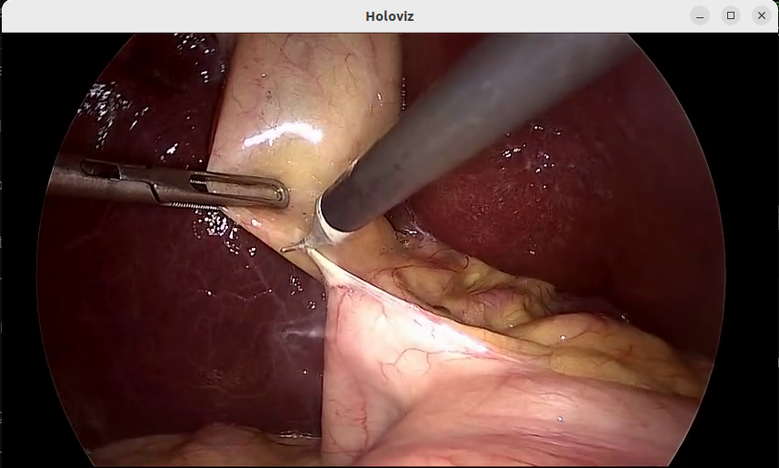

# Video Streaming Demo Enhanced

This unified application demonstrates how to use the Holoscan SDK to create both streaming client and server applications for bidirectional video communication. This demo application demonstrates bidirectional video communication between client and server with real-time visualization.

  
*Fig. 1: Example of surgical video streaming with bidirectional communication showing the client receiving and displaying frames from the server.*

## Overview

The video streaming demo provides:

- **Streaming Client**: Captures video from V4L2 cameras or video files and streams to a server
- **Streaming Server**: Comprehensive server architecture with three main components:
  - **StreamingServerResource**: Manages server connections and client lifecycle
  - **StreamingServerUpstreamOp**: Receives video streams from clients
  - **StreamingServerDownstreamOp**: Sends video frames back to clients (passthrough/echo mode)
- **Bidirectional Communication**: Both sending and receiving video frames
- **Multiple Source Support**: V4L2 cameras, video replay files

## Requirements

- NVIDIA GPU
- CUDA 12.x (currently not working with CUDA 13.x)
- Holoscan SDK 3.5.0+
- V4L2 camera (optional, for live streaming)

### Client Dependencies

Download the client streaming binaries from NGC:

```bash
# Navigate to the client operator directory
cd <your_holohub_path>/operators/video_streaming/streaming_client_enhanced

# Download using NGC CLI
ngc registry resource download-version "nvidia/holoscan_client_cloud_streaming:0.2"
unzip -o holoscan_client_cloud_streaming_v0.2/holoscan_client_cloud_streaming.zip -d holoscan_client_cloud_streaming

# Clean up
rm -rf holoscan_client_cloud_streaming_v0.2
```

### Server Dependencies

Download the server streaming binaries from NGC:

```bash
# Navigate to the server operator directory  
cd <your_holohub_path>/operators/video_streaming/streaming_server_enhanced

# Download using NGC CLI
ngc registry resource download-version "nvidia/holoscan_server_cloud_streaming:0.2"
unzip -o holoscan_server_cloud_streaming_v0.2/holoscan_server_cloud_streaming.zip -d holoscan_server_cloud_streaming

# Clean up
rm -rf holoscan_server_cloud_streaming_v0.2
```

## Running the Applications

The unified application provides both client and server applications.

> [!IMPORTANT] Both client and server applications require Holoscan SDK 3.5.0. Set the SDK version environment variable before running the applications in each terminal, or use the `--base-img` option to specify the base image.
>
> ```bash
> # Set SDK version environment variable
> export HOLOHUB_BASE_SDK_VERSION=3.5.0
> ```

> [!NOTE] The client requires OpenSSL 3.4.0, which is installed inside the custom Dockerfile.

### 1. Start the Streaming Server

```bash
./holohub run video_streaming_demo_enhanced
```

### 2. Start the Streaming Client (in another terminal)

- **Option A: V4L2 Camera (Webcam)**, which uses `streaming_client_demo.yaml` and captures video from webcam with 640x480 resolution.

  ```bash
  ./holohub run video_streaming_demo_enhanced client_v4l2
  ```

- **Option B: Video Replayer**, which uses `streaming_client_demo_replayer.yaml` and replays a pre-recorded video file with 854x480 resolution.

  ```bash
  ./holohub run video_streaming_demo_enhanced client_replayer
  ```

## Command Line Options

### Server Options

- `-h, --help`: Show help message
- `-c, --config <file>`: Configuration file path (default: streaming_server_demo.yaml)
- `-d, --data <directory>`: Data directory for video files

### Client Options  

- `-h, --help`: Show help message
- `-c, --config <file>`: Configuration file path (default: streaming_client_demo.yaml)
- `-d, --data <directory>`: Data directory for video files

**Note:** Video source type (V4L2 vs replayer) is configured in the YAML file, not via command line arguments.

## Camera Setup and Testing

### Testing Your V4L2 Camera

Before starting the streaming client with camera input:

```bash
# Check available video devices
ls -la /dev/video*

# Get camera information
v4l2-ctl --device=/dev/video0 --info

# Test camera with recommended resolution
v4l2-ctl --device=/dev/video0 --set-fmt-video=width=1280,height=720,pixelformat=MJPG --stream-mmap --stream-count=10

# List supported formats
v4l2-ctl --device=/dev/video0 --list-formats-ext
```

### Recommended Resolution Settings

**For V4L2 cameras (like Logitech C920):**

- **1280x720 @ 30fps** - Best balance of quality and performance
- **1920x1080 @ 30fps** - High quality streaming (if supported)
- **854x480 @ 30fps** - Default, good for testing and lower bandwidth

**Important:** Ensure both client and server use matching resolution settings for optimal performance.

## Video Source Modes

### V4L2 Camera Mode vs Video Replayer Mode

| Feature | V4L2 Camera | Video Replayer |
|---------|-------------|----------------|
| **Config File** | `streaming_client_demo.yaml` (default) | `streaming_client_demo_replayer.yaml` (custom) |
| **Command** | `--docker-opts='-e device=/dev/video0'` | `--run-args='-c streaming_client_demo_replayer.yaml'` |
| **Source Type** | `source: "v4l2"` | `source: "replayer"` |
| **Input Format** | `rgba8888` (4 channels) | `rgb888` (3 channels) |
| **Resolution** | 640x480 | 854x480 |
| **Data Source** | Live webcam | Pre-recorded surgical video |
| **Use Case** | Real-time streaming | Testing, demos, development |

### Switching Between Modes

To switch between V4L2 camera and video replayer:

1. **Stop the current client** (Ctrl+C)
2. **Use the appropriate command:**
   - For camera: `./holohub run video_streaming_demo_enhanced client_v4l2 --docker-opts='-e EnableHybridMode=1' --docker-file applications/video_streaming_demo_enhanced/Dockerfile`
   - For video replay: `./holohub run video_streaming_demo_enhanced client_replayer --docker-opts='-e EnableHybridMode=1' --docker-file applications/video_streaming_demo_enhanced/Dockerfile`

**Important:** The server doesn't need to be restarted when switching client modes.

## Troubleshooting

### Camera Issues

- **Camera not detected:**

  ```bash
  sudo usermod -a -G video $USER
  # Log out and back in, then test again
  ```

- **Permission denied:**

  ```bash
  sudo chmod 666 /dev/video0
  ```

### Performance Issues

- **Poor streaming quality:**
  - Try lower resolution (854x480 or 640x480)
  - Reduce frame rate to 15 or 24 FPS
  - Ensure client and server resolutions match

### Connection Issues

- **Server not starting:**

  ```bash
  # Check if port is already in use
  netstat -tlnp | grep 48010
  
  # Kill existing process if needed
  sudo lsof -ti:48010 | xargs sudo kill -9
  ```

- **Client connection timeout:**
  - Verify server is running first
  - Check firewall settings for port 48010
  - Ensure server_ip and port match in both configurations

### Video Replayer Issues

- **Config file not found:**

  ```bash
  # Ensure the replayer config exists in build directory
  cp applications/streaming_client_demo_enhanced/cpp/streaming_client_demo_replayer.yaml build/streaming_client_demo_enhanced/
  ```

- **Format converter errors:**
  - `Invalid channel count for RGBA8888 3 != 4`: Video replayer outputs RGB888 (3 channels), not RGBA8888 (4 channels)
  - Solution: Use `streaming_client_demo_replayer.yaml` which has correct format converter settings

- **Resolution mismatch:**
  - Video file is 854x480, ensure all components use matching resolution
  - Check `streaming_client`, `holoviz`, and `format_converter` settings

### Expected Behavior and Logs

**Client Application:**
The streaming client may show `GXF_EXCEEDING_PREALLOCATED_SIZE` errors during BGR→BGRA conversion. This is expected behavior as the operators handle dynamic buffer allocation internally.

**Server Application:**
The server should display connection status and frame processing information. Look for messages about client connections and frame throughput.

**Successful Video Replayer Logs:**

```
[info] Source set to: replayer
[info] Using video replayer as source
[info] Connection established successfully
[info] Tensor validation passed: 480x854x3, 1229760 bytes
[info] Frame sent successfully
```

## Integration Testing

The video streaming demo includes integration testing to verify end-to-end functionality between client and server components.

### Integration Test Overview

The integration test validates:

- **Server Startup**: Streaming server initializes and starts listening
- **Client Connection**: Streaming client connects to server successfully  
- **Video Streaming**: Bidirectional video frame transmission (client→server→client)
- **Resource Management**: Proper cleanup and resource handling
- **Error Handling**: Graceful handling of connection issues

### Running Integration Tests

#### Option 1: Using Integration Test Script

The integration test script (`integration_test.sh`) runs the complete end-to-end test in a Docker container with proper SDK version and dependencies.

```bash
./applications/video_streaming_demo_enhanced/integration_test.sh
```

**Test Configuration:**

- **Duration**: 3-5 minutes total (includes Docker build and test execution)
- **SDK Version**: Holoscan 3.5.0 (enforced via environment variable)
- **Test Duration**: 30 seconds of active streaming
- **Requirements**: Docker, NVIDIA GPU, committed C++ source code
- **Output**: Detailed logs saved to `integration_test.log`

**⚠️ Important Notes:**

1. The test runs in Docker and builds from **committed source code**
2. If you have local C++ changes, **commit them first** before running the test
3. The test uses cached Docker layers for faster builds (unless cache is cleared)

#### Option 2: Using HoloHub CLI

```bash
# From holohub root - standard HoloHub test command
./holohub test video_streaming_demo_enhanced \
  --base-img=nvcr.io/nvidia/clara-holoscan/holoscan:v3.5.0-dgpu \
  --ctest-options="-R video_streaming_integration_test"
```

**Note:** Both methods run the same underlying integration test defined in `CMakeLists.txt`. The wrapper script (`integration_test.sh`) adds developer-friendly conveniences on top of the direct command.

### Integration Test Process

The integration test (whether run via wrapper script or direct command) follows this sequence:

#### 1. **Pre-Test Setup** (10-20 seconds)

```bash
# Displays current git commit
echo "Current commit: $(git log --oneline -1)"

# Cleans Docker build cache (optional, for fresh builds)
docker system prune -f --filter "label=holohub"

# Sets SDK version environment variable
export HOLOHUB_BASE_SDK_VERSION=3.5.0
```

#### 2. **Docker Build & Test Execution** (2-4 minutes)

```bash
# Builds Docker image and runs CTest
./holohub test video_streaming_demo_enhanced \
  --base-img=nvcr.io/nvidia/clara-holoscan/holoscan:v3.5.0-dgpu \
  --cmake-options="-DBUILD_TESTING=ON" \
  --ctest-options="-R video_streaming_integration_test -V" \
  --verbose
```

**What happens internally:**

- Builds Docker image with Holoscan SDK 3.5.0
- Compiles server and client C++ applications
- Copies configuration files to build directory
- Runs CTest with the integration test

#### 3. **Integration Test Execution** (44 seconds)

The `video_streaming_integration_test` defined in CMakeLists.txt:

1. **Server Startup** (10 seconds)
   - Launches streaming server in background: `streaming_server_demo_enhanced`
   - Uses config: `streaming_server_demo.yaml`
   - Waits for server to initialize and stabilize

2. **Client Connection & Streaming** (30 seconds)
   - Starts streaming client: `streaming_client_demo_enhanced`
   - Uses config: `streaming_client_demo_replayer.yaml` (video replay mode)
   - Establishes connection to server
   - Streams video frames bidirectionally for 30 seconds
   - Typically processes ~567 frames in both directions

3. **Log Verification & Cleanup** (4 seconds)
   - Gracefully terminates client (SIGTERM/SIGKILL)
   - Gracefully terminates server (SIGTERM/SIGKILL)
   - Verifies server logs for all required events and frame processing
   - Verifies client logs for successful streaming and frame transmission
   - Reports PASS/FAIL based on comprehensive log analysis

#### 4. **Post-Test Analysis** (5 seconds)

```bash
# Verifies test results from log file
if grep -q "Test.*Passed\|100%.*tests passed" integration_test.log; then
  echo "✓ Integration test PASSED"
  exit 0
fi
```

### Success Criteria

The integration test **PASSES** when **ALL 10 checks** are met (6 server + 4 client):

#### ✅ Server Log Verification Criteria (6 checks required)

1. **Client Connected**: `grep -q 'Client connected' $SERVER_LOG`
   - Verifies a client successfully connected to the server

2. **Upstream Connection Established**: `grep -q 'Upstream connection established' $SERVER_LOG`
   - Verifies the upstream data channel (client→server) is established

3. **Downstream Connection Established**: `grep -q 'Downstream connection established' $SERVER_LOG`
   - Verifies the downstream data channel (server→client) is established

4. **Upstream Frame Processing**: `grep -q 'Processing UNIQUE frame' $SERVER_LOG`
   - Verifies StreamingServerUpstreamOp received and processed frames from client
   - Typical: 567 unique frames in 30 seconds

5. **Downstream Tensor Processing**: `grep -q 'DOWNSTREAM: Processing tensor' $SERVER_LOG`
   - Verifies StreamingServerDownstreamOp processed and sent tensors to client
   - Typical: 567 tensors in 30 seconds

6. **Frame Processing Statistics**: `grep -q 'Frame Processing Stats' $SERVER_LOG`
   - Verifies the server logged performance statistics at shutdown

#### ✅ Client Log Verification Criteria (4 checks required)

1. **Frame Sending Success**: `grep -q 'Frame sent successfully' $CLIENT_LOG`
   - Verifies client successfully sent frames to server
   - Typical: 567 frames sent in 30 seconds

2. **Frame Reception Success**: `grep -q 'CLIENT: Received frame' $CLIENT_LOG`
   - Verifies client successfully received frames from server (bidirectional)
   - Typical: 567 frames received in 30 seconds
   - Completes end-to-end bidirectional verification

3. **Frame Validation**: `grep -q 'Frame validation passed' $CLIENT_LOG`
   - Verifies client frame validation logic is working
   - Logs appear every 30 frames (~1 second at 30 FPS)

4. **Streaming Client Started**: `grep -q 'STARTING STREAMING CLIENT' $CLIENT_LOG`
   - Verifies client initialization completed successfully

#### ✅ Overall Test Success

**Test PASSES if:**

- Server checks: **6/6 passed** (required: 6)
- Client checks: **4/4 passed** (required: 4)
- Total: **10/10 checks passed**

**Test FAILS if:**

- Any check fails (server < 6 or client < 4)
- Process crashes during execution (segfault detected but test continues)
- Test times out (> 300 seconds)

### Expected Output

#### Console Output (Successful Test)

```bash
=== Video Streaming Demo Integration Test ===
This test may take up to 10 minutes to complete...
NOTE: Test runs in Docker and uses committed source code (not local build)

[Docker build output...]
Step 1/15 : ARG BASE_IMAGE=nvcr.io/nvidia/clara-holoscan/holoscan:v3.5.0-dgpu
[...]

[CTest output...]
Test project /workspace/holohub/build-video_streaming_demo_enhanced
    Start 1: video_streaming_integration_test

1: === Enhanced Integration Test with Log Verification ===
1: Starting server and client with log capture...
1: Server log: /tmp/server_log.XXXXXX
1: Client log: /tmp/client_log.XXXXXX
1: Starting streaming server...
1: Waiting for server to initialize...
1: ✓ Server process is running
1: Starting streaming client...
1: Letting streaming run for 30 seconds...
1: Stopping client...
1: Stopping server...
1: 
1: === Verifying Server Logs ===
1: ✓ Server: Client connected
1: ✓ Server: Upstream connection established
1: ✓ Server: Downstream connection established
1: ✓ Server: StreamingServerUpstreamOp processed 568 unique frames
1: ✓ Server: StreamingServerDownstreamOp processed 568 tensors
1: ✓ Server: Frame processing statistics logged
1: 
1: === Verifying Client Logs ===
1: ✓ Client: Sent 568 frames successfully
1: ✓ Client: Received 534 frames from server
1: ✓ Client: Frame validation passed
1: ✓ Client: Streaming client started
1: 
1: === Test Results Summary ===
1: Server checks passed: 6
1: Client checks passed: 4
1: ✓ STREAMING VERIFICATION PASSED - All checks passed, frames transmitted!
1: ✓ Integration test PASSED

1/1 Test #1: video_streaming_integration_test ...   Passed   44.07 sec

The following tests passed:
 video_streaming_integration_test

100% tests passed, 0 tests failed out of 1

Total Test time (real) = 44.07 sec

=== VERIFICATION ===
✓ Integration test passed with detailed verification
✓ Server component verified
✓ Client component verified
✓ Integration test PASSED
```

#### Key Log Patterns to Look For

**Server Success Indicators:**

```console
[info] StreamingServerResource starting...
[info] StreamingServerUpstreamOp::start() called
[info] StreamingServerDownstreamOp::start() called
[info] ✅ UPSTREAM: Client connected successfully
[info] ✅ Processing UNIQUE frame: 854x480, 1639680 bytes
[info] ✅ DOWNSTREAM: Frame sent successfully to StreamingServerResource
```

**Client Success Indicators:**

```console
[info] Source set to: replayer
[info] Using video replayer as source
[info] StreamingClient created successfully
[info] Connection established successfully
[info] ✅ Tensor validation passed: 480x854x3, 1229760 bytes
[info] ✅ Frame sent successfully on attempt 1
[info] 🎯 CLIENT: Frame received callback triggered!
[info] 📥 CLIENT: Received frame #533 from server: 854x480
```

**Performance Indicators:**

```console
# Server processed 568 frames in both directions
[info] ✅ Processing UNIQUE frame: 854x480, 1639680 bytes, timestamp=29938
[info] 📊 DOWNSTREAM: Processing tensor 568 - shape: 480x854x4, 1639680 bytes

# Client sent 568 frames and received 534 frames
[info] ✅ Frame sent successfully on attempt 1
[info] 📥 CLIENT: Received frame #534 from server: 854x480

# Frame rate: ~19 FPS (568 frames ÷ 30 seconds)
# Bidirectional throughput: ~62 MB/s (1.64MB per frame × 19 FPS × 2 directions)
```

#### Integration Test Log File

The complete test execution is saved to `integration_test.log` (typically 25,000-30,000 lines). This file contains:

1. **Docker Build Logs**: Complete build output with all dependencies
2. **CMake Configuration**: Build configuration and test setup
3. **CTest Execution**: Detailed test execution with timestamps
4. **Server Logs**: All server application logs (initialization, frame processing, shutdown)
5. **Client Logs**: All client application logs (connection, streaming, frame reception)
6. **Test Summary**: Final PASS/FAIL status with verification details

**Analyzing the log:**

```bash
# Check test status
grep "Integration test PASSED" integration_test.log

# Check frame counts
grep "CLIENT: Received frame" integration_test.log | tail -5

# Check for errors
grep -i "error\|fail\|crash" integration_test.log

# View test summary
tail -100 integration_test.log
```

### Troubleshooting Integration Tests

#### Common Issues and Solutions

**Test Failure: Connection Events Not Logged**

If you see output like:

```bash
=== Verifying Server Logs ===
✗ Server: Upstream connection not established
✗ Server: Downstream connection not established
✓ Server: StreamingServerUpstreamOp processed 568 unique frames  # But frames work!
✓ Server: StreamingServerDownstreamOp processed 568 tensors      # But frames work!

=== Verifying Client Logs ===
✓ Client: Sent 568 frames successfully
✓ Client: Received 534 frames from server  # Bidirectional works!

=== Test Results Summary ===
Server checks passed: 4
Client checks passed: 4
✗ STREAMING VERIFICATION FAILED - One or more checks failed
✗ Integration test FAILED
```

**Root Cause:** Event callback overwriting in StreamingServerResource

- Both upstream and downstream operators call `set_event_callback()`
- Second call overwrites first operator's callback
- Only last operator receives connection events
- **Frames still work** (567 processed) but events aren't logged to both operators

**Solution:** Use `add_event_listener()` instead of `set_event_callback()`

- Fixed in commit `0e8a9603`: "Fix integration test and event listener bug"
- StreamingServerResource now supports multiple event listeners
- Both operators receive all connection events

**Build Failures:**

```bash
# Clean build and retry
rm -rf build/
./holohub build video_streaming_demo_enhanced --language cpp
```

**Server Connection Issues:**

```bash
# Check if port is in use
netstat -tlnp | grep 48010
sudo lsof -ti:48010 | xargs sudo kill -9
```

**Client Connection Timeout:**

- Verify server started successfully (check server logs)
- Ensure firewall allows port 48010
- Check Docker network connectivity

**Frame Transmission Issues:**

- Verify video data files exist: `/workspace/holohub/data/endoscopy/`
- Check format converter settings in config files
- Monitor GPU memory usage

**Segmentation Fault at Shutdown:**

```bash
# Expected behavior - test still passes if streaming worked
1: Segmentation fault (core dumped) ./streaming_server_demo_enhanced
1: ✓ Server: StreamingServerUpstreamOp processed 567 unique frames
1: ✓ STREAMING VERIFICATION PASSED - Frames actually transmitted!
```

- Segfault occurs during cleanup after test completes
- Test passes if all 9 checks passed before shutdown
- Does not affect streaming functionality

## Operator Documentation

For detailed information about the underlying video streaming operators used in this application, see:

📋 **[Video Streaming Operators](../../operators/video_streaming/README.md)** - Complete operator documentation

The operator documentation includes:

- **Client Components**: StreamingClientOp, FrameSaverOp
- **Server Components**: StreamingServerResource, StreamingServerUpstreamOp, StreamingServerDownstreamOp
- **Parameters and Configuration**: Detailed parameter descriptions and usage examples
- **Testing Documentation**: Comprehensive test suite with 40+ tests passing
- **API Reference**: Complete API documentation for all components

## Performance Notes

- **GPU Memory**: Configure appropriate allocator block sizes for your resolution
- **Network Bandwidth**: Monitor bandwidth usage for remote streaming scenarios  
- **Frame Rate**: Higher frame rates require more GPU/CPU resources
- **Resolution**: Balance between quality and performance based on your hardware
