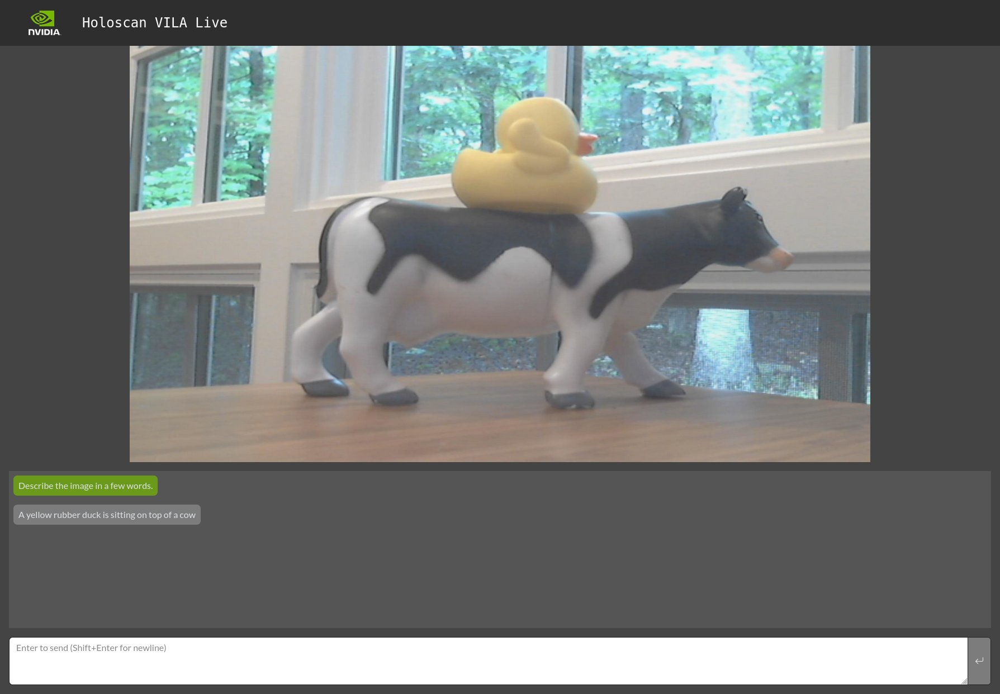

# VILA Live

This application demonstrates how to run [VILA 1.5](https://github.com/Efficient-Large-Model/VILA) models on live video feed with the possibility of changing the prompt in real time.

VILA 1.5 is a family of Vision Language Models (VLM) created by NVIDIA & MIT. It uses SigLIP to encode images into tokens which are fed into an LLM with an accompanying prompt. This application collects video frames from the V4L2 operator and feeds them to an AWQ-quantized VILA 1.5 for inference using the [TinyChat](https://github.com/mit-han-lab/llm-awq/blob/main/tinychat/README.md) library. This allows users to interact with a Generative AI model that is "watching" a chosen video stream in real-time.


Note: This demo currently uses [Llama-3-VILA1.5-8b-AWQ](https://huggingface.co/Efficient-Large-Model/Llama-3-VILA1.5-8b-Fix-AWQ), but any of the following AWQ-quantized models from the VILA 1.5 family should work as long as the file names are changed in the [Dockerfile](./Dockerfile) and [run_vila_live.sh](./run_vila_live.sh):
- [VILA1.5-3b-AWQ](https://huggingface.co/Efficient-Large-Model/VILA1.5-3b-AWQ)
- [VILA1.5-3b-s2-AWQ](https://huggingface.co/Efficient-Large-Model/VILA1.5-3b-s2-AWQ)
- [Llama-3-VILA1.5-8b-AWQ](https://huggingface.co/Efficient-Large-Model/Llama-3-VILA1.5-8b-AWQ)
- [VILA1.5-13b-AWQ](https://huggingface.co/Efficient-Large-Model/VILA1.5-13b-AWQ)
- [VILA1.5-40b-AWQ](https://huggingface.co/Efficient-Large-Model/VILA1.5-40b-AWQ)

## ⚙️ Setup Instructions
The app defaults to using the video device at `/dev/video0`

> Note: You can use a USB webcam as the video source, or an MP4 video by following the instructions for the [V4L2_Camera](https://github.com/nvidia-holoscan/holoscan-sdk/tree/main/examples/v4l2_camera#use-with-v4l2-loopback-devices) example app.

To debug if this is the correct device download `v4l2-ctl`:
```bash
sudo apt-get install v4l-utils
```
To check for your devices run:
```bash
v4l2-ctl --list-devices
```
This command will output something similar to this:
```bash
NVIDIA Tegra Video Input Device (platform:tegra-camrtc-ca):
        /dev/media0

vi-output, lt6911uxc 2-0056 (platform:tegra-capture-vi:0):
        /dev/video0

Dummy video device (0x0000) (platform:v4l2loopback-000):
        /dev/video3
```
Determine your desired video device and edit the source device in [vila_live.yaml](vila_live.yaml)

## 🚀 Build and Run Instructions
From the Holohub main directory run the following command:
```bash
./holohub run vila_live
```
or running with a replayer:
```bash
./holohub run vila_live --run-args="--source replayer"
```
Note: The first build will take **~1.5 hours** if you're on ARM64. This is largely due to building [Flash Attention 2](https://github.com/Dao-AILab/flash-attention) since pre-built wheels are not distributed for ARM64 platforms.

Once the main LMM-based app is running, you will see a link for the app at `http://127.0.0.1:8050`.
To receive the video stream, please also ensure port 49000 is open.

## 💻 Supported Hardware
- IGX w/ dGPU
- x86 w/ dGPU
- IGX w/ iGPU and Jetson AGX supported with workaround<br>
  There is a known issue running this application on IGX w/ iGPU and on Jetson AGX (see [#500](https://github.com/nvidia-holoscan/holohub/issues/500)).
  The workaround is to update the device to avoid picking up the libnvv4l2.so library.

  ```bash
  cd /usr/lib/aarch64-linux-gnu/
  ls -l libv4l2.so.0.0.999999
  sudo rm libv4l2.so.0.0.999999
  sudo ln -s libv4l2.so.0.0.0.0  libv4l2.so.0.0.999999
  ```

## 📷⚙️ Video Options
There are three options to ingest video data.

1. use a physical device or capture card, such as a v4l2 device as described in the [Setup Instructions](##-⚙️-Setup-Instructions
). Make sure the [vila_live.yaml](./vila_live.yaml) contains the v4l2_source group and specifies the device correctly (`pixel_format` may be tuned accordingly, e.g. `pixel_format: "auto"`).
2. convert a video file to a gxf-compatible format using the [convert_video_to_gxf_entities.py](https://github.com/nvidia-holoscan/holoscan-sdk/tree/main/scripts#convert_video_to_gxf_entitiespy) script. See the [yolo_model_deployment](https://github.com/nvidia-holoscan/holohub/tree/main/applications/yolo_model_deployment#step-2-deployment) application for a detailed example. When using the replayer, configure the replayer_source in the yaml file and launch the application with:
    ```bash
    ./run_vila_live.sh --source "replayer"
    ```
This application downloads a pre-recorded video from [Pexels](https://www.pexels.com/video/a-group-of-people-introduces-oneself-to-each-other-by-shaking-hands-3252919/) when the application is built.  Please review the [license terms](https://www.pexels.com/license/) from Pexels.


3. create a virtual video device, that mounts a video file and replays it, as detailed in the [v4l2_camera examples in holoscan-sdk](https://github.com/nvidia-holoscan/holoscan-sdk/tree/main/examples/v4l2_camera#use-with-v4l2-loopback-devices). This approach may require signing the [v4l2loopback kernel module](https://github.com/umlaeute/v4l2loopback), when using a system with secure-boot enabled. Make sure the vila_live.yaml contains the v4l2_source group and specifies the virtual device correctly. replay the video, using for example:
    ```bash
    ffmpeg -stream_loop -1 -re -i <your_video_path> -pix_fmt yuyv422 -f v4l2 /dev/video3
    ```
## 🙌 Acknowledgements
- Jetson AI Lab, [Live LLaVA](https://www.jetson-ai-lab.com/tutorial_live-llava.html): for the inspiration to create this app
- [Jetson-Containers](https://github.com/dusty-nv/jetson-containers/tree/master/packages/llm/llamaspeak) repo: For the Flask web-app with WebSockets
- [LLM-AWQ](https://github.com/mit-han-lab/llm-awq) repo: For the example code to create AWQ-powered LLM servers
