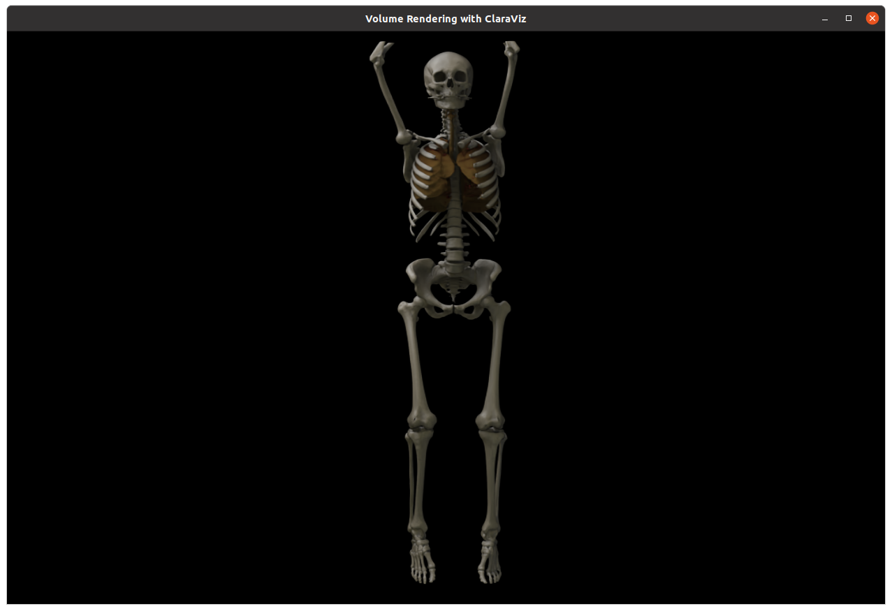

# Volume rendering using ClaraViz

<br>

This application loads a medical CT scan and renders it in real time at interactive frame rates using ClaraViz (https://github.com/NVIDIA/clara-viz).

The application uses the `VolumeLoaderOp` operator to load the medical volume data, the `VolumeRendererOp` operator to render the volume and the `HolovizOp` operator to display the result and handle the camera movement.

### Data

You can find CT scan datasets for use with this application from [embodi3d](https://www.embodi3d.com/).

Datasets are bundled with a default ClaraViz JSON configuration file for volume rendering. See [`VolumeRendererOp` documentation](/operators/volume_renderer/README.md#configuration) for details on configuration schema.

See [`VolumeLoaderOp` documentation](/operators/volume_loader/README.md#supported-formats) for supported volume formats.

## Build and Run Instructions

To build and run this application, use the ```holohub``` script:

```bash
# C++
 ./holohub run volume_rendering --language cpp

 # Python
  ./holohub run volume_rendering --language python
```

The path of the volume configuration file, volume density file and volume mask file can be passed to the application.

You can use the following command to get more information on command line parameters for this application:

```bash
./holohub run volume_rendering --language [cpp|python] --run-args="--usages"
```

## Dev Container

To start the the Dev Container, run the following command from the root directory of Holohub:

```bash
./holohub vscode volume_rendering
```

### VS Code Launch Profiles

#### C++

Use the **(gdb) volume_rendering/cpp** launch profile to run and debug the C++ application.

#### Python

There are a couple of launch profiles configured for this application:

1. **(debugpy) python_rendering/python**: Launch the Volume Rendering application with the ability to debug Python code.
2. **(pythoncpp) python_rendering/python**: Launch the Volume Rendering application with the ability to debug both Python and C++ code.

### Command Line Arguments

```
Holoscan ClaraViz volume renderer.
Usage: ./applications/volume_rendering/volume_rendering [options]
Options:
  -h,-u, --help, --usages               Display this information
  -c <FILENAME>, --config <FILENAME>    Name of the renderer JSON configuration file to load (default '../../../data/volume_rendering/config.json')
  -p <FILENAME>, --preset <FILENAME>    Name of the renderer JSON preset file to load. This will be merged into the settings loaded from the configuration file. Multiple presets can be specified.
  -w <FILENAME>, --write_config <FILENAME> Name of the renderer JSON configuration file to write to (default '')
  -d <FILENAME>, --density <FILENAME>   Name of density volume file to load (default '../../../data/volume_rendering/highResCT.mhd')
  -i <MIN>, --density_min <MIN>         Set the minimum of the density element values. If not set this is calculated from the volume data. In practice CT volumes have a minimum value of -1024 which corresponds to the lower value of the Hounsfield scale range usually used.
  -a <MAX>, --density_max <MAX>         Set the maximum of the density element values. If not set this is calculated from the volume data. In practice CT volumes have a maximum value of 3071 which corresponds to the upper value of the Hounsfield scale range usually used.
  -m <FILENAME>, --mask <FILENAME>      Name of mask volume file to load (default '../../../data/volume_rendering/smoothmasks.seg.mhd')
  -n <COUNT>, --count <COUNT>           Duration to run application (default '-1' for unlimited duration)
  ```

### Importing CT datasets

This section describes the steps to user CT datasets additionally to the dataset provided by the volume rendering application.

First get the data in a supported format. Supported formats are:
* [MHD](https://itk.org/Wiki/ITK/MetaIO/Documentation)
* [NIFTI](https://nifti.nimh.nih.gov/)
* [NRRD](https://teem.sourceforge.net/nrrd/format.html)

CT Data for the example dataset is downloaded to the `data/volume_rendering` folder when the application builds.

Additionally information on lighting, transfer functions and other settings is needed for the renderer to create an image. These settings are loaded from JSON files. The JSON files for the included example dataset is here `data/volume_rendering/config.json`.

There are two options to create a config file for a new dataset. First, use the example config as a reference to create a new config and modify parameters. Or let the renderer create a config file with settings deduced from the dataset.

Assuming the volume file is is named `new_volume.nrrd`. Specify the new volume file (`-d new_volume.nrrd`), set the config file option to an empty string (`-c ""`) to force the renderer to deduce settings and specify the name of the config file to write (`-w new_config.json`):

```bash
  ./applications/volume_rendering/cpp/volume_rendering -d new_volume.nrrd -c "" -w new_config.json
```

This will create a file `new_config.json`. If there is a segmentation volume present add it with `-m new_seg_volume.nrrd`.

By default the configuration is set up for rendering still images. For interactive rendering change the `timeSlot` setting in `RenderSettings` to the desired frame time in milliseconds, e.g. `33.0` for 30 fps.

Also by default all lights and the background are shown in the scene. To avoid this change all `"show": true,` values to `"show": false,`.

Modify the configuration file to your needs. To display the volume with the new configuration file add the configuration with the `-c new_config.json` argument:

```bash
  ./applications/volume_rendering/cpp/volume_rendering -d new_volume.nrrd -c new_config.json
```

It's possible to load preset JSON configuration files by using the `--preset preset.json` command line option. Presets are merged into the settings loaded from the configuration file. Multiple presets can be specified.

A preset for bones is included. To load that preset use this command:

```bash
  ./applications/volume_rendering/cpp/volume_rendering -d new_volume.nrrd -c new_config.json -p presets/bones.json
```

### Transfer functions

Usually CT datasets are stored in [Hounsfield scale](https://en.wikipedia.org/wiki/Hounsfield_scale). The renderer maps these values in Hounsfield scale to opacity in order to display the volume. These mappings are called transfer functions. Multiple transfer functions for different input value regions can be defined. Transfer functions also include material properties like diffuse, specular and emissive color. The range of input values the transfer function is applied to is in normalized input range `[0, 1]`.

### Segmentation volume

Different organs often have very similar Hounsfield values, therefore additionally an segmentation volume is supported. The segmentation volume contains an integer index for each element of the volume. Transfer functions can be restricted on specific segmentation indices. The segmentation volume can, for example, be generated using [TotalSegmentator](https://github.com/wasserth/TotalSegmentator).
