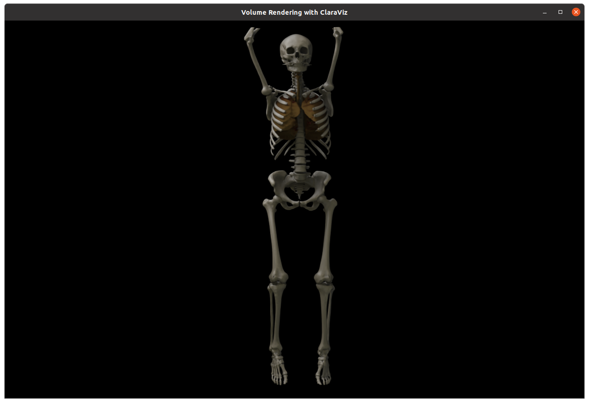

# Volume rendering using ClaraViz

<br>

This application loads a medical CT scan and renders it in real time at interactive frame rates using ClaraViz (https://github.com/NVIDIA/clara-viz).

The application uses the `VolumeLoaderOp` operator to load the medical volume data, the `VolumeRendererOp` operator to render the volume and the `HolovizOp` operator to display the result and handle the camera movement.

### Data

You can find CT scan datasets for use with this application from [embodi3d](https://www.embodi3d.com/).

Datasets are bundled with a default ClaraViz JSON configuration file for volume rendering. See [`VolumeRendererOp` documentation](/operators/volume_renderer/README.md#configuration) for details on configuration schema.

See [`VolumeLoaderOp` documentation](/operators/volume_loader/README.md#supported-formats) for supported volume formats.

## Build Instructions

To build this application, use the ```run``` script:

```bash
  ./run build volume_rendering
```

## Run Instructions

From the build directory, run the command:

```bash
  ./run launch volume_rendering
```

The path of the volume configuration file, volume density file and volume mask file can be passed to the application.

You can use the following command to get more information on command line parameters for this application:

```bash
./run launch volume_rendering --extra_args -h
```
