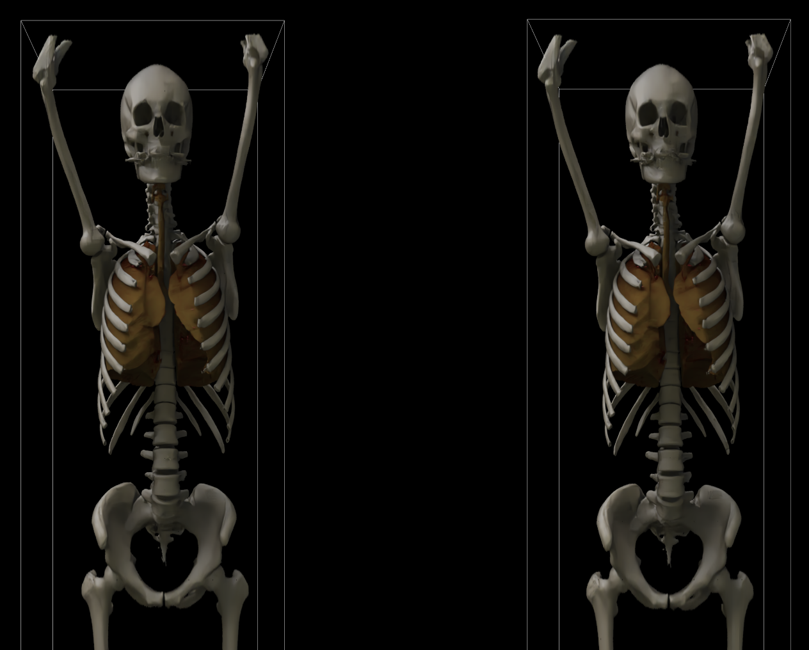

# Medical Image Viewer in XR



## Description

We collaborated with Magic Leap on a proof of concept mixed reality viewer for medical imagery built on the Holoscan platform.

Medical imagery is one of the fastest-growing sources of data in any industry. When we think about typical diagnostic imaging, X-ray, CT scans, and MRIs come to mind. X-rays are 2D images, so viewing them on a lightbox or, if they’re digital, a computer, is fine. But CT scans and MRIs are 3D. They’re incredibly important technologies, but our way of interacting with them is flawed. This technology helps physicians in so many ways, from training and education to making more accurate diagnoses and ultimately to planning and even delivering more effective treatments.

You can use this viewer to visualize a segmented medical volume with a mixed reality device.

## Prerequisites

### Host Machine

Review the [HoloHub README document](/README.md#prerequisites) for supported platforms and software requirements.

The application supports x86_64 or IGX dGPU platforms. IGX iGPU, AGX, and RHEL platforms are not fully tested at this time.

#### Magic Leap 2 Device

The following packages and applications are required to run remote rendering with a Magic Leap 2 device:

| Requirement | Platform | Version | Source |
|--|------|---------|--|
| Magic Leap Hub | Windows or macOS PC | latest | [Magic Leap Website](https://ml2-developer.magicleap.com/downloads) |
| Headset Firmware | Magic Leap 2 | v1.6.0 | Magic Leap Hub |
| Headset Remote Rendering Viewer (.apk) | Magic Leap 2 | 1.11.64 | Magic Leap Download Link |
| Windrunner OpenXR Backend | HoloHub Container | 1.11.74 | Included in Container |
| Magic Leap 2 Pro License | | | Magic Leap |

Refer to the Magic Leap 2 documentation for more information:
- [Updating your device with Magic Leap Hub](https://www.magicleap.care/hc/en-us/articles/5341445649805-Updating-Your-Device);
- [Installing `.apk` packages with Magic Leap Hub](https://developer-docs.magicleap.cloud/docs/guides/developer-tools/ml-hub/ml-hub-package-manager/)

## Quick Start

Run the following command in the top-level HoloHub folder to build and run the host application:

```bash
./dev_container build_and_run volume_rendering_xr
```

A QR code will be visible in the console log. Refer to Magic Leap 2 [Remote Rendering Setup documentation](https://developer-docs.magicleap.cloud/docs/guides/remote-rendering/remote-rendering/#:~:text=Put%20on%20the%20Magic%20Leap,headset%20by%20looking%20at%20it.&text=The%20QR%20code%20launches%20a,Click%20Continue.) to pair the host and device in preparation for remote viewing. Refer to the [Remote Viewer](#starting-the-magic-leap-2-remote-viewer) section to regenerate the QR code as needed, or to use the local debugger GUI in place of a physical device.

The application supports the following hand or controller interactions by default:
- **Translate**: Reach and grab inside the volume with your hand or with the controller trigger to move the volume.
- **Scale**: Grab any face of the bounding box and move your hand or controller to scale the volume.
- **Rotate**: Grab any edge of the bounding box and move your hand or controller to rotate the volume.
- **Crop**: Grab any vertex of the bounding box and move your hand or controller to translate the cropping planes.

### Testing Utility
We provide a simple test application in `utils/xr_hello_holoscan` for validating basic XR functionality. This utility uses the same XR operators and configuration as the main application but with minimal rendering setup. See [utils/xr_hello_holoscan/README.md](utils/xr_hello_holoscan/README.md) for details on running the test utility.

## Advanced Setup

You can use the `--dryrun` option to see the individual commands run by the quick start option above:
```
./dev_container build_and_run volume_rendering_xr --dryrun
```

Alternatively, follow the steps below to set up the interactive container session.

### Build the Container

Run the following commands to build and enter the interactive container environment:
```bash
./dev_container build --img holohub:volume_rendering_xr --docker_file ./applications/volume_rendering_xr/Dockerfile # Build the dev container
./dev_container launch --img holohub:volume_rendering_xr # Launch the container
```

### Build the Application

Inside the container environment, build the application:
```bash
./run build volume_rendering_xr # Build the application
```

### Run the Application

Inside the container environment, start the application:
```bash
export ML_START_OPTIONS=<""/"debug"> # Defaults to "debug" to run XR device simulator GUI
./run launch volume_rendering_xr
```

### Deploying as a Standalone Application

`volume_rendering_xr` can be packaged in a self-contained release container with datasets and binaries.

To build the release container:
```bash
# Generate HoloHub `volume_rendering_xr` installation in the "holohub/install" folder
./dev_container launch --img holohub:volume_rendering_xr -c ./run build volume_rendering_xr --configure-args "-DCMAKE_INSTALL_PREFIX:PATH=/workspace/holohub/install"
./dev_container launch --img holohub:volume_rendering_xr -c cmake --build ./build --target install

# Copy files into a release container
./dev_container build --img holohub:volume_rendering_xr_rel --docker_file ./applications/volume_rendering_xr/scripts/Dockerfile.rel --base_img nvcr.io/nvidia/cuda:12.4.1-runtime-ubuntu22.04
```

To run the release container, first create the container startup script:
```bash
docker run --rm holohub:volume_rendering_xr_rel > ./render-volume-xr
chmod +x ./render-volume-xr
```

Then execute the script to start the Windrunner service and the app:
```bash
./render-volume-xr
```

For more options, e.g. list available datasets or to select a different dataset, type
```bash
./render-volume-xr --help
```

Options not recognized by the render-volume-xr script are forwarded to the application.

## Additional Notes

### Supported Formats

This application loads static volume files from the local disk. See HoloHub [`VolumeLoaderOp`](/operators/volume_loader/README.md#supported-formats) documentation for supported volume formats and file conversion tools.

### Launch Options

Use the `--extra-args` to see all options, including how to specify a different dataset or configuration file to use.
```bash
./run launch volume_rendering_xr --extra_args --help
...
Holoscan OpenXR volume renderer.Usage: /workspace/holohub/build/applications/volume_rendering_xr/volume_rendering_xr [options]
Options:
  -h, --help                            Display this information
  -c <FILENAME>, --config <FILENAME>    Name of the renderer JSON configuration file to load (default '/workspace/holoscan-openxr/data/volume_rendering/config.json')
  -d <FILENAME>, --density <FILENAME>   Name of density volume file to load (default '/workspace/holoscan-openxr/data/volume_rendering/highResCT.mhd')
  -m <FILENAME>, --mask <FILENAME>      Name of mask volume file to load (default '/workspace/holoscan-openxr/data/volume_rendering/smoothmasks.seg.mhd')
```

To use a new dataset with the application, mount its volume location from the host machine when launching the container and pass all required arguments explicitly to the executable:
```bash
./dev_container launch --as_root --img holohub:openxr-dev --add-volume /host/path/to/data-dir
>>> ./build/applications/volume_rendering_xr/volume_rendering_xr \
      -c /workspace/holohub/data/volume_rendering/config.json \
      -d /workspace/volumes/path/to/data-dir/dataset.nii.gz \
      -m /workspace/volumes/path/to/data-dir/dataset.seg.nii.gz
```

### Starting the Magic Leap OpenXR runtime

OpenXR runtimes are implementations of the OpenXR API that allow the Holoscan XR operators to create XR sessions and render content. The Magic Leap OpenXR runtime including a CLI are by default installed in the dev container. __From a terminal inside the dev container__ you can execute the following scripts:

```
ml_start.sh
```
starts the OpenXR runtime service. After executing this command, the remote viewer on the Magic Leap device should connect to this runtime service. If not, then you still have to pair the device with the host computer running the Holoscan application.

For rapid iteration without a Magic Leap device, pass the argument `debug` to `ml_start.sh` i.e.
```
ml_start.sh debug
```
This will enable a debug view on your computer showing what the headset would see. You may click into this window and navigate with the keyboard and mouse to manipulate the virtual head position.

If you connect an ML2 while the debug view is active, you can continue to view the content on the debug view but can no longer adjust the virtual position, as the real position is used instead.

```
ml_pair.sh
```
displays a QR code used to pair the device with the host. Start the QR code reader App on the device and scan the QR code displayed in the terminal. Note that the OpenXR runtime has to have been started using the __ml_start__ command in order for the paring script to execute correctly.

```
ml_stop.sh
```
stops the OpenXR runtime service.

### Starting the Magic Leap 2 Remote Viewer

When using a Magic Leap 2 device for the first time or after a software upgrade, the device must be provided with the IP address of the host running the OpenXR runtime. From a terminal inside the dev container run the

```
ml_pair.sh
```

command, which will bring up a QR code that has to be scanned using the __QR Code App__ on the Magic Leap 2 device. Once paired with the host, the device  will automatically start the remote viewer which will then prompt you to start an OpenXR application on the host. Any time thereafter, start the remote viewer via the App menu.

### Developing with a Different OpenXR Backend

`volume_renderer_xr` is an OpenXR compatible application. The Magic Leap Remote Rendering runtime is installed in the application container by default, but a compatible runtime can be used if appropriate to your use case. See [https://www.khronos.org/openxr/](https://www.khronos.org/openxr/) for more information on conformant OpenXR runtimes.

### Volume Rendering

The application carries out volume rendering via the HoloHub [`volume_renderer`](../../operators/volume_renderer/) operator,
which in turn wraps the NVIDIA [ClaraViz](https://github.com/NVIDIA/clara-viz) rendering project. ClaraViz JSON configurations provided in the [config folder](./configs/) are available for specifying default scene parameters.

See [`volume_renderer` Configuration section](../../operators/volume_renderer/README.md#configuration) for details on
manipulating configuration values, along with [how to create a new configuration file](../../operators/volume_renderer/README.md#creating-a-configuration-file) to fit custom data.

### Troubleshooting

Please verify that you are building from the latest HoloHub `main` branch before reviewing troubleshooting steps.

```sh
git checkout main
```

#### Libraries are missing when building the application (Vulkan, OpenXR, etc)

This error may indicate that you are building inside the default HoloHub container instead of the expected `volume_rendering_xr` container.
Review the [build steps](#build-the-application) and ensure that you have launched the container with the appropriate
`dev_container --img` option.

#### Unexpected CMake errors

You may need to clear your CMake build cache. See the HoloHub [Cleaning](/README.md#cleanup) section for instructions.

#### "Seccomp" Errors

The Magic Leap Windrunner OpenXR backend and remote rendering host application use seccomp to limit syscalls on Linux platforms.
You can exempt individual syscalls for local development by adding them to the [application syscall whitelist](thirdparty/magicleap/seccomp_whitelist.cfg).

#### Debug GUI does not appear

The `./run launch volume_rendering_xr` command initializes the Magic Leap Windrunner debug GUI by default. If you do not see
the debug GUI appear in your application, or if the application appears to stall with no further output after the pairing QR
code appears, try any of the following:

1. Manually set the `ML_START_OPTIONS` environment variable so that `run launch` initializes with the debug view:
```sh
export ML_START_OPTIONS="debug"
```

2. Follow [Advanced Setup Instructions](#advanced-setup) and add the `--as_root` option to launch the container with root permissions.
```sh
./dev_container launch --img holohub:volume_rendering_xr --as_root
```

3. Clear the build cache and any home cache folders in the HoloHub workspace.
```sh
./run clear_cache
rm -rf .cache/ .cmake/ .config/ .local/
```
