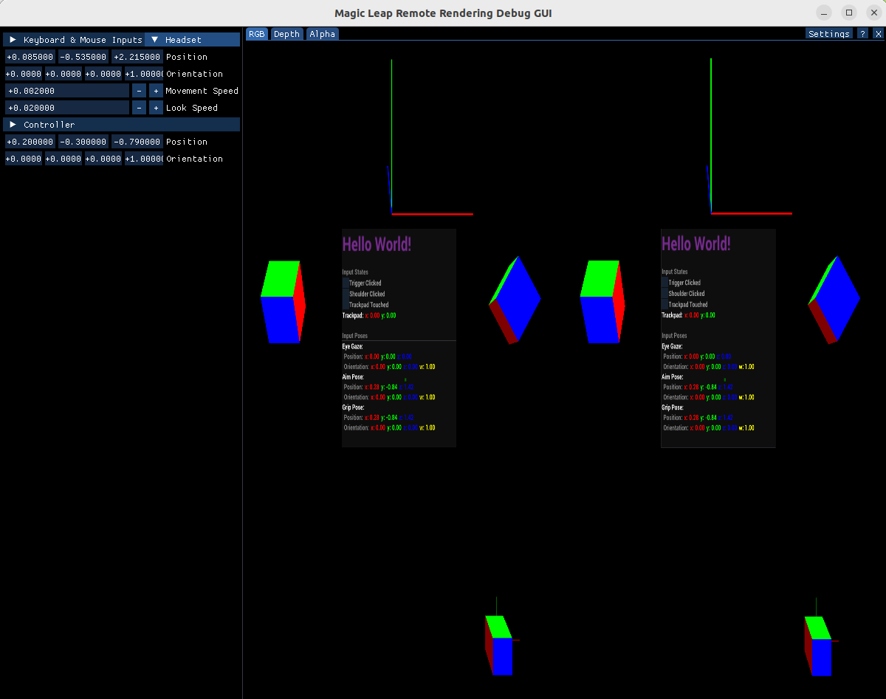

# XR Demo

This application provides a simple scene demonstrating mixed reality viewing with Holoscan SDK. It can be served as a testing tool for validating basic XR features.


## Background

We created this test application as part of a collaboration between the Magic Leap and NVIDIA Holoscan teams.
See the [`volume_rendering_xr`](/applications/volume_rendering_xr/) application for a demonstration of medical viewing
in XR with Holoscan SDK.

## Description

The application provides a blueprint for how to set up a mixed reality scene for viewing with Holoscan SDK and
HoloHub components.

The mixed reality demonstration scene includes:
- Static components such as scene axes and cube primitives;
- A primitive overlay on the tracked controller input;
- A static UI showcasing sensor inputs and tracking.

## Getting Started

Refer to the [`volume_rendering_xr` README](/applications/volume_rendering_xr/README.md#prerequisites) for details on hardware, firmware, and software prerequisites.

This utility is part of the `volume_rendering_xr` application suite. 


### Running the Test Utility

Run the following command in the top-level HoloHub folder to build and run the host application:

```bash
./holohub run volume_rendering_xr --run-args="xr_hello_holoscan"
```

Note that without specifying the extra arguments, it will launch the main volume rendering application by default.

To pair your Magic Leap 2 device with the host, open the QR Reader application in the ML2 headset and scan the QR code printed in console output on the host machine.

## Frequently Asked Questions

### Can I test the application without a Magic Leap 2 device?

Yes, a debug GUI not requiring a headset is installed inside the application container by default. Follow the steps
below to launch the debug GUI and run the application:

```bash
# Build and launch the container
./holohub run-container xr_hello_holoscan

# Enable the debug GUI
export ML_START_OPTIONS="debug"

# Build and run the application
./holohub run xr_hello_holoscan
```

The ImGui debug application will launch. Click and slide the position entries to adjust your view of the scene.


