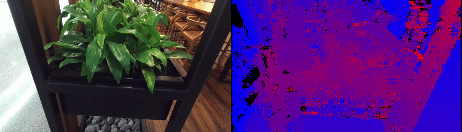

# VPI Stereo Vision

<p align="center">
  
</p>

## Overview

Demo pipeline showing stereo disparity estimation using the
Vision Programming Interface [VPI](https://developer.nvidia.com/embedded/vpi).

## Description

This pipeline takes video from a stereo camera and uses VPI's
[stereo disparity estimation algorithm](https://docs.nvidia.com/vpi/algo_stereo_disparity.html).
The input video and estimate disparity map are displayed using Holoviz.

The application will select accelerator backends if available (OFA, PVA and VIC). This demonstrates
how VPI can be used to offload stereo disparity processing from the GPU on supported devices such as
NVIDIA IGX, AGX, or NX platforms.

## Input Video

Requires a V4L2 stereo camera, or recorded stereo video, and matching calibration data. By default,
the application will share the same source data as [stereo_vision](../stereo_vision/).

## Requirements

This demo requires VPI version 3.2 or greater. The included Dockerfile will install VPI and its
dependencies for either an amd64 target (with discrete NVIDIA GPU), or arm64 target (NVIDIA IGX,
AGX, or NX).

## Build and Run Instructions

Using default video source (same as stereo_vision application):
```sh
./holohub run vpi_stereo
```
Using a v4l2 video source (live camera or loopback device):
```sh
./holohub run vpi_stereo --run-args="--source v4l2"
```
