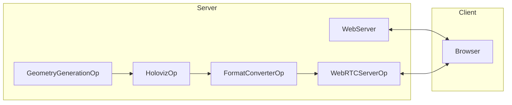

# WebRTC Holoviz Server

<br>

This app generates video frames with user specified content using Holoviz and sends it to a browser using WebRTC. The goal is to show how to remote control operators and view the output of a Holoscan pipeline.

The app starts a web server, the pipeline starts when a browser is connected to the web server and the `Start` button is pressed. The pipeline stops when the `Stop` button is pressed.

The web page has user inputs for specifying text and for the speed the text moves across the screen.



> **_NOTE:_** When using VPN there might be a delay of several seconds between pressing the `Start` button and the first video frames are display. The reason for this is that the STUN server `stun.l.google.com:19302` used by default might not be available when VPN is active and the missing support for Trickle ICE in the used aiortc library. Trickle ICE is an optimization to speed up connection establishment. Normally, possible connections paths are tested one after another. If connections time out this is blocking the whole process. Trickle ICE checks each possible connection path in parallel so the connection timing out won't block the process.

## Prerequisites

The app is using [AIOHTTP](https://docs.aiohttp.org/en/stable/) for the web server and [AIORTC](https://github.com/aiortc/aiortc) for WebRTC. Install both using pip.

```bash
pip install aiohttp aiortc
```

## Run Instructions

Run the command:

```bash
./run launch webrtc_holoviz_server
```

On the same machine open a browser and connect to `127.0.0.1:8080`. You can also connect from a different machine by connecting to the IP address the app is running on.

Press the `Start` button. Video frames are displayed. To stop, press the `Stop` button. Pressing `Start` again will continue the video.

Change the text input and the speed slider to control the generated video frame content.

### Command Line Arguments

```
usage: webrtc_server.py [-h] [--cert-file CERT_FILE] [--key-file KEY_FILE] [--host HOST] [--port PORT] [--verbose VERBOSE]

optional arguments:
  -h, --help            show this help message and exit
  --cert-file CERT_FILE
                        SSL certificate file (for HTTPS)
  --key-file KEY_FILE   SSL key file (for HTTPS)
  --host HOST           Host for HTTP server (default: 0.0.0.0)
  --port PORT           Port for HTTP server (default: 8080)
  --verbose, -v
```
