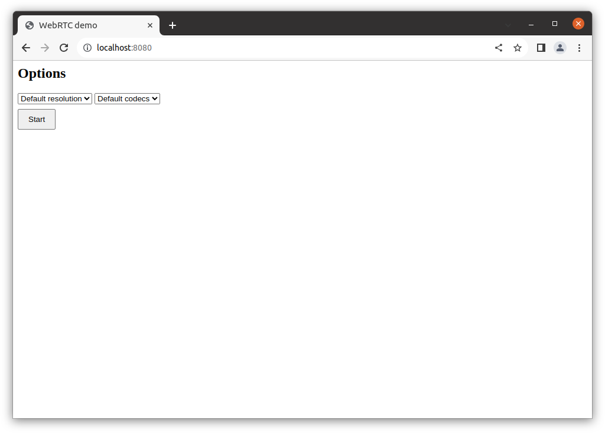
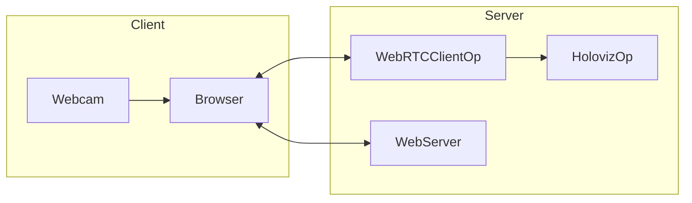

# WebRTC Video Client

<br>

This app receives video frames from a web cam connected to a browser and display them on the screen.

The app starts a web server, the pipeline starts when a browser is connected to the web server and the `Start` button is pressed. The pipeline stops when the `Stop` button is pressed.

The video resolution and video codec can be selected in browser.



> **_NOTE:_** When using VPN there might be a delay of several seconds between pressing the `Start` button and the first video frames are display. The reason for this is that the STUN server `stun.l.google.com:19302` used by default might not be available when VPN is active and the missing support for Trickle ICE in the used aiortc library. Trickle ICE is an optimization to speed up connection establishment. Normally, possible connections paths are tested one after another. If connections time out this is blocking the whole process. Trickle ICE checks each possible connection path in parallel so the connection timing out won't block the process.

## Prerequisites

The app is using [AIOHTTP](https://docs.aiohttp.org/en/stable/) for the web server and [AIORTC](https://github.com/aiortc/aiortc) for WebRTC. Install both using pip.

```bash
pip install aiohttp aiortc
```

## Run Instructions

Run the command:

```bash
./holohub run webrtc_video_client --local --no-local-build
```

On the same machine open a browser and connect to `127.0.0.1:8080`.

Select the video resolution and codec or keep the defaults.

Press the `Start` button. Video frames are displayed. To stop, press the `Stop` button. Pressing `Start` again will continue the video.

You can also connect from a different machine by connecting to the IP address the app is running on. Chrome disables features such as getUserMedia when it comes from an unsecured origin. `http://localhost` is considered as a secure origin by default, however if you use an origin that does not have an SSL/TLS certificate then Chrome will consider the origin as unsecured and disable getUserMedia.

Solutions

- Create an self-signed SSL/TLS certificate with `openssl req -new -newkey rsa:4096 -x509 -sha256 -days 365 -nodes -out MyCertificate.crt -keyout MyKey.key`. Pass the generated files to the `webrtc_client` using the `--cert-file` and `--key-file` arguments. Connect the browser to `https://{YOUR HOST IP}:8080`.
- Go to chrome://flags, search for the flag `unsafely-treat-insecure-origin-as-secure`, enter the origin you want to treat as secure such as `http://{YOUR HOST IP}:8080`, enable the feature and relaunch the browser.

### Command Line Arguments

```
usage: webrtc_client.py [-h] [--cert-file CERT_FILE] [--key-file KEY_FILE] [--host HOST] [--port PORT] [--verbose VERBOSE]

optional arguments:
  -h, --help            show this help message and exit
  --cert-file CERT_FILE
                        SSL certificate file (for HTTPS)
  --key-file KEY_FILE   SSL key file (for HTTPS)
  --host HOST           Host for HTTP server (default: 0.0.0.0)
  --port PORT           Port for HTTP server (default: 8080)
  --verbose, -v
```
