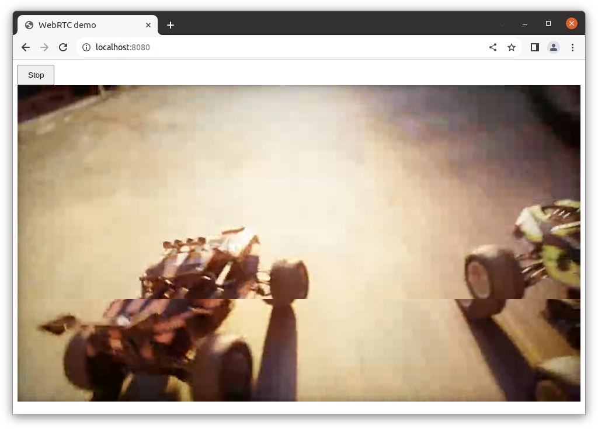
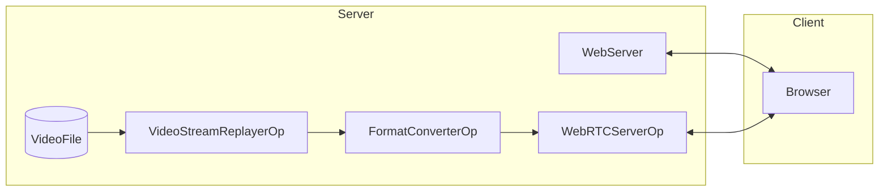
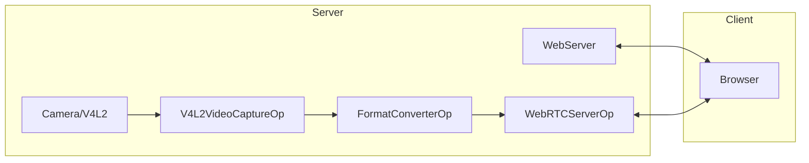

# WebRTC Video Server

<br>

This application provides a flexible WebRTC video streaming server that supports **both video file replay and live camera capture**. It can operate in two modes: with an embedded web client or as a server-only API for external applications.

## Features

- **Dual Video Sources**:
  - **File Replay**: Stream pre-recorded video files (default: racerx)
  - **Camera Capture**: Stream live video from V4L2 camera devices
- **Flexible Deployment**:
  - **Embedded Client Mode**: Built-in web UI with Start/Stop controls
  - **API-Only Mode**: RESTful endpoints for external web applications

## Architecture

### File Replay Mode (Default)


### Camera Capture Mode


> **_NOTE:_** When using VPN there might be a delay of several seconds between pressing the `Start` button and the first video frames are display. The reason for this is that the STUN server `stun.l.google.com:19302` used by default might not be available when VPN is active and the missing support for Trickle ICE in the used aiortc library. Trickle ICE is an optimization to speed up connection establishment. Normally, possible connections paths are tested one after another. If connections time out this is blocking the whole process. Trickle ICE checks each possible connection path in parallel so the connection timing out won't block the process.

## Prerequisites

The app requires:
- [AIOHTTP](https://docs.aiohttp.org/en/stable/) for the web server
- [AIORTC](https://github.com/aiortc/aiortc) for WebRTC
- [aiohttp-cors](https://github.com/aio-libs/aiohttp-cors) for CORS support (optional but recommended)

Install dependencies using pip:

```bash
pip install -r requirements.txt
```

**For Camera Mode**: Ensure your camera device (e.g., `/dev/video0`) is accessible:

```bash
ls -la /dev/video*
```

## Quick Start

### Default Mode: File Replay with Embedded Client

Run the server with default settings (plays racerx video with embedded web UI):

```bash
./holohub run webrtc_video_server --local --no-local-build
```

Or directly:

```bash
python3 webrtc_server.py
```

Open a browser and navigate to `http://localhost:8080`, then press the `Start` button.

### Camera Mode: Live Camera Streaming

Stream from a camera device:

```bash
python3 webrtc_server.py --source camera --camera-device /dev/video0
```

Open a browser and navigate to `http://localhost:8080`, then press the `Start` button to see live video.

### API-Only Mode: For External Clients

Run without the embedded client (useful for microservice architectures):

```bash
python3 webrtc_server.py --no-serve-client
```

External web applications can now connect to the API endpoints. See [example_client.html](example_client.html) for a reference implementation.

## Command Line Reference

```text
usage: webrtc_server.py [-h] [--source {file,camera}] [--video-file VIDEO_FILE]
                        [--camera-device CAMERA_DEVICE] [--pixel-format PIXEL_FORMAT]
                        [--host HOST] [--port PORT] [--serve-client]
                        [--no-serve-client] [--cert-file CERT_FILE]
                        [--key-file KEY_FILE] [--ice-server ICE_SERVER]
                        [--verbose]

WebRTC Video Streaming Server - Supports both file replay and live camera streaming

Video Source Options:
  --source {file,camera}
                        Video source type: 'file' for video file replay or 'camera' for
                        live camera capture (default: file)
  --video-file VIDEO_FILE
                        Path to video file (for source=file). If not specified, uses
                        default racerx video
  --camera-device CAMERA_DEVICE
                        Camera device path (for source=camera, default: /dev/video0)
  --pixel-format PIXEL_FORMAT
                        Camera pixel format (for source=camera, default: YUYV)

Server Options:
  --host HOST           Host for HTTP server (default: 0.0.0.0)
  --port PORT           Port for HTTP server (default: 8080)
  --serve-client        Serve embedded web client UI (default: True)
  --no-serve-client     API-only mode - do not serve embedded client (enables full CORS for external clients)
  --cert-file CERT_FILE
                        SSL certificate file (for HTTPS)
  --key-file KEY_FILE   SSL key file (for HTTPS)

WebRTC Options:
  --ice-server ICE_SERVER
                        ICE server config in the form of
                        turn:<ip>:<port>[<username>:<password>] or stun:<ip>:<port>.
                        Can be specified multiple times. If not specified, default STUN
                        servers will be used.

General Options:
  --verbose, -v         Enable verbose logging
  -h, --help           Show this help message and exit
```

## Usage Examples

### 1. File Replay (Default)

```bash
# Use default racerx video
python3 webrtc_server.py

# Use custom video file
python3 webrtc_server.py --video-file /path/to/my_video.gxf
```

### 2. Camera Streaming

```bash
# Stream from /dev/video0 (default)
python3 webrtc_server.py --source camera

# Stream from specific camera with custom format
python3 webrtc_server.py --source camera --camera-device /dev/video5 --pixel-format MJPEG
```

### 3. API-Only Mode (No Embedded Client)

```bash
# File replay, API only
python3 webrtc_server.py --no-serve-client

# Camera streaming, API only
python3 webrtc_server.py --source camera --no-serve-client
```

Then serve an external client from a separate web server:

```bash
# In the application directory
python3 -m http.server 3000
# Open http://localhost:3000/example_client.html
```

### 4. Custom Port and Host

```bash
python3 webrtc_server.py --host 0.0.0.0 --port 9090
```

## API Endpoints

When running in any mode, the following RESTful API endpoints are available:

### `GET /iceServers`
Returns ICE server configuration for WebRTC connection establishment.

**Response:**
```json
[
  {"urls": "stun:stun.l.google.com:19302"},
  {"urls": "stun:stun1.l.google.com:19302"}
]
```

### `POST /offer`
Handles WebRTC signaling (SDP offer/answer exchange).

**Request:**
```json
{
  "sdp": "v=0\r\no=- 123456789...",
  "type": "offer"
}
```

**Response:**
```json
{
  "sdp": "v=0\r\no=- 987654321...",
  "type": "answer"
}
```

## Running With TURN Server

A TURN server may be needed if you're running in a containerized environment without host networking (e.g. Kubernetes or Docker) or behind strict NAT/firewalls.

### Setup TURN Server

Run the TURN server on the same machine (or accessible network):

**Note: It is strongly recommended to run the TURN server with docker network=host for best performance**

```bash
# This is the external IP address of the machine running the TURN server
export TURN_SERVER_EXTERNAL_IP="<your-ip>"

# Command below uses admin:admin as the username and password as an example
docker run -d --rm --network=host instrumentisto/coturn \
    -n --log-file=stdout \
    --external-ip=$TURN_SERVER_EXTERNAL_IP \
    --listening-ip=$TURN_SERVER_EXTERNAL_IP \
    --lt-cred-mech --fingerprint \
    --user=admin:admin \
    --no-multicast-peers \
    --verbose \
    --realm=default.realm.org
```

### Use TURN Server

Pass the TURN server configuration when starting the application:

```bash
# File replay with TURN
python3 webrtc_server.py --ice-server "turn:<your-ip>:3478[admin:admin]"

# Camera streaming with TURN
python3 webrtc_server.py --source camera --ice-server "turn:<your-ip>:3478[admin:admin]"

# Multiple ICE servers
python3 webrtc_server.py --ice-server "stun:stun.l.google.com:19302" \
                         --ice-server "turn:<your-ip>:3478[admin:admin]"
```

This will enable you to access the WebRTC application from different machines and networks.

## Use Cases

### 1. **Development & Testing**
- Use file replay mode with embedded client for quick demos and testing with no hardware dependencies

### 2. **Live Production Streaming**
- Stream live video from cameras, robots, IoT devices, medical equipment, or industrial inspection systems
- Deploy as a microservice with API-only mode for custom web applications
