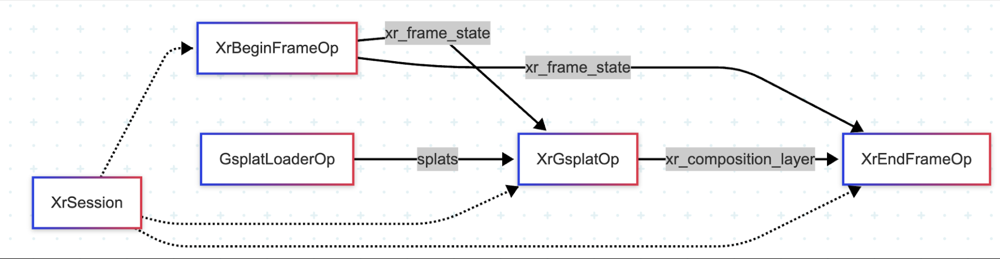

# XR + Gaussian Splatting

This application demonstrates rendering a 3D scene using Gaussian Splatting in XR.  


*Demo running on Apple Vision Pro*
## Flow Diagram



*Diagram illustrating the architecture and data flow of this application*

### 0. Training a Gaussian Splatting Model
The below instructions are based on the [gsplat colmap example](https://docs.gsplat.studio/main/examples/colmap.html).

#### 0.1. Clone the gsplat repo
```bash
git clone https://github.com/nerfstudio-project/gsplat.git
```

#### 0.2. Install dependencies and download the data
```bash
cd gsplat/examples
# Install torch
pip install torch
# Install gsplat
pip install git+https://github.com/nerfstudio-project/gsplat.git
# Install dependencies
pip install -r requirements.txt
# Download the data
python datasets/download_dataset.py
```

#### 0.3. Train the model
```bash
CUDA_VISIBLE_DEVICES=0 python simple_trainer.py default \
    --data_dir data/360_v2/garden/ --data_factor 4 \
    --result_dir ./results/garden
```

__note__: Training time is observed to take about 30 minutes on Intel i9 CPU + NVIDIA RTX A5000 dGPU

#### 0.4. Set up the checkpoint paths in `config.yaml`


## Quick Start

### Option 1: Stream to Apple Vision Pro (CloudXR)

To stream this XR application to devices like Apple Vision Pro, refer to the [CloudXR Runtime tutorial](../../tutorials/cloudxr_runtime_for_xr_applications/) for setup instructions.

### Option 2: Using Monado OpenXR Runtime (Local Development)

Monado is an open-source OpenXR runtime that supports various XR devices and includes a simulator for local development without physical XR hardware.

#### Terminal 1: Launch Container and Start Monado Service
```bash
# If you're already in the container, skip this step
./holohub run-container xr_gsplat

# Inside the container, start the Monado XR runtime service
monado-service
```
Keep this terminal open and running.

#### Terminal 2: Build and Run the Application
```bash
# Enter the same container (replace <container_id> with actual ID from 'docker ps')
docker exec -it <container_id> bash

# Build and run the application
./holohub run xr_gsplat
```