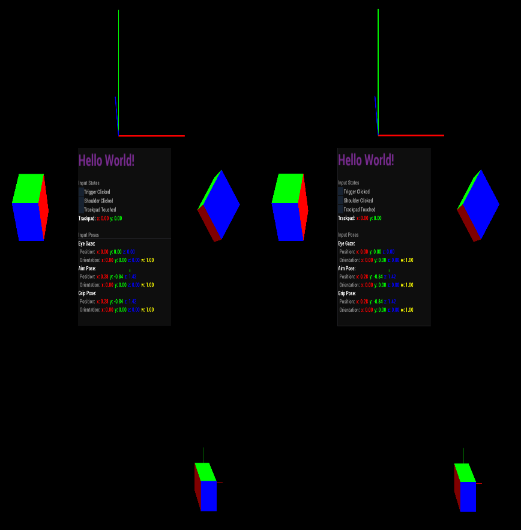
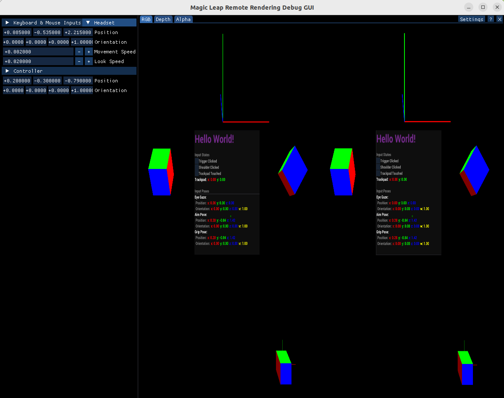

# XR "Hello Holoscan"

This application provides a simple scene demonstrating mixed reality viewing with Holoscan SDK.



## Background

We created this test application as part of a collaboration between the Magic Leap and NVIDIA Holoscan teams.
See the [`volume_rendering_xr`](/applications/volume_rendering_xr/) application for a demonstration of medical viewing
in XR with Holoscan SDK.

## Description

The application provides a blueprint for how to set up a mixed reality scene for viewing with Holoscan SDK and
HoloHub components.

The mixed reality demonstration scene includes:
- Static components such as scene axes and cube primitives;
- A primitive overlay on the tracked controller input;
- A static UI showcasing sensor inputs and tracking.

## Getting Started

Refer to the [`volume_rendering_xr` README](/applications/volume_rendering_xr/README.md#prerequisites) for details on hardware, firmware, and software prerequisites.

To run the application, run the following command in the HoloHub folder on your host machine:
```bash
./dev_container build_and_run xr_hello_holoscan
```

To pair your Magic Leap 2 device with the host, open the QR Reader application in the ML2 headset and scan the QR code printed in console output on the host machine.

## Frequently Asked Questions

### Can I test the application without a Magic Leap 2 device?

Yes, a debug GUI not requiring a headset is installed inside the application container by default. Follow the steps
below to launch the debug GUI and run the application:

```bash
# Build and launch the container
./dev_container build --img holohub:xr_hello_holoscan --docker_file ./applications/volume_rendering_xr/Dockerfile
./dev_container launch --img holohub:xr_hello_holoscan

# Build the application
./run build xr_hello_holoscan

# Launch the debug GUI and the application
export ML_START_OPTIONS="debug"
./run launch xr_hello_holoscan
```

The ImGui debug application will launch. Click and slide the position entries to adjust your view of the scene.


