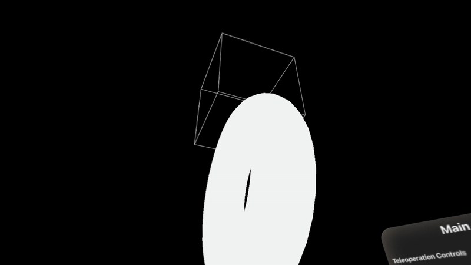
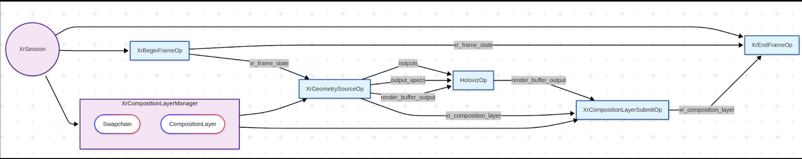

# XR + Holoviz

This application demonstrates the integration of Holoscan-XR with Holoviz for extended reality visualization.


*Demo running on Apple Vision Pro*

## Flow Diagram



*Diagram illustrating the architecture and data flow of the XR + Holoviz application*


## Quick Start

### Option 1: Stream to Apple Vision Pro through CloudXR Runtime

To stream this XR application to devices like Apple Vision Pro, refer to the [CloudXR Runtime tutorial](../../tutorials/cloudxr_runtime_for_xr_applications/) for setup instructions.

### Option 2: Using Monado OpenXR Runtime (Local Development)

Monado is an open-source OpenXR runtime that supports various XR devices and includes a simulator for local development without physical XR hardware.

#### Terminal 1: Launch Container and Start Monado Service
```bash
# If you're already in the container, skip this step
./holohub run-container xr_holoviz

# Inside the container, start the Monado XR runtime service
monado-service
```
Keep this terminal open and running.

#### Terminal 2: Build and Run the Application
```bash
# Enter the same container (replace <container_id> with actual ID from 'docker ps')
docker exec -it <container_id> bash

# Build and run the application
./holohub run xr_holoviz
```

#### Set up width and height correctly

The width and height of the HolovizOp should be set to the width and height of the XR display, which can only be obtained during runtime. To set the width and height correctly, we need to:

1. Run the application
2. Find the log showing 
```
XrCompositionLayerManager initialized width: XXX height: YYY
```
3. Copy the width and height
4. Set the width and height of the HolovizOp in `config.yaml`
5. Re-run the application

##### Troubleshooting

###### Buffer Size Too Small
If you encounter the following errors:
```
[error] [gxf_executor.cpp:2506] Graph execution error: GXF_FAILURE
terminate called after throwing an instance of 'std::runtime_error'
  what():  The size of the buffer is too small
```

This error is typically caused by incorrect width and height configuration for the XR display. To resolve this issue:

1. Follow the **"Set up width and height correctly"** section above to obtain the correct display dimensions
2. Update the HolovizOp width and height values in `config.yaml` with the runtime-detected values
3. Restart the application 