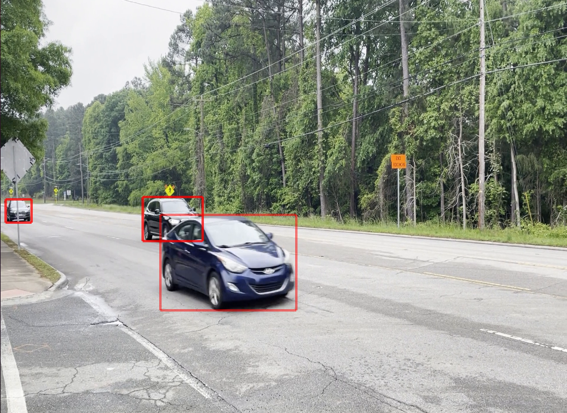

# Holoscan-Yolo
This project is aiming to provide basic guidance to deploy Yolo-based model to Holoscan SDK as "Bring Your Own Model"

The reference application's pipeline is the same as [Ultrasound Segmentation Application in Holoscan SDK](https://github.com/nvidia-holoscan/holohub/tree/main/applications/ultrasound_segmentation).


The operators applied in this operation including:    
- Video Stream Replayer (replayer as source) | AJASourceOp (AJA card is as source)
- Format Converter (float32 + resize)
- TensorRT Inference
- Detection PostProcessor (customized Python Operator to extract Bounding Box)
- HoloViz  

This project includes below precedures:
1. [Prerequisition](#prerequisition)    
    1.1 Prepare Holoscan SDK env    
    1.2 Prepare dependent libraries inside container.
2. [Deploy Procedures](#precedures)    
    2.1 [Step1: prepare the model with NMS](#step-1-prepare-the-model-with-nms-layer-and-nms-plugin) depend on pytorch env, can be done outside Holoscan SDK, refer each models' installation env section.     
    2.2 [Step2: Deployment](#step-2-deployment)     
        - Prepare Env    
        - Update Model with NHWC as input    
        - Prepare test video with gxf support format    
        - Update application with py/yaml     
        - Prepare working folder    
        - Run the Application.    

This repo takes yolo v7 as an example.

## Dependencies Repos
- Holoscan SDK: https://github.com/nvidia-holoscan/holoscan-sdk
- Yolo v7 repo: https://github.com/WongKinYiu/yolov7 
- Yolo v8 repo: https://github.com/ultralytics/ultralytics 
- Yolo v8 export repo: https://github.com/triple-Mu/YOLOv8-TensorRT 


## Prerequisition
- Holoscan environment: 
    - NGC container: [Holoscan container image on NGC](https://catalog.ngc.nvidia.com/orgs/nvidia/teams/clara-holoscan/containers/holoscan)

- Install below libraries inside container via, or skip it to [Step 2: Deployment](#step-2-deployment)
    ```
        pip install onnxruntime
        pip install nvidia-pyindex
        pip install onnx-graphsurgeon
        apt update
        apt install ffmpeg
    ```
    - onnxruntime, nvidia-pyindex,onnx-graphsurgeon are needed for [graph_surgeon.py](https://github.com/nvidia-holoscan/holoscan-sdk/tree/main/scripts#graph_surgeonpy) scripts to do onnx model conversion. Since when converting a model from PyTorch to ONNX, it is likely that the input of the model is in the form NCHW (batch, channels, height, width), and needs to be converted to NHWC (batch, height, width, channels). 
    - cupy is used in custom operators for performance improvements
    - numpy is used in script to convert video in [Step 2](#step-2-deployment)

## Precedures
### Step 1: Prepare the Model with NMS Layer and NMS Plugin
- [Yolo_v8](https://github.com/triple-Mu/YOLOv8-TensorRT)
    - ```git clone https://github.com/triple-Mu/YOLOv8-TensorRT.git```
    - Installation dependent package as described in this repo. Recommend to use latest [PyTorch docker](https://catalog.ngc.nvidia.com/orgs/nvidia/containers/pytorch) for model export. 
    - Export the model
        ```
            wget https://github.com/ultralytics/assets/releases/download/v0.0.0/yolov8s.pt
            python3 export-det.py --weights yolov8s.pt --iou-thres 0.65 --conf-thres 0.25 --topk 100 --opset 11 --sim --input-shape 1 3 640 640 --device cuda:0
        ```
    - Check the model via [netron](https://netron.app/) shall include EfficientNMS_TRT layer with output ```num_dets```, ```bboxes```, ```scores```, and ```labels```

- [Yolo_v7](https://github.com/WongKinYiu/yolov7)
    - ```git clone https://github.com/WongKinYiu/yolov7.git```
    - Prepare env, docker recommended as [yolo v7 installation](https://github.com/WongKinYiu/yolov7#installation)
    - Export the model
        ```
        wget https://github.com/WongKinYiu/yolov7/releases/download/v0.1/yolov7-tiny.pt
        python3 export.py --weights ./yolov7-tiny.pt --grid --end2end --simplify --topk-all 100 --iou-thres 0.65 --conf-thres 0.35 --img-size 640 640
        ```
        NOTE: the ```end2end``` parameter will output the the end to end model with NMS Layer and Plugin. Other parameters pls refer detail information via [link](https://github.com/WongKinYiu/yolov7/blob/main/export.py#L19)
    - Check the model via [netron](https://netron.app/) shall include EfficientNMS_TRT layer with output ```num_dets```, ```det_boxes```, ```det_scores```, and ```det_classes```

NOTE: The output name maybe different for different export models, pls correct yolo_detecton.yaml section "output_binding_names" in detection_inference part accordingly.     

### Step 2: Deployment 
- ```git clone ``` this repo to your local folder, e.g. ./holohub    

- ```cd ./holohub/applications/yolo_model_deployment```

- Copy the onnx model with NMS in Step 1 to this application folder. (The onnx model name in this example is yolov8s.onnx for yolo v8 model, and yolov7-tiny.onnx for yolo v7 model)     

- Run the Holoscan container via
    ```
    # Update the ngc container image path as needed
    export NGC_CONTAINER_IMAGE_PATH="nvcr.io/nvidia/clara-holoscan/holoscan:v0.6.0"

    # DISPLAY env may be different due to different settings, 
    # try DISPLAY=:1 if failure with "Failed to open display :0"
    export DISPLAY=:0 
    xhost +local:docker

    # Find the nvidia_icd.json file which could reside at different paths
    # Needed due to https://github.com/NVIDIA/nvidia-container-toolkit/issues/16
    nvidia_icd_json=$(find /usr/share /etc -path '*/vulkan/icd.d/nvidia_icd.json' -type f 2>/dev/null | grep .) || (echo "nvidia_icd.json not found" >&2 && false)

    # Run the container
    docker run -it --rm --net host \
    --runtime=nvidia \
    -v /tmp/.X11-unix:/tmp/.X11-unix \
    -v $nvidia_icd_json:$nvidia_icd_json:ro \
    -v ${PWD}:/holohub-yolo \
    -w /holohub-yolo \
    -e NVIDIA_DRIVER_CAPABILITIES=graphics,video,compute,utility,display \
    -e DISPLAY=$DISPLAY \
    ${NGC_CONTAINER_IMAGE_PATH}
    ```      

- Install necessary libraries inside the container via:
    _This section is intended for the initial preparation of the model and video, and can be skipped once the model has been prepared._   
    ```
    apt update
    apt install ffmpeg
    pip3 install --upgrade setuptools

    cat requirement.txt | xargs -n 1 -L 1 pip3 install 
    ```     

- Update the model with input from NCHW format to NHWC format inside the container    
    _This section is intended for the initial preparation of the model and video, and can be skipped once the model has been prepared._      

    If you are converting your model from PyTorch to ONNX, chances are your input is NCHW and will need to be converted to NHWC. We provide an example [transformation script on Github](https://github.com/nvidia-holoscan/holoscan-sdk/tree/main/scripts#graph_surgeonpy) named ```graph_surgeon.py``` to do such conversion. You may need to modify the dimensions as needed before modifying your model. For this example, use below command to do the conversion. 

    ```
    python3 ./scripts/graph_surgeon_yolo.py [yolov8s.onnx] [yolov8-nms-update.onnx]
    ```
    NOTE: the yolov8s.onnx refer to input onnx model name, yolov8-nms-update.onnx is the updated model which will be used in yolo application for inference. The yolov8-nms-update.onnx will be used in yolo_detection.py, if the onnx model name changed, pls update yolo_detection.py ```self.model_file_path``` accordingly.

- Prepare the Video with gxf format inside the container    
    _This section is intended for the initial preparation of the model and video, and can be skipped once the model has been prepared._ 
    
    Video files need to be converted into a GXF replayable tensor format to be used as stream inputs. This step has already been done for the sample applications. To do so for your own video data, we provide a [utility script on GitHub](https://github.com/nvidia-holoscan/holoscan-sdk/tree/main/scripts#convert_video_to_gxf_entitiespy) named ```convert_video_to_gxf_entities.py```. This script should yield two files in .gxf_index and .gxf_entities formats, which can be used as inputs with Holoscan.
    
    Follow below procedures to convert the video. 

    1. Copy your video to the working directory. In this example to /holohub-yolo/example_video   
    2. Take cars.mp4 from [NGC](https://catalog.ngc.nvidia.com/orgs/nvidia/teams/clara-holoscan/resources/holoscan_cars_video) as an example. Download it to  /holohub-yolo/example_video
        ```
        git clone https://github.com/nvidia-holoscan/holoscan-sdk.git
        cd ./example_video
        ffmpeg -i cars.mp4 -pix_fmt rgb24 -f rawvideo pipe:1 | python3 ../holoscan-sdk/scripts/convert_video_to_gxf_entities.py --width 1920 --height 1080 --channels 3 --directory ./ --basename cars
        ```

        NOTE:
        - ```basename``` will be used in VideoStreamReplayerOp, you can see yolo_detection.yaml, replayer section, the basename shall be defined as "cars" in this example, change the yaml file if needed.
        - ```height``` and ```width``` are the height and the width of the video. 


- Run the application inside the container
    Please make sure that the yolov8-nms-update.onnx file exists under the specified data path.
    
    ```
    python3 ./yolo_detection.py  --data=<your data path> --source=replayer --video_dir=./example_video
    ```

## Results:



