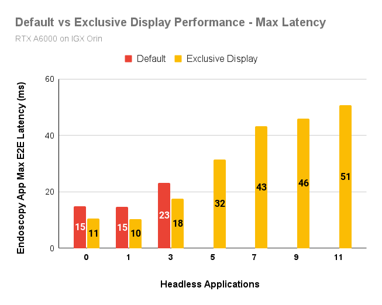
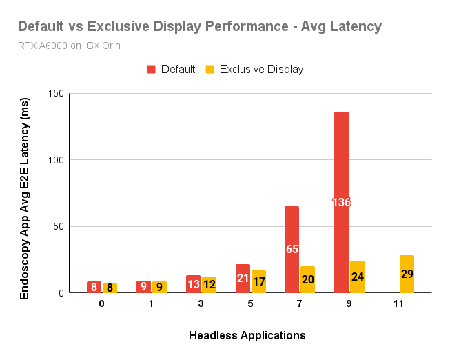

# Exclusive Display Benchmark

This document investigates the performance of the [exclusive
display](https://docs.nvidia.com/holoscan/sdk-user-guide/enable_exclusive_display.html) feature in
`holoviz` operator of Holoscan SDK.

## Introduction

By default, Holoscan SDK application uses the `holoviz` operator for display, and it uses a
windowing system like [X11](https://en.wikipedia.org/wiki/X_Window_System). X11 is a compositor
which combines the display requests from different applications and renders them on the screen. In
`exclusive_display` mode, `holoviz` turns off the default display manager and directly renders the
output in full-screen mode. This mode is obviously more performant as a single application
exclusively uses the monitor to display its output.

In this document, we provide the performance measurements of the `exclusive_display` mode and compare it
with the default mode that uses `X11`. We execute the [endoscopy tool tracking](https://github.com/nvidia-holoscan/holohub/tree/main/applications/endoscopy_tool_tracking) in these two display
modes and measure its maximum and average end-to-end latency. In addition, we also run a number of
"headless" applications simultaneously. These headless applications are executing both AI workloads
and graphics processing but do not utilize the screen to display any output. They are representative
of background workloads. Usually, these background workloads run alongside a primary display
application which, in this case, is the endoscopy tool tracking application using display in either
`exclusive` or `default` mode.

## Platform

The experiments are conducted with Holoscan v2.1 container on IGX Orin with RTX A6000 GPU flashed
with IGX SW 1.0.

## Results

For the experiment, we use the endoscopy tool tracking application which is using the display
monitor for outputs in two modes, as said above. This application is executed with `realtime: false`
for the
video stream replayer source, so that the source feeds the frames as fast as possible, without an
external frame-rate limitation.

For the headless applications, we run the same endoscopy
tool application in different process instances but in `headless: true` mode.

In the graphs below, Y-axis shows the end-to-end latency of the endoscopy tool tracking with
display. In the X-axis, we vary the number of headless applications from 0 to 11. `0` means only the
endoscopy application with display is running. We do not show any numbers when the latency is more
than 200ms.

### Maximum End-to-end Latency

The maximum end-to-end latency results are given below:

In the above graph, the maximum end-to-end latency for the default mode increases from 15 ms to 23
ms when the number of background headless applications rises from 0 to 3. For more than 3 background
headless applications, the maximum end-to-end latency in default mode is more than 200 ms.

The exclusive display mode performs much better than the default mode because of no overhead of the
compositor. The maximum end-to-end latency is 20 to 30% lower in presence of up to 3 headless
applications. The benefits are more pronounced when the number of background headless applications
is more than 3.

Despite better performance with exclusive display, the maximum end-to-end latency increases to 51 ms
when the number of background headless applications is 11. Therefore, exclusive display mode alone
cannot guarantee an upper bound on the latency if the number of applications using the GPU
increases.

### Average End-to-end Latency

The average end-to-end latency results are given below:

In the above graph, the average end-to-end latency for the default mode increases from 8 ms to 136
ms when the number of headless applications increases from 0 to 9. For more than 9 headless
applications, the average end-to-end latency in default mode is more than 200 ms.

The exclusive display mode performs much better than the default mode in average latency as well.
Average end-to-end latency is up to 80% lower in exclusive display mode compared to the default
mode, for up to 9 simultaneous headless applications.
The average latency increases from 8 ms to 29 ms in exclusive mode when the
number of headless applications increases from 0 to 11.

### Conclusions

- The exclusive display mode provides better average latency and deterministic performance
  (maximum latency) than the default mode.
- Headless applications using the GPU which are running in the background, impact the performance both in default and exclusive display
  modes. However, exclusive display mode is more resilient than the default mode to the background
  applications using the GPU.
- Even in the exclusive display mode, the maximum latency, capturing the performance predictability,
  increases 4-5x while the background headless applications increase from 0 to 11. Therefore, the exclusive mode does not provide a guarantee on the upper bound of the latency in presence of other GPU workloads.