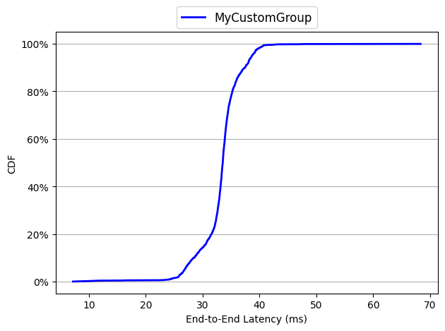
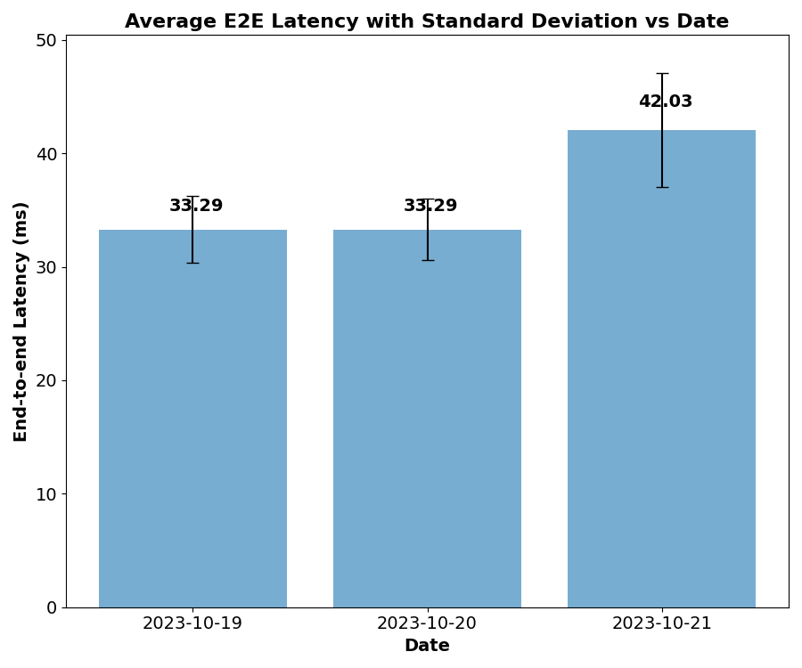
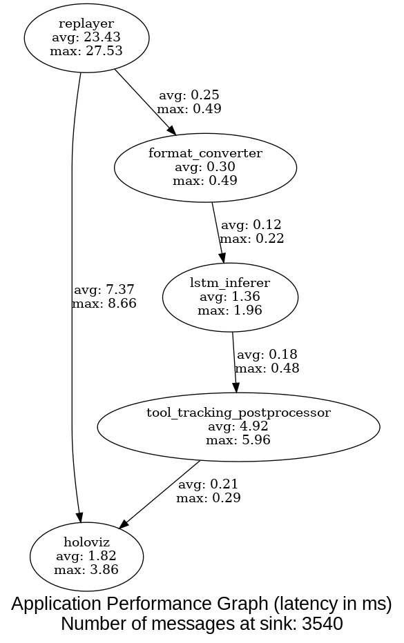

# Holoscan Flow Benchmarking for HoloHub

Holoscan Flow Benchmarking is a comprehensive performance evaluation tool designed to measure and analyze the execution characteristics of HoloHub and Holoscan applications. It provides detailed insights into operator execution times, data transfer latencies, and overall application performance.

For detailed information, refer to:

- [Holoscan Flow Benchmarking Tutorial](./flow_benchmarking_tutorial.md) (up-to-date)
- [Holoscan Flow Benchmarking Whitepaper](https://developer.download.nvidia.com/holoscan/Holoscan-Flow-Benchmarking.pdf)

**Key Features:**

- Support for all Holoscan applications (Python support since v1.0)
- Real-time performance monitoring
- Detailed latency analysis
- Visual performance graphs

## Table of Contents

- [Environment Setup](#environment-setup)
  - [Holohub Docker Container (recommended)](#holohub-docker-container-recommended)
  - [Bare-metal Installation](#bare-metal-installation)
- [Step-by-step Guide to Holoscan Flow Benchmarking](#step-by-step-guide-to-holoscan-flow-benchmarking)
  - [1. Build Applications](#1-build-applications)
  - [2. Run Benchmarks](#2-run-benchmarks)
  - [3. Analyze Results](#3-analyze-results)
- [Generate Application Graph with Latency Numbers](#generate-application-graph-with-latency-numbers)
  - [Monitor Application Performance in Real-time](#monitor-application-performance-in-real-time)

## Environment Setup

### Holohub Docker Container (recommended)

All dependencies are automatically managed by the Holohub Docker container. You can simply run:

```bash
./holohub run-container [<application_name>]
```

### Bare-metal Installation

If not using the Holohub Docker container, apart from the holoscan and application's specific dependencies, additional Python packages should be installed:

```bash
pip install -r benchmarks/holoscan_flow_benchmarking/requirements.txt
```

These python dependencies include:

- numpy: Data processing
- matplotlib: Graph generation
- nvitop: GPU monitoring
- argparse: CLI handling
- pydot: Graph creation
- xdot: Graph visualization

**Note:** `xdot` has additional system dependencies. See [xdot requirements](https://github.com/jrfonseca/xdot.py?tab=readme-ov-file#requirements).

## Step-by-step Guide to Holoscan Flow Benchmarking

### 1. Build Applications

#### Automatic Build with Benchmarking

```bash
./run build <application_name> [options] --benchmark
```

This command:

- Patches the application source
- Builds with benchmarking enabled
- Automatically restores source files after build

#### Manual Patching [only if need to]

```bash
# Apply patches
./benchmarks/holoscan_flow_benchmarking/patch_application.sh <app_directory>

# Example: Patch endoscopy tool tracking
./benchmarks/holoscan_flow_benchmarking/patch_application.sh applications/endoscopy_tool_tracking

# Restore original files when done
./benchmarks/holoscan_flow_benchmarking/restore_application.sh <app_directory>
```

**Note:** Source files are backed up as `*.bak` during patching.

### Important notes

- Verify the application runs correctly after building and before proceeding with performance evaluation.
- For applications using TensorRT, run once to generate engine files (e.g., for the endoscopy tool tracking application).
- See [patch_application.sh](./patch_application.sh) and [restore_application.sh](./restore_application.sh) for more details about the patching process.

### 2. Run Benchmarks

```bash
python benchmarks/holoscan_flow_benchmarking/benchmark.py -a <app_name> [options]
```

**Key Options:**

- `-a, --app`: Application name
- `-r, --runs`: Number of runs
- `-i, --instances`: Instances per run
- `-m, --max-frames`: Number of frames to process
- `--sched`: Scheduler type
- `-d, --directory`: Output directory
- `--run-command`: Custom run command (if needed)

For a complete list of arguments, run:

```bash
python benchmarks/holoscan_flow_benchmarking/benchmark.py -h
```

**Example:**

```bash
# Run endoscopy tool tracking benchmark
python benchmarks/holoscan_flow_benchmarking/benchmark.py \
    -a endoscopy_tool_tracking \
    -r 3 -i 3 -m 200 \
    --sched greedy \
    -d myoutputs
```

**Output Files:**

- Data flow logs: `logger_<scheduler>_<run>_<instance>.log`
- GPU utilization: `gpu_utilization_<scheduler>_<run>.csv`

### 3. Analyze Results

#### 3.1 Basic Analysis

```bash
python benchmarks/holoscan_flow_benchmarking/analyze.py \
    -g myoutputs/logger_greedy_* MyCustomGroup \
    -m -a  # Show max and average latencies
```


#### 3.2 Generate CDF Plot

```bash
python benchmarks/holoscan_flow_benchmarking/analyze.py \
    --draw-cdf single_path_cdf.png \
    -g myoutputs/logger_greedy_* MyCustomGroup \
    --no-display-graphs
```



#### 3.3 Historical Analysis

```bash
python bar_plot_avg_datewise.py \
    avg_values_2023-10-{19,20,21}.csv \
    stddev_values_2023-10-{19,20,21}.csv
```



## Generate Application Graph with Latency Numbers

The app_perf_graph.py script can be used to generate a graph of a Holoscan application with latency data from benchmarking embedded into the graph. The graph looks like the figure below, where graph nodes are operators along with their average and maximum execution times, and edges represent connection between operators along with the average and maximum data transfer latencies.



### Monitor application performance in real-time

```bash
# Terminal 1: Run benchmark
python3 benchmarks/holoscan_flow_benchmarking/benchmark.py \
    -a endoscopy_tool_tracking \
    -i 1 -r 3 -m 1000 \
    --sched=greedy \
    -d endoscopy_results

# Terminal 2: Generate live graph
python3 benchmarks/holoscan_flow_benchmarking/app_perf_graph.py \
    -o live_app_graph.dot \
    -l endoscopy_results

# Terminal 3: View live graph
xdot live_app_graph.dot
```
