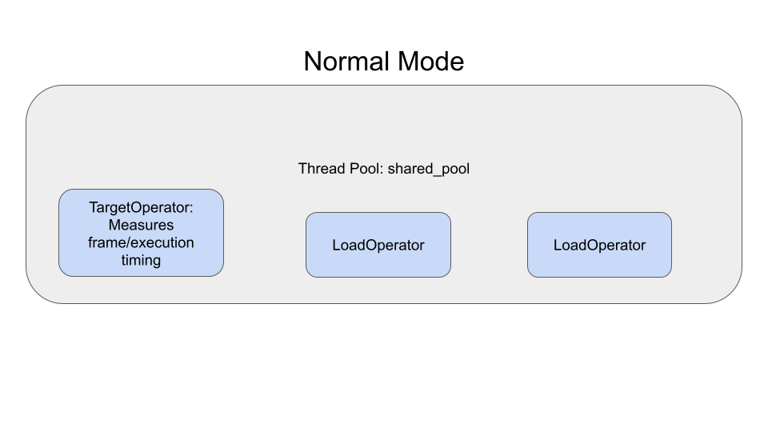
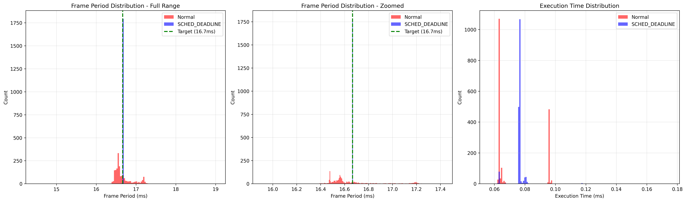
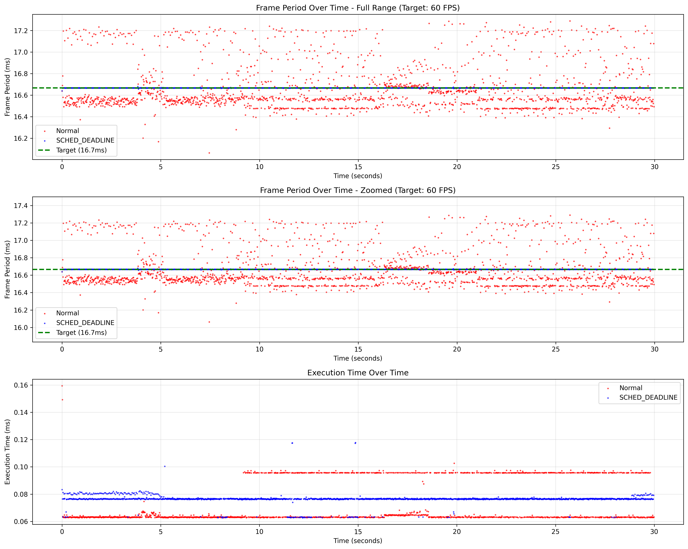

# Real-time Thread Scheduling Benchmark

This benchmark application demonstrates and evaluates the effectiveness of real-time thread scheduling in Holoscan applications. It compares the performance of normal thread scheduling against real-time scheduling policies (SCHED_DEADLINE, SCHED_FIFO, SCHED_RR) in scenarios with competing workloads.

## Overview

The benchmark creates a controlled environment to test real-time scheduling by:
- Running a target Holoscan operator at a specific FPS (30 or 60 FPS)
- Creating competing CPU load through load operators
- Measuring timing precision and consistency for the Holoscan operator
- Comparing normal scheduling vs real-time scheduling policies for Holoscan operator performance

## Implementations

This benchmark is available in two implementations:

### Python Version (`python/`)
- Full-featured benchmark with integrated plotting
- Easier to modify and extend
- Higher-level abstractions

### C++ Version (`cpp/`)
- Lower overhead and better performance
- Separate plotting script (`plot.py`) for post-processing
- More suitable for production benchmarking

Both versions provide identical functionality and can be used interchangeably.

## Usage

### Basic Usage

Run the benchmark with default settings (60 FPS, 30 seconds, SCHED_DEADLINE):
```bash
sudo ./holohub run realtime_threads_benchmarking \
  --docker-opts="--privileged -v /tmp/benchmark_plots:/tmp/benchmark_plots"
```

**Important**: The benchmark requires:
- `sudo` privileges to run Docker with `--privileged` flag
- `--privileged` flag to enable real-time scheduling policies (SCHED_DEADLINE, SCHED_FIFO, SCHED_RR)
- Volume mounting to access generated plots on the host system

### Advanced Options

The benchmark supports several configuration options:

```bash
sudo ./holohub run realtime_threads_benchmarking \
  --docker-opts="--privileged -v /tmp/benchmark_plots:/tmp/benchmark_plots" \
  --run-args="--target-fps 30 --duration 20 --scheduling-policy SCHED_DEADLINE --load-duration-ms 10.0"
```

Available options:
- `--target-fps`: Target FPS for the benchmark (30 or 60, default: 60)
- `--duration`: Benchmark duration in seconds (default: 30)
- `--scheduling-policy`: Real-time scheduling policy to test (SCHED_DEADLINE, SCHED_FIFO, SCHED_RR, default: SCHED_DEADLINE)
- `--load-duration-ms`: CPU work duration per load operator call in milliseconds (default: 20.0)
- `--plot-dir`: Directory to save benchmark plots (default: /tmp/benchmark_plots)

### C++ Version Usage

The C++ version can be run directly (without Docker) if you have the Holoscan SDK installed:

```bash
# Build the benchmark
cd cpp
mkdir build && cd build
cmake ..
make

# Run the benchmark
./realtime_thread_benchmark --target-fps 60 --duration 30 --scheduling-policy SCHED_DEADLINE

# Generate plots from results
python3 ../plot.py --input benchmark_results.json --output-dir ./plots
```

The C++ version outputs JSON data that can be processed by the `plot.py` script for visualization.

### Timing Analysis Plots

The benchmark automatically generates detailed timing analysis plots including:
- Frame period distribution histograms (full range and zoomed views)
- Execution time distribution histograms
- Time series plots showing frame periods and execution times over time

To specify a custom output directory for the plots:
```bash
sudo ./holohub run realtime_threads_benchmarking \
  --docker-opts="--privileged -v /path/to/host/output:/tmp/benchmark_plots" \
  --run-args="--plot-dir /tmp/benchmark_plots"
```

**Note**: When using custom paths, the container directory (`/tmp/benchmark_plots`) should match the `--plot-dir` argument.

## Architecture

The benchmark application consists of:

1. **TargetOperator**: Main operator that aims to run at the specified FPS and measures timing performance
   - Intentionally does NOT emit frame data to avoid framework overhead
   - Large frame data transmission adds significant latency that would interfere with accurate timing measurements
   - Focuses purely on operator scheduling and execution timing
2. **LoadOperator**: Creates CPU contention by performing computational work
3. **DataSinkOperator**: Receives data from other operators
4. **Thread Pools**:
   - Real-time pool for the target operator (with Linux RT scheduling)
   - Load pool for competing workloads (normal scheduling)

### Scheduling Mode Comparison

The benchmark demonstrates the difference between normal and real-time scheduling:

#### Normal Scheduling Mode


In normal scheduling, all operators compete equally for CPU resources, leading to timing variability and potential frame drops.

#### Real-time Scheduling Mode


With real-time scheduling, the target operator gets priority access to CPU resources, resulting in more consistent timing and better frame rate stability.

## Metrics

The benchmark measures and compares:

### Performance Metrics
- **Frame Period Statistics**: Mean, standard deviation, min/max of frame periods
- **Execution Time Statistics**: Mean, standard deviation, min/max of execution times (compute time in operator)

### Timing Analysis
- **Frame Period Consistency**: How consistently the target FPS is maintained
- **Standard Deviation Reduction**: Improvement in timing variability with real-time scheduling
- **Resource Contention Impact**: How competing workloads affect timing

## Requirements

### System Requirements
- Linux system with real-time scheduling support
- Docker with privileged mode support
- `sudo` access to run Docker with `--privileged` flag
- Multiple CPU cores recommended for meaningful contention testing

### Docker Requirements
The benchmark requires running Docker in privileged mode to enable real-time scheduling:
- **Required Docker flag**: `--privileged`
- **Required capabilities**: `CAP_SYS_NICE` and `CAP_SYS_ADMIN` (automatically provided by `--privileged`)
- **Volume mounting**: Required to access generated plots on the host system

Without `--privileged`, you'll encounter "Operation not permitted" errors when trying to set real-time scheduling policies.

## Understanding Results

### Example Output

The benchmark generates comprehensive visualization plots to help analyze real-time scheduling performance:

#### Timing Distribution Analysis


This plot shows the distribution of frame periods and execution times, comparing normal scheduling vs real-time scheduling. The histograms reveal:
- **Frame Period Consistency**: How tightly clustered the frame periods are around the target (16.67ms for 60 FPS)
- **Execution Time Stability**: The variability in operator execution times
- **Scheduling Impact**: Clear differences between normal and real-time scheduling policies

#### Timing Over Time Analysis


This time-series plot demonstrates timing behavior throughout the benchmark duration, showing:
- **Frame Period Trends**: How frame periods vary over time
- **Execution Time Patterns**: Temporal patterns in operator execution
- **Real-time Benefits**: Reduced standard deviation and more consistent timing with RT scheduling

### Good Real-time Performance Indicators
- **Frame Period Standard Deviation Reduction** (★ key metric): Lower standard deviation in frame periods indicates more consistent timing
- Better handling of CPU contention under load
- Visual feedback indicates improvement level:
  - 🚀 EXCELLENT: >50% reduction in frame period standard deviation
  - ✅ Good: >20% reduction in frame period standard deviation
  - 👍 Modest: >5% reduction in frame period standard deviation
  - ⚠️ Limited: <5% improvement

### Example Output
```
Timing plots saved to: /tmp/benchmark_plots
Generated plots:
  - timing_over_time.png (raw data points over time)
  - simple_histograms.png (distribution without overlays)

Benchmark Results:
  Configuration: Normal (Normal)
  Target FPS: 60.0
  ★ Frame Period Std Dev: 0.297ms  ← KEY METRIC
  Frame Period Mean: 16.667ms (Target: 16.7ms)
  Execution Time Std Dev: 0.035ms
  Execution Time Mean: 0.114ms
  Frame Period Min/Max: 7.9ms / 25.5ms
  Execution Range: 0.083ms - 0.348ms
  Frame Count: 1956
  Total Duration: 32.58s
  Load Duration: 20.0ms per call

Benchmark Results:
  Configuration: SCHED_DEADLINE (RT)
  Target FPS: 60.0
  ★ Frame Period Std Dev: 0.049ms  ← KEY METRIC
  Frame Period Mean: 16.666ms (Target: 16.7ms)
  Execution Time Std Dev: 0.039ms
  Execution Time Mean: 0.122ms
  Frame Period Min/Max: 15.2ms / 16.9ms
  Execution Range: 0.082ms - 0.276ms
  Frame Count: 1956
  Total Duration: 32.58s
  Load Duration: 20.0ms per call

=================================================================
COMPARISON SUMMARY
=================================================================
                        Normal    Real-time    Improvement
-----------------------------------------------------------------
★ Frame Period Std Dev: 0.297        0.049      -83.6% ★
🚀 EXCELLENT real-time improvement!
  Exec Time Std Dev:     0.035        0.039      +11.0%
```

## Troubleshooting

### Real-time Scheduling Permission Errors

If you encounter errors like:
```
[error] [event_based_scheduler.cpp:984] Failed to set SCHED_DEADLINE policy with policy=6, runtime=1666666, deadline=15833332, period=16666666: Operation not permitted
[error] [event_based_scheduler.cpp:381] Failed to configure worker thread [pool name: realtime_pool, thread uid: 10]: GXF_FAILURE
```

**Solutions:**

1. **Ensure Docker privileged mode**:
```bash
sudo ./holohub run realtime_threads_benchmarking \
  --docker-opts="--privileged -v /tmp/benchmark_plots:/tmp/benchmark_plots"
```

2. **Remove kernel real-time runtime limits** (run on host system, not in container):
```bash
sudo sysctl -w kernel.sched_rt_runtime_us=-1
```
This removes the kernel limit on real-time task runtime, which is often required for SCHED_DEADLINE scheduling.

**Note**: The kernel parameter change persists until reboot.

### Missing Plot Files

If benchmark plots are not accessible on the host system, ensure proper volume mounting:
- Both host and container use: `/tmp/benchmark_plots` (matches the default `--plot-dir`)
- Volume mount: `-v /tmp/benchmark_plots:/tmp/benchmark_plots`
- For custom locations: `-v /your/custom/path:/tmp/benchmark_plots`

## Notes

- Real-time scheduling requires Docker `--privileged` mode and `sudo` privileges
- The benchmark automatically handles thread pool configuration and CPU pinning
- Detailed timing plots are automatically generated and saved to the specified directory
- Results may vary based on system load and hardware configuration
- For best results, run on a system with minimal background processes
