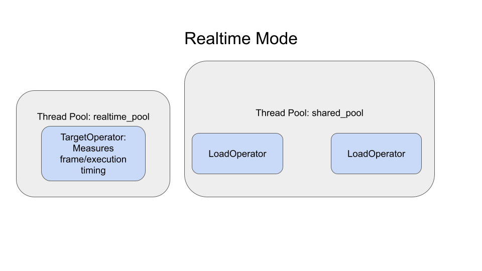

# Real-time Thread Scheduling Benchmark

This benchmark application demonstrates and evaluates the effectiveness of real-time thread scheduling in Holoscan applications. It compares the performance of normal thread scheduling against real-time scheduling policies (SCHED_DEADLINE, SCHED_FIFO, SCHED_RR) in scenarios with competing workloads.

## Overview

The benchmark creates a controlled environment to test real-time scheduling by:
- Running a target Holoscan operator at a specific FPS (30 or 60 FPS)
- Creating competing CPU load through load operators
- Measuring timing precision and consistency for the Holoscan operator
- Comparing normal scheduling vs real-time scheduling policies for Holoscan operator performance

## Implementation

This benchmark is implemented in C++ for optimal performance and provides:
- Low overhead and high precision timing measurements
- Integrated automatic plot generation
- Comprehensive real-time scheduling analysis
- Configurable workload parameters for flexible testing

## Usage

### Basic Usage

Run the benchmark with default settings (60 FPS, 30 seconds, SCHED_DEADLINE):
```bash
sudo ./holohub run realtime_threads_benchmarking \
  --docker-opts="--privileged -v /tmp/benchmark_plots:/tmp/benchmark_plots"
```

**Important**: The benchmark requires:
- `sudo` privileges to run Docker with `--privileged` flag
- `--privileged` flag to enable real-time scheduling policies (SCHED_DEADLINE, SCHED_FIFO, SCHED_RR)
- Volume mounting to access generated plots on the host system

### Advanced Options

The benchmark supports several configuration options:

```bash
sudo ./holohub run realtime_threads_benchmarking \
  --docker-opts="--privileged -v /tmp/benchmark_plots:/tmp/benchmark_plots" \
  --run-args="--target-fps 30 --duration 20 --scheduling-policy SCHED_DEADLINE --bg-load-intensity 2000"
```

Available options:
- `--target-fps`: Target FPS for the benchmark (30 or 60, default: 60)
- `--duration`: Benchmark duration in seconds (default: 30)
- `--scheduling-policy`: Real-time scheduling policy to test (SCHED_DEADLINE, SCHED_FIFO, SCHED_RR, default: SCHED_DEADLINE)
- `--bg-load-intensity`: Background load intensity (iterations, default: 1000)
- `--bg-workload-size`: Background workload size (data array size, default: 100)
- `--bm-load-intensity`: Benchmark target load intensity (iterations, default: 100)
- `--bm-workload-size`: Benchmark target workload size (data array size, default: 100)
- `--worker-thread-number`: Worker thread number (default: 2)
- `--dummy-load-number`: Number of dummy load operators (default: 2)
- `--output`: Output JSON file for raw data (default: /tmp/benchmark_plots/realtime_thread_benchmark_results.json)

### Timing Analysis Plots

The benchmark automatically generates detailed timing analysis plots including:
- Frame period distribution histograms (full range and zoomed views)
- Execution time distribution histograms
- Time series plots showing frame periods and execution times over time

To specify a custom output location:
```bash
sudo ./holohub run realtime_threads_benchmarking \
  --docker-opts="--privileged -v /path/to/host/output:/custom/output" \
  --run-args="--output /custom/output/my_results.json"
```

**Note**: Plots are automatically saved to the same directory as the JSON output file. Use volume mounting to access them on the host system.

## Architecture

The benchmark application consists of:

1. **Benchmark Operator**: Main operator that aims to run at the specified FPS and measures timing performance
   - Intentionally does NOT emit frame data to avoid framework overhead
   - Focuses purely on operator scheduling and execution timing
   - Measures frame periods and execution times
2. **Load Operators**: Create CPU contention by performing computational work
   - Configurable number of operators (default: 2)
   - Run independently to create background CPU load
   - No data flow between operators (avoids framework overhead)
3. **Thread Pools**:
   - Real-time pool for the benchmark operator (with Linux RT scheduling)
   - Load pool for competing workloads (normal scheduling)

### Scheduling Mode Comparison

The benchmark demonstrates the difference between normal and real-time scheduling:

#### Normal Scheduling Mode


In normal scheduling, all operators compete equally for CPU resources, leading to timing variability and potential frame drops.

#### Real-time Scheduling Mode


With real-time scheduling, the target operator gets priority access to CPU resources, resulting in more consistent timing and better frame rate stability.

## Metrics

The benchmark measures and compares:

### Performance Metrics
- **Frame Period Statistics**: Mean, standard deviation, min/max of frame periods

### Timing Analysis
- **Frame Period Consistency**: How consistently the target FPS is maintained
- **Standard Deviation Reduction**: Improvement in timing variability with real-time scheduling
- **Resource Contention Impact**: How competing workloads affect timing

## Requirements

### System Requirements
- Linux system with real-time scheduling support
- Docker with privileged mode support
- `sudo` access to run Docker with `--privileged` flag
- Multiple CPU cores recommended for meaningful contention testing

### Docker Requirements
The benchmark requires running Docker in privileged mode to enable real-time scheduling:
- **Required Docker flag**: `--privileged`
- **Required capabilities**: `CAP_SYS_NICE` and `CAP_SYS_ADMIN` (automatically provided by `--privileged`)
- **Volume mounting**: Required to access generated plots on the host system

Without `--privileged`, you'll encounter "Operation not permitted" errors when trying to set real-time scheduling policies.

## Understanding Results

### Example Output

The benchmark generates comprehensive visualization plots to help analyze real-time scheduling performance:

#### Timing Distribution Analysis


This plot shows the distribution of frame periods and execution times, comparing normal scheduling vs real-time scheduling. The histograms reveal:
- **Frame Period Consistency**: How tightly clustered the frame periods are around the target (16.67ms for 60 FPS)
- **Execution Time Stability**: The variability in operator execution times
- **Scheduling Impact**: Clear differences between normal and real-time scheduling policies

#### Timing Over Time Analysis


This time-series plot demonstrates timing behavior throughout the benchmark duration, showing:
- **Frame Period Trends**: How frame periods vary over time
- **Execution Time Patterns**: Temporal patterns in operator execution
- **Real-time Benefits**: Reduced standard deviation and more consistent timing with RT scheduling

### Good Real-time Performance Indicators
- **Frame Period Standard Deviation Reduction** : Lower standard deviation in frame periods indicates more consistent timing
- Better handling of CPU contention under load

### Example Output
```
================================================================================
Benchmark Configurations
================================================================================
  Target FPS: 60 (16.667 ms period)
  Duration: 30s
  Realtime: false
  Background Load Intensity: 1000
  Background Workload Size: 100
  Benchmark Load Intensity: 100
  Benchmark Workload Size: 100
  Worker Thread Number: 2
  Dummy Load Number: 2

================================================================================
Benchmark Results
================================================================================
=== Non-real-time Thread (Baseline) ===
Frame period std: 0.646 ms
Frame period mean: 16.667 ms
Frame period min/max: 10.027 ms / 21.073 ms

=== Real-time Thread ===
Frame period std: 0.024 ms
Frame period mean: 16.667 ms
Frame period min/max: 16.435 ms / 16.899 ms

================================================================================
Non-real-time and Real-time Thread Benchmark Comparison
================================================================================
Period std comparison:     0.65 ms →     0.02 ms  (+96.22%)

Raw measurement data written to: /tmp/benchmark_plots/realtime_thread_benchmark_results.json

Generating plots...

Timing plots saved to: /tmp/benchmark_plots
Generated plots:
  - timing_over_time.png (raw data points over time)
  - simple_histograms.png (distribution without overlays)
```

## Troubleshooting

### Real-time Scheduling Permission Errors

If you encounter errors like:
```
[error] [event_based_scheduler.cpp:984] Failed to set SCHED_DEADLINE policy with policy=6, runtime=1666666, deadline=15833332, period=16666666: Operation not permitted
[error] [event_based_scheduler.cpp:381] Failed to configure worker thread [pool name: realtime_pool, thread uid: 10]: GXF_FAILURE
```

**Solutions:**

1. **Ensure Docker privileged mode**:
```bash
sudo ./holohub run realtime_threads_benchmarking \
  --docker-opts="--privileged -v /tmp/benchmark_plots:/tmp/benchmark_plots"
```

2. **Remove kernel real-time runtime limits** (run on host system, not in container):
```bash
sudo sysctl -w kernel.sched_rt_runtime_us=-1
```
This removes the kernel limit on real-time task runtime, which is often required for SCHED_DEADLINE scheduling.

**Note**: The kernel parameter change persists until reboot.

### Missing Plot Files

If benchmark plots are not accessible on the host system, ensure proper volume mounting:
- Plots are saved in the same directory as the JSON output file
- Default: `/tmp/benchmark_plots/` (both JSON and plots)
- Volume mount: `-v /tmp/benchmark_plots:/tmp/benchmark_plots`
- For custom locations: Mount the directory containing your `--output` file path

## Notes

- Real-time scheduling requires Docker `--privileged` mode and `sudo` privileges
- The benchmark automatically handles thread pool configuration and CPU pinning
- Detailed timing plots are automatically generated and saved to the specified directory
- Results may vary based on system load and hardware configuration
- For best results, run on a system with minimal background processes
